# 全屏特效后处理流程

全屏特效后处理简称全屏后效、后效等，指的是在相机绘制完成整个画面后，对画面再次进行一次或者多次的图像处理。从而获取更好的画面或者实现某些特殊的效果。

Cocos Creator 在 v3.8 版本新加了全屏特效后处理流程，并且内置了一系列常用的效果。

## 开启后效流程

[开启自定义管线并切换至**前向渲染管线**](../custom-pipeline.md#功能开启)，如图所示：

  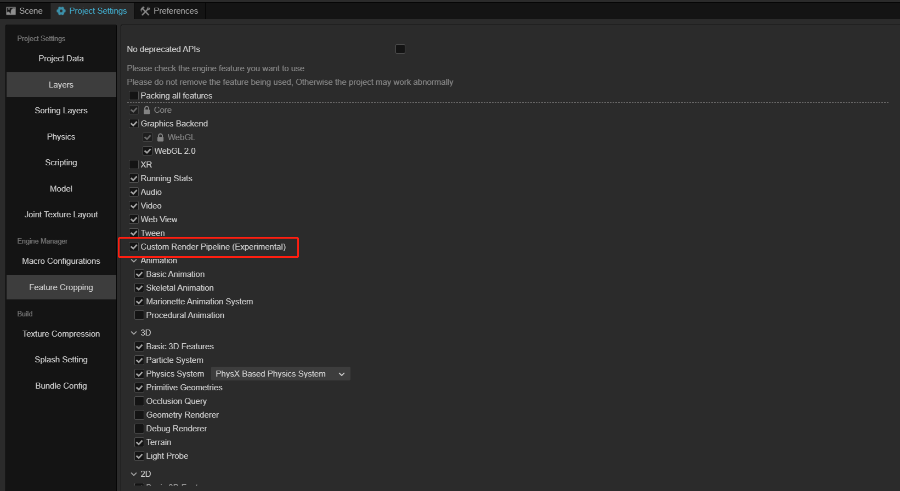

  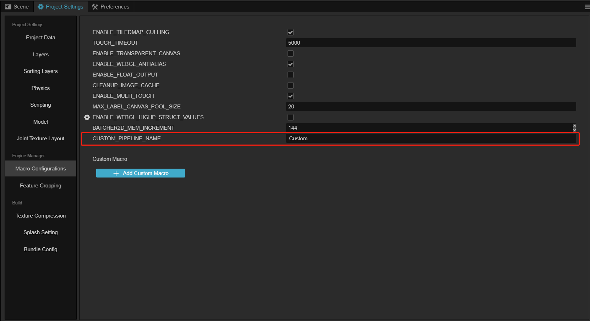

## 设置后效流程

1. 在 **层级管理器** 内点击右键添加一个空节点，命名为 PostProcess （可以按自己的习惯命名）

2. 点击 **属性检查器** 面板上的 **添加组件** 按钮，并在输入框内输入 PostProcess，菜单栏会列出所有可用的后效组件，选择指定的后效组件来添加

  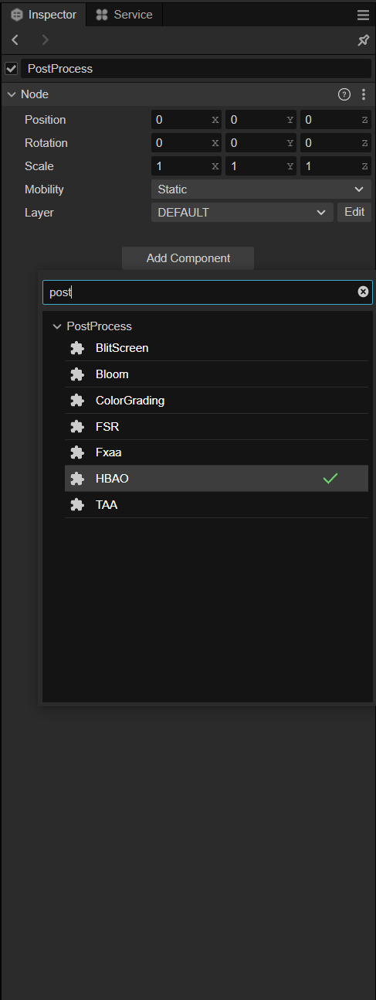

添加后效后，节点上会自动增加 **PostProcess** 组件，详情请参考 [Post Process](./post-process.md)。

## 启用后效

后效可以针对单个相机使用，也可以作为全局后效针对所有相机开启。

需要注意的是，如果该相机要启用后效，则必须保持其 **Use Post Process** 属性为勾选状态。

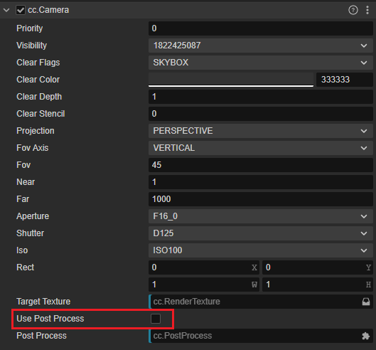

### 全局后效

如果要将后效应用到所有开启了 **Use Post Process** 的相机，需要在 **PostProcess** 中勾选 **Global** 属性（默认为勾选状态）。

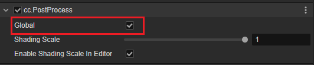

### 单个相机后效

如果只想针对某个相机开启后效，在想要开启后效的相机组件的 **属性检查器** 上找到 **Post Process** 属性，并将之前创建好的 **PostProcess** 节点拖拽到其上，这样的话，该相机就会启用 **PostProcess** 节点上的后效。

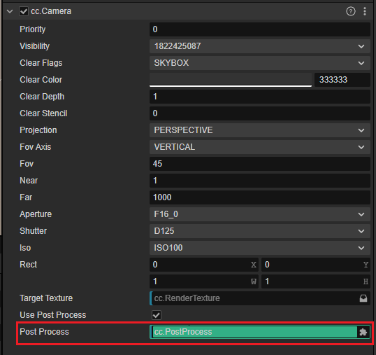

## 内置后效

### TAA (Temporal Anti-aliasing)

TAA 是一种先进的抗锯齿技术，他会将历史帧数据混合到一个缓冲区中来使画面更加平滑。TAA 的性能消耗是比较大的，推荐在中高端机型以上才使用。

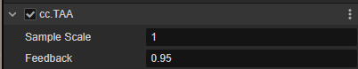

参数说明：

1. Sample Scale：采样范围，推荐使用较小的值，该值过大可能造成画面抖动。
2. Feedback：历史帧混合值，该值越大抗锯齿效果越好，但是画面可能会变糊。

- 关闭 TAA

  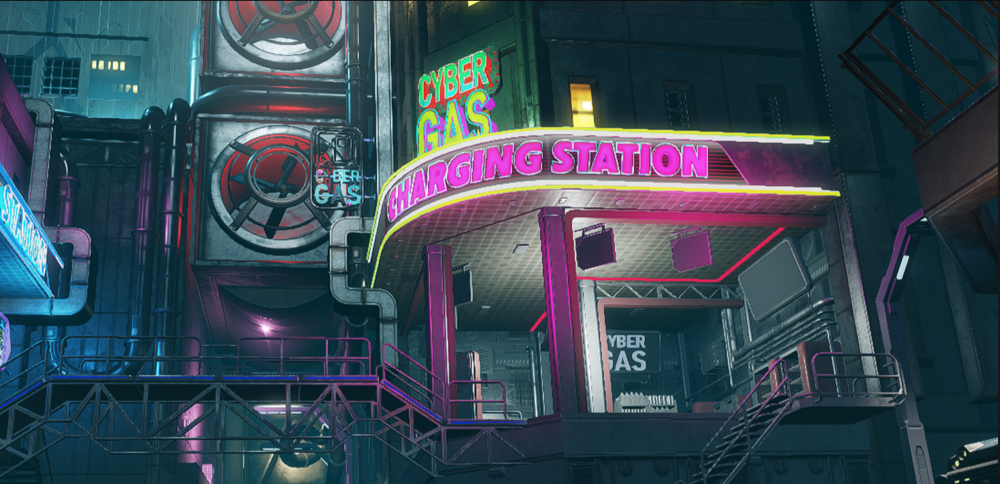
- 开启 TAA

  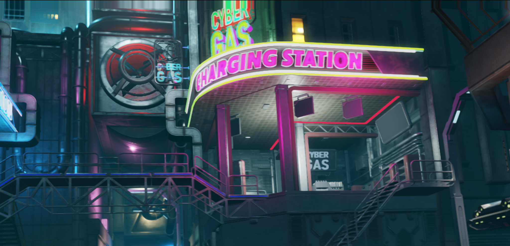

### FSR (AMD FidelityFX Super Resolution)

FSR 是 AMD 全新的、开源的、高质量的渲染解决方案，用于从低分辨率的输入产生高分辨率的渲染结果。它使用了一系列尖端的算法，特别强调创建高质量的边缘，与直接以原始分辨率渲染相比，性能有很大的提高。

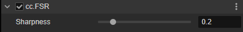

参数说明：

1. Sharpness：画面锐化度

- 关闭 FSR

  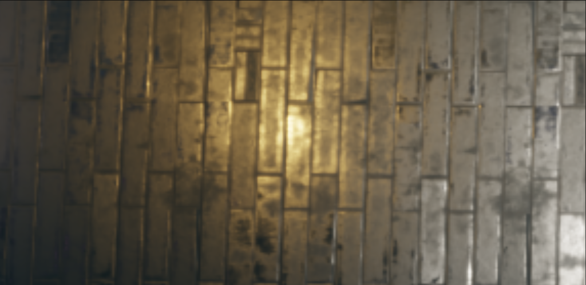

- 开启 FSR

  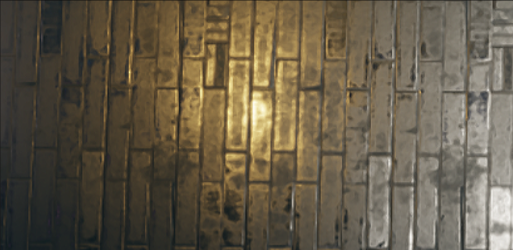

### FXAA（Fast Approximate Anti-Aliasing）

FXAA 以极低的代价来降低场景中的锯齿。

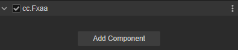

- 关闭 FXAA

  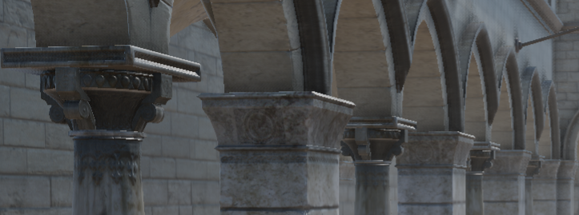

- 开启 FXAA

  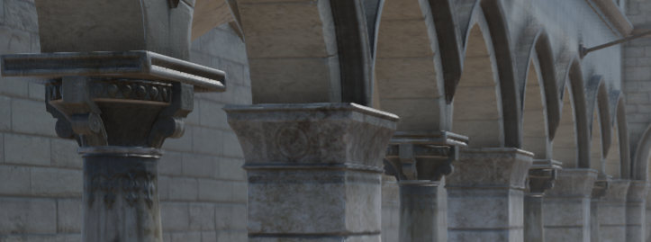

### Bloom

Bloom 用于在场景高亮区形成泛光和光晕，可以让光源或强烈反射的材质看起来更加真实。

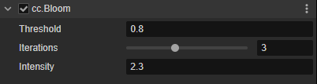

参数说明：

1. Threshold：光晕的亮度阈值，大于此亮度的区域才会产生泛光。注意该值是人眼所见的 LDR 亮度单位，和曝光无关
2. Iterations：模糊迭代次数，该值越大则光晕范围越大、越柔和，但性能也会有所降低
3. Intensity：泛光强度，该值越大则光晕越亮，请适度调节

- 关闭 Bloom
  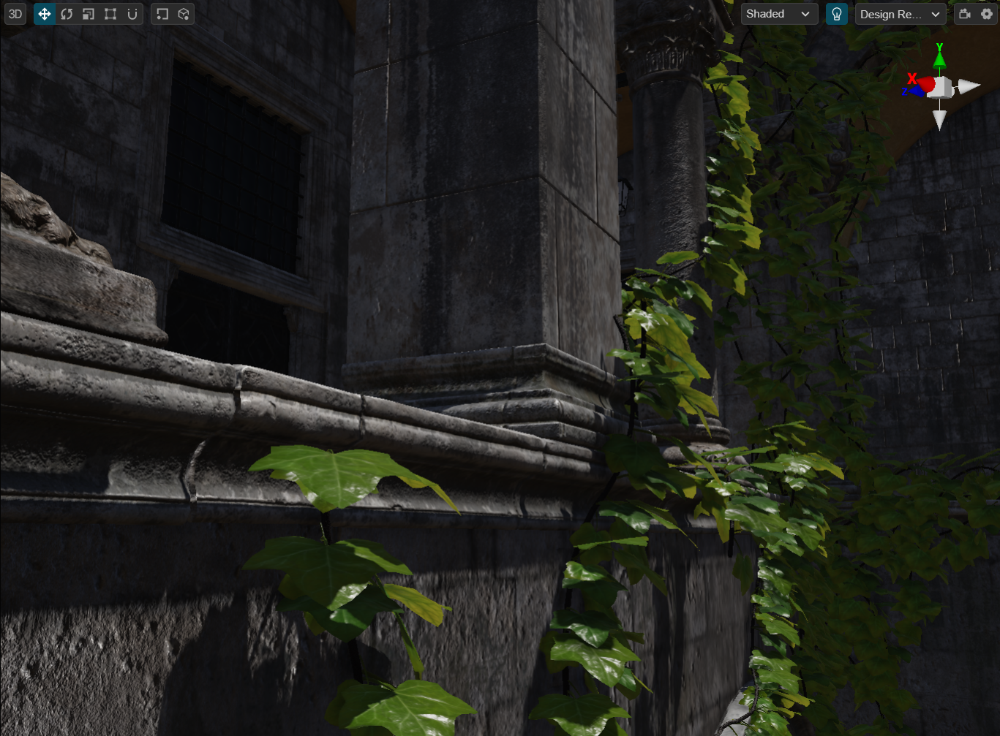
- 开启 Bloom
  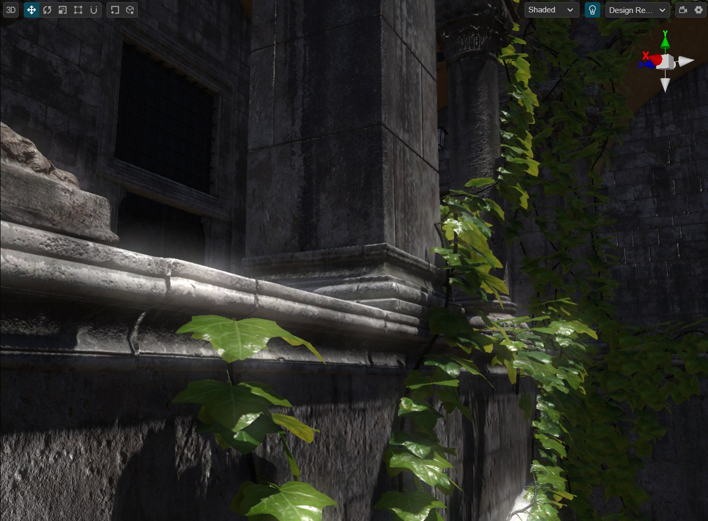

### Color Grading

Color Grading 使用颜色查找表（LUT）的方式对场景颜色做美术向的校正，LUT 贴图可以从网络上下载，也可以在 Photoshop 等软件中自己制作。

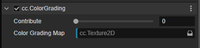

参数说明：

1. Contribute：贡献度，可在0-1的范围内调节其对颜色的影响程度
2. Color Grading Map：颜色查找表贴图，支持任意 Nx1 的长条图和 8x8 的方块图，系统自动适配。内置 LUT 贴图路径为 internal/dependencies/textures/lut/

- 关闭 Color Grading
  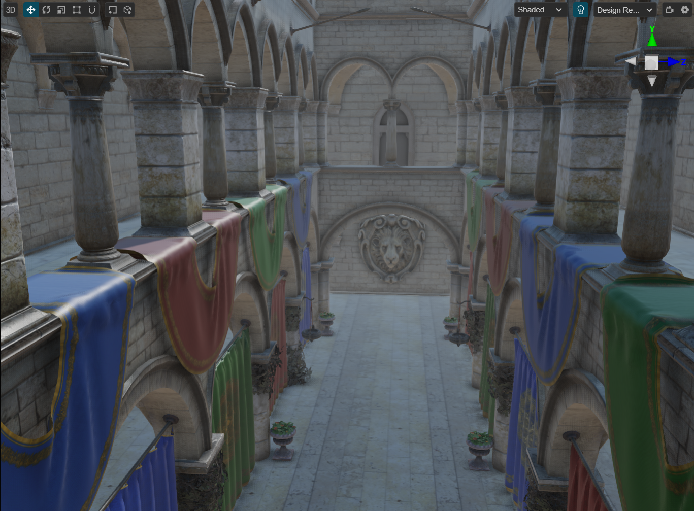
- 开启 Color Grading
  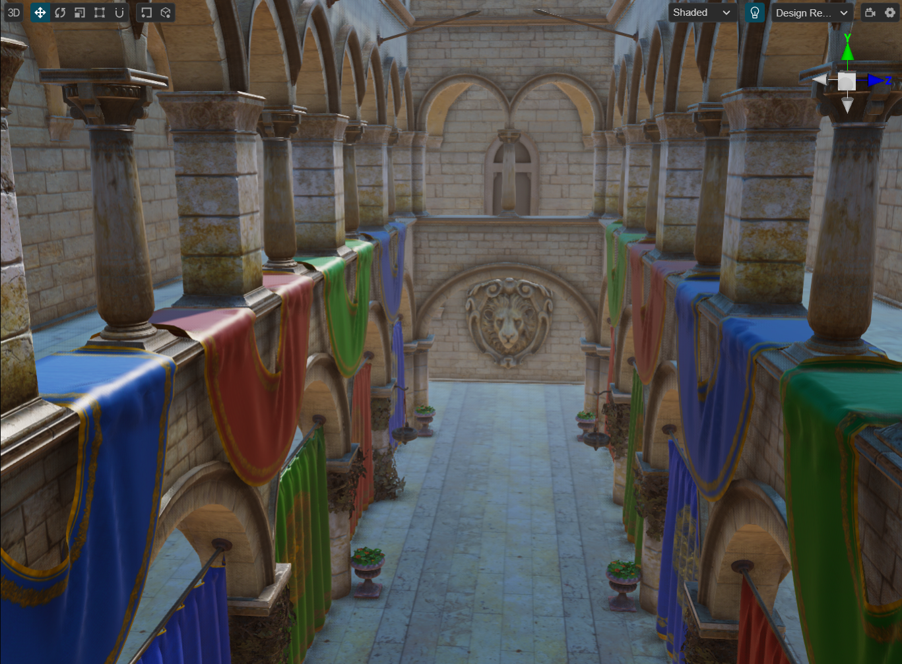

### HBAO（Horizon-Based Ambient Occlusion）

HBAO 提供了一种简便的方式去计算全局照明中的环境光遮蔽，对于整个场景层次感的提升有很大的帮助。

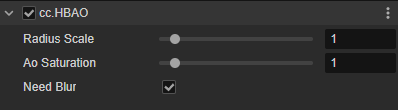

参数说明：

1. Radius Scale：环境光遮蔽的范围，通过调整该值可以让暗部区域更好的按场景尺度进行适配
2. AO Saturation：环境光遮蔽的饱和度，该值越大则越暗
3. Need Blur：开启可以获得更柔和的效果，噪点更少，但会耗费一些性能

- 关闭 HBAO

  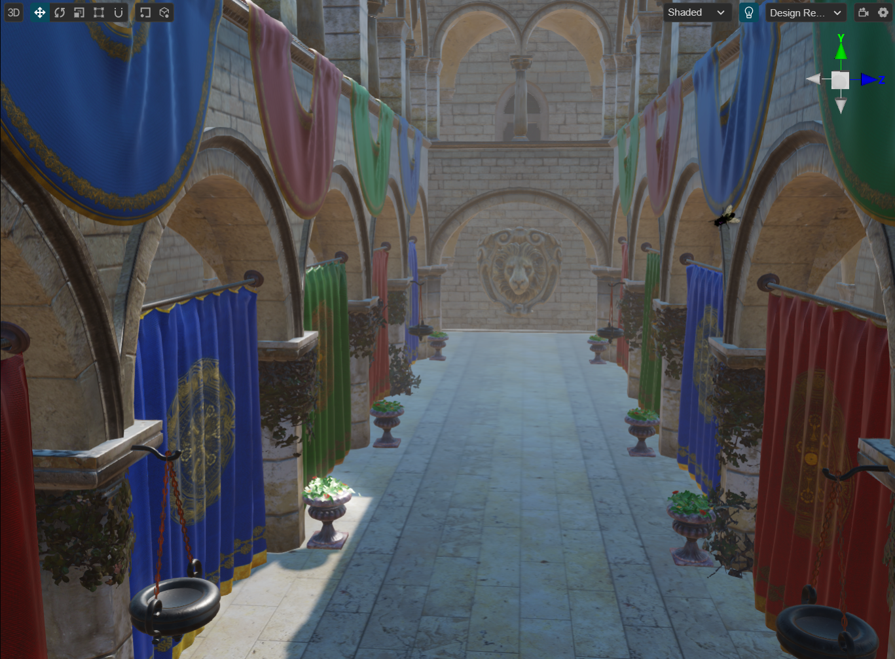

- 开启 HBAO

  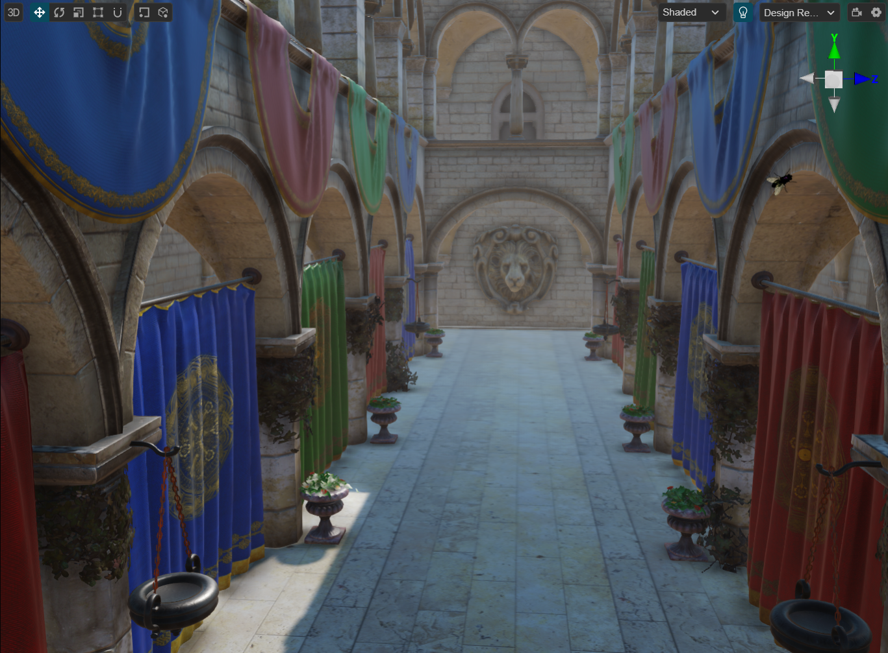

- 可以在渲染调试中单独查看 HBAO，在场景右上角的调试模式菜单中选择单项选择中的环境光遮蔽即可

  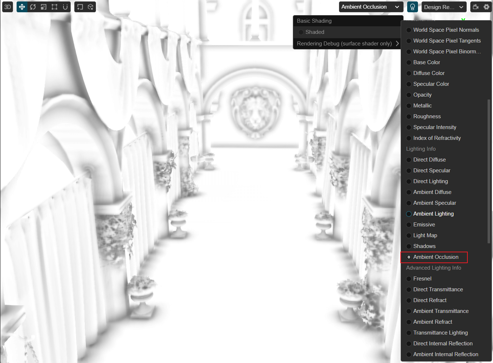

## 自定义后效

参考 [自定义后效](./custom.md)

## 后效的顺序

在节点上挂载的后效组件的顺序不等于后效的执行顺序，实际上后效有严格的启用和执行属性，开发者可以在引擎的源代码目录内的 [post-process-builder.ts](https://github.com/cocos/cocos-engine/blob/v3.8.0/cocos/rendering/post-process/post-process-builder.ts) 文件内找到。

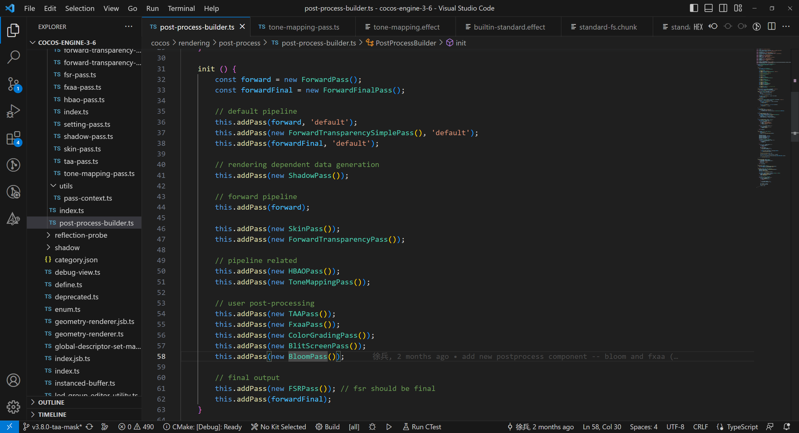
