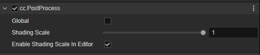

# PostProcess 组件

Post-Process 组件是 [后效](./index.md) 的辅助组件，提供后效的配置。在任何后效组件被添加后，该组件会自动添加到节点上。

## 属性

| 属性 | 说明 |
| :-- | :-- |
| **Global** | 是否是全局后效特效，启用后，所有开启了 **Use Post Process** 的相机组件都会应用该组件下所挂载的后效 |
| **Shading Scale** | 最终输出时的分辨率缩放因子，基于当前的屏幕分辨率，最大为 1，最小为  0.01 |
| **Enable Shading Scale In Editor** | 是否在编辑器中启用 **Shading Scale** |

### 说明

- 当 **Use Post Process** 属性被勾选，并给相机分配了 **Post Process** 后，PostProcess 组件的 **Global** 属性会被忽略。

- 当 **Use Post Process** 属性被勾选，并未给相机分配了 **Post Process** 后，需要在 PostProcess 组件上勾选 **Global** 属性才会时配置的后效生效。

- 假如场景内有多个 **PostProcess** 组件并添加了同样的后效组件，只有一个会生效。
