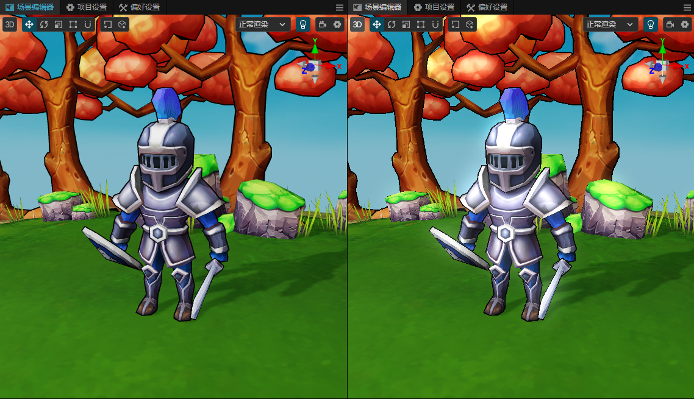

# 使用内置渲染管线

在 项目->项目设置->图形设置中选择**新渲染管线**。

</img>

默认的渲染管线为内置渲染管线**Builtin**。

## 内置渲染管线（Builtin）

内置渲染管线（Builtin）是基于可自定义渲染管线（Customizable Render Pipeline）的一种实现，提供了跨平台的基础渲染功能，适用于所有平台。

目前内置渲染管线支持以下功能：

- 前向光照
- 多重采样抗锯齿（MSAA）
- 阴影
- 后处理，包括（Bloom、Color Grading、FXAA、FSR等）

## 代码位置

内置渲染管线的实现位于 `editor/assets/default_renderpipeline/builtin-pipeline.ts`。

其中`BuiltinPipelineBuilder`类实现了内置管线的主要功能。

## 渲染流程

场景中每个相机组件，根据排序依次进行渲染，输出到屏幕或者渲染纹理。

相机组件所在节点，可以添加`BuiltinPipelineSettings`组件，对相机的渲染进行设置。

目前开启对应的功能时，需要附上所需材质以及贴图，一般以builtin开头。

</img>

## 编辑器预览（实验）

勾选`Editor Preview (Experimental)`时，可以在场景编辑器中可以直接预览渲染效果。

</img>

由于场景渲染可能附带后期效果，因此在编辑器中预览时，可能会有性能影响，以及部分编辑器效果显示异常。

## 多重采样抗锯齿（MSAA）

多重采样抗锯齿（MSAA）是一种抗锯齿技术，光照阶段通过混合不同深度的采样，消除图像边缘锯齿现象。

目前支持2x、4x的多重采样，仅在原生平台上开启。

Web 平台上，目前使用`WebGL`的`antialias`功能，通过`ENABLE_WEBGL_ANTIALIAS`宏开启。

## 渲染缩放（Shading Scale）

`Shading Scale` 是一种渲染优化技术，通过降低渲染分辨率，减少渲染负担，提高渲染性能。

比如窗口大小为 1920x1080，`Shading Scale` 为 0.5 时，渲染分辨率为 960x540。

适用于渲染压力较大的场景，同时可以配合超分辨率技术，提高画面质量。

对于最后的UI渲染，会使用原始分辨率进行渲染。

`BuiltinPipelineSettings`组件上设置的`Shading Scale`属性，仅对当前相机生效。

## 泛光（Bloom）

泛光（Bloom）是一种后处理效果，通过提取图像中的高亮部分，模糊处理后叠加到原图上，增强画面的光亮效果。

`Bloom Iteraions` 为泛光迭代次数，`Bloom Threshold` 为泛光阈值。

</img>

## 色彩分级（Color Grading）

色彩分级（Color Grading）是一种后处理效果，通过分级贴图(Grading Map LUT)，调整画面的色彩效果。

## 快速近似抗锯齿（FXAA）

快速近似抗锯齿（FXAA）是一种抗锯齿技术，通过对图像进行平滑处理，消除图像边缘锯齿现象。

</img>

## 超分辨率（FSR）

超分辨率是一种渲染技术，通过降低渲染分辨率，再通过算法提高画面质量。

目前使用的是`AMD FidelityFX Super Resolution`技术。

目前仅在`Shading Scale < 1`时生效。

## 色调映射（Tone Mapping）

色调映射（Tone Mapping）是一种后处理效果，通过调整图像的色调，提高画面的视觉效果。

目前色彩分级（Color Grading）整合了色调映射（Tone Mapping），如要自定义，需要协同修改。
