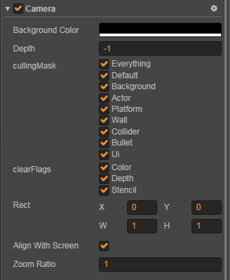
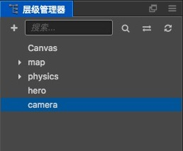
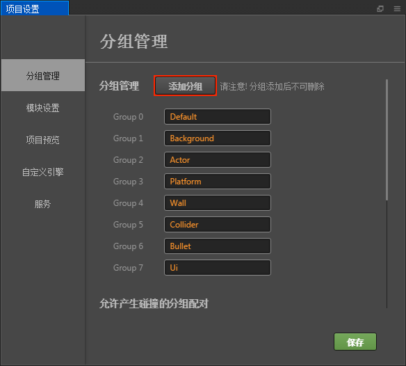
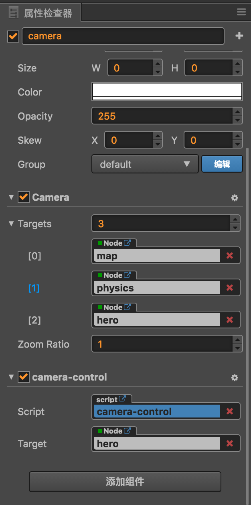

# Camera 摄像机

摄像机是玩家观察游戏世界的窗口，场景中至少需要有一个摄像机，也可以同时存在多个摄像机。创建场景时，Creator 会默认创建一个名为 `Main Camera` 的摄像机，作为这个场景的主摄像机。多摄像机的支持可以让你轻松实现高级的自定义效果，比如双人分屏效果，或者场景小地图的生成。



## 摄像机属性

- **cullingMask**

  `cullingMask` 将决定这个摄像机用来渲染场景的哪些部分。在 **属性检查器** 中的摄像机组件中的 `cullingMask` 会列出当前可以选择的 mask 选项，你可以通过勾选这些选项来组合生成 `cullingMask`。

  例如下图中的 `cullingMask` 设置表示这个摄像机只用来渲染游戏中的 UI 部分，一般游戏中的 UI 部分都是不需要移动的，而游戏节点可能会往屏幕外移动，这时需要另外的一个摄像机去跟随这个游戏节点。

  

  用户可以通过编辑器菜单栏中的 **项目 -> 项目设置 -> 分组管理** 来添加或者更改分组，这些分组即是对应的 mask。

  

- **zoomRatio**

  指定摄像机的缩放比例, 值越大显示的图像越大。

- **clearFlags**

  指定渲染摄像机时需要做的清除操作。

  

- **backgroundColor**

  当指定了摄像机需要清除颜色的时候，摄像机会使用设定的背景色来清除场景。

- **depth**

  摄像机深度，用于决定摄像机的渲染顺序。值越大，则摄像机越晚被渲染。

- **targetTexture**

  如果设置了 `targetTexture`，那么摄像机渲染的内容不会输出到屏幕上，而是会渲染到 `targetTexture` 上。

  如果你需要做一些屏幕的后期特效，可以先将屏幕渲染到 `targetTexture`，然后再对 `targetTexture` 做整体处理，最后再通过一个 `sprite` 将这个 `targetTexture` 显示出来。

  具体可以参考 **example-case**（[GitHub](https://github.com/cocos/example-projects/blob/next/assets/cases/07_render_texture/render_to_sprite.js#L31) | [Gitee](https://gitee.com/mirrors_cocos-creator/example-cases/tree/master/assets/cases/07_capture_texture)） 中的 `/assets/cases/07_render_texture/render_to_sprite.js`。

## 摄像机方法

- **cc.Camera.findCamera**

  `findCamera` 会通过查找当前所有摄像机的 `cullingMask` 是否包含节点的 `group` 来获取第一个匹配的摄像机。

  ```javascript
  cc.Camera.findCamera(node);
  ```

- **containsNode**

  检测节点是否被此摄像机影响。

- **render**

  如果你需要立即渲染摄像机，可以调用这个方法来手动渲染摄像机，比如截图的时候。

  ```javascript
  camera.render();
  ```

### 坐标转换

一个常见的问题是，当摄像机被移动，旋转或者缩放后，这时候用点击事件获取到的坐标去测试节点的坐标，这样往往是获取不到正确结果的。

因为这时候获取到的点击坐标是摄像机坐标系下的坐标了，我们需要将这个坐标转换到世界坐标系下，才能继续与节点的世界坐标进行运算。

下面是一些摄像机坐标系转换的函数

```javascript
// 将一个摄像机坐标系下的点转换到世界坐标系下
camera.getCameraToWorldPoint(point, out);
// 将一个世界坐标系下的点转换到摄像机坐标系下
camera.getWorldToCameraPoint(point, out);

// 获取摄像机坐标系到世界坐标系的矩阵
camera.getCameraToWorldMatrix(out);
// 获取世界坐标系到摄像机坐标系的矩阵
camera.getWorldToCameraMatrix(out);
```

## 截图

截图是游戏中一个非常常见的需求，通过摄像机和 RenderTexture 我们可以快速实现一个截图功能。对于截图功能，在 example-cases 中有完整的测试例，代码示例可参考 **07_capture_texture**（[GitHub](https://github.com/cocos/example-projects/tree/master/assets/cases/07_capture_texture) | [Gitee](https://gitee.com/mirrors_cocos-creator/example-cases/tree/master/assets/cases/07_capture_texture)）范例。

```javascript
let node = new cc.Node();
node.parent = cc.director.getScene();
let camera = node.addComponent(cc.Camera);

// 设置你想要的截图内容的 cullingMask
camera.cullingMask = 0xffffffff;

// 新建一个 RenderTexture，并且设置 camera 的 targetTexture 为新建的 RenderTexture，这样 camera 的内容将会渲染到新建的 RenderTexture 中。
let texture = new cc.RenderTexture();
let gl = cc.game._renderContext;
// 如果截图内容中不包含 Mask 组件，可以不用传递第三个参数
texture.initWithSize(cc.visibleRect.width, cc.visibleRect.height, gl.STENCIL_INDEX8);
camera.targetTexture = texture;

// 渲染一次摄像机，即更新一次内容到 RenderTexture 中
camera.render();

// 这样我们就能从 RenderTexture 中获取到数据了
let data = texture.readPixels();

// 接下来就可以对这些数据进行操作了
let canvas = document.createElement('canvas');
let ctx = canvas.getContext('2d');
canvas.width = texture.width;
canvas.height = texture.height;

let rowBytes = width * 4;
for (let row = 0; row < height; row++) {
    let srow = height - 1 - row;
    let imageData = ctx.createImageData(width, 1);
    let start = srow*width*4;
    for (let i = 0; i < rowBytes; i++) {
        imageData.data[i] = data[start+i];
    }

    ctx.putImageData(imageData, 0, row);
}

let dataURL = canvas.toDataURL("image/jpeg");
let img = document.createElement("img");
img.src = dataURL;
```

### 保存截图文件

Creator 从 **v2.0.2** 开始新增了保存截图文件功能。首先先截图，然后在 `readPixels` 之后使用：

```js
var data = renderTexture.readPixels();
var filePath = jsb.fileUtils.getWritablePath() + 'Image.png';
jsb.saveImageData(data, imgWidth, imgHeight, filePath)
```

详情请参考：**capture_to_native**（[GitHub](https://github.com/cocos/example-projects/tree/master/assets/cases/07_capture_texture/capture_to_native.js) | [Gitee](https://gitee.com/mirrors_cocos-creator/example-cases/blob/master/assets/cases/07_capture_texture/capture_to_native.js)）。

## 微信中的截图

**注意**：微信小游戏中由于不支持 createImageData，也不支持用 data url 创建 image，所以上面的做法需要一些变通。在使用 Camera 渲染出需要的结果后，请使用微信的截图 API：[canvas.toTempFilePath](https://developers.weixin.qq.com/minigame/dev/document/render/canvas/Canvas.toTempFilePath.html) 完成截图的保存和使用。

## 案例

具体可以参考 example-case 中的 **render_to_canvas**（[GitHub](https://github.com/cocos/example-projects/blob/next/assets/cases/07_render_texture/render_to_canvas.js) | [Gitee](https://gitee.com/mirrors_cocos-creator/example-cases/blob/next/assets/cases/07_render_texture/render_to_canvas.js)）范例。
