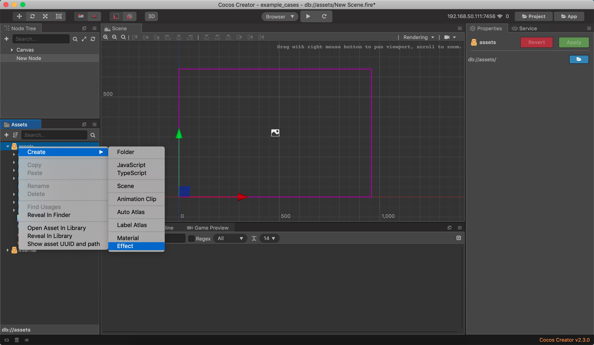
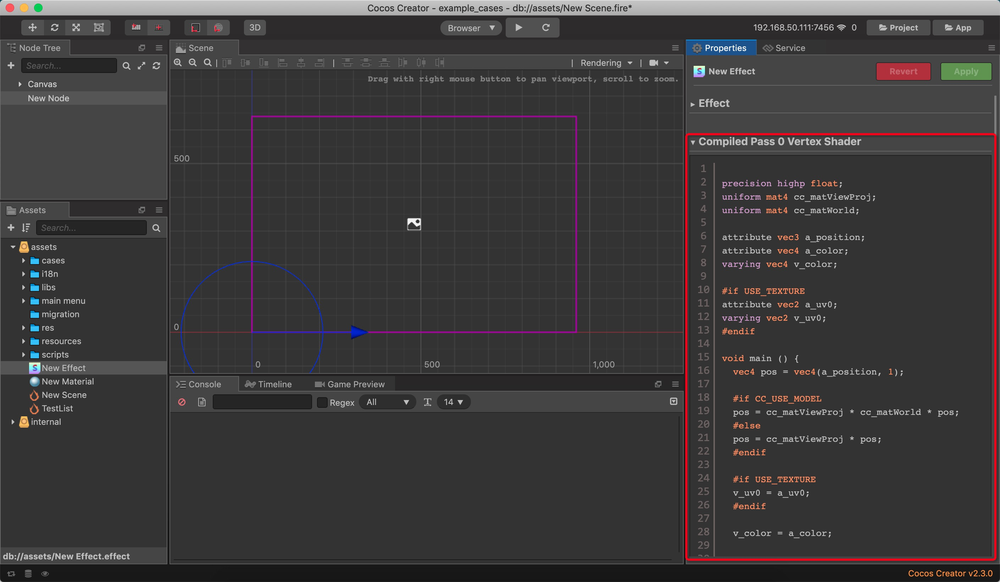
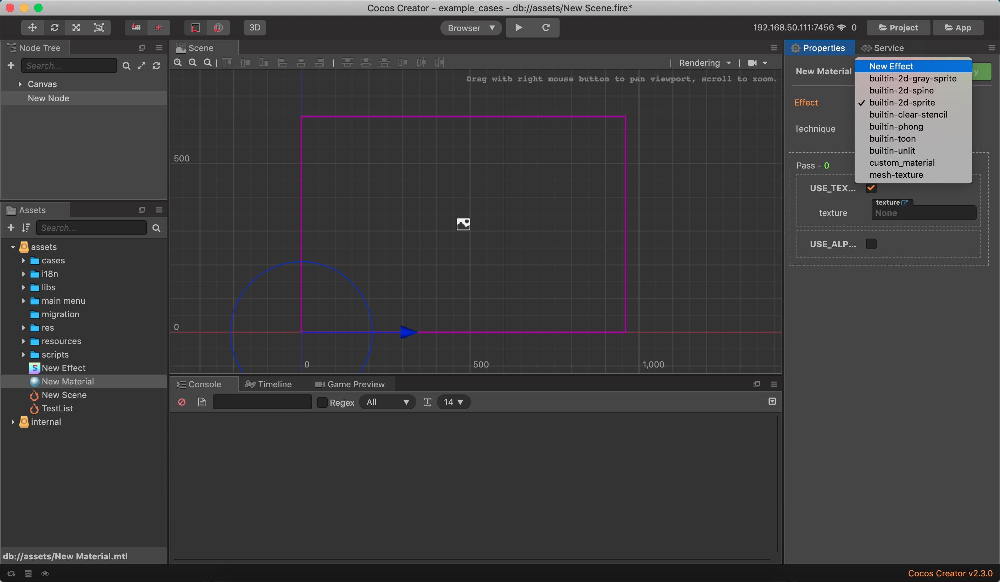

# Effect 参考

## 创建与使用 Effect

1. 在资源面板右键选择 Create => Effect 创建新的 Effect

2. 选择新建的 New Effect，在属性面板上可以预览到编译后的 glsl 代码。

3. 选择材质，在 Effect 下拉框可以看到新建的 New Effect 选项

## 书写 Effect

Cocos Creator 的 Effect 书写规则基本与 Cocos Creator 3D 一致，详细的规则可以参考 [文档](https://docs.cocos.com/creator3d/manual/zh/material-system/effect-syntax.html)
