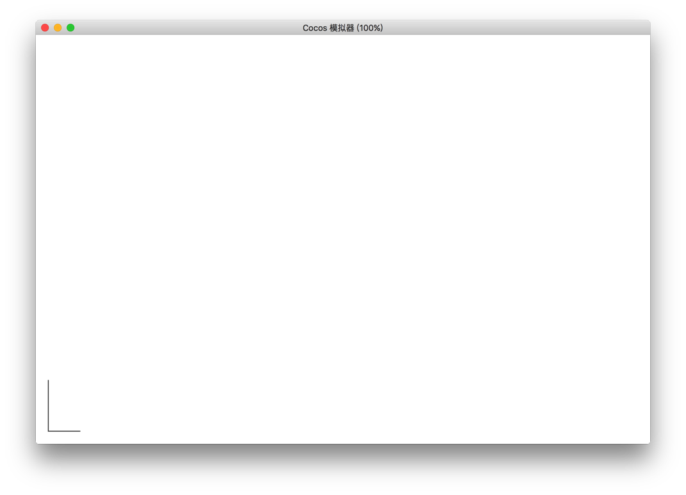

# stroke

`stroke()` 方法会实际地绘制出通过 `moveTo()` 和 `lineTo()` 等路径方法定义的路径。默认颜色是黑色。

## 实例

```javascript
var ctx = node.getComponent(cc.Graphics);
ctx.moveTo(20, 100);
ctx.lineTo(20, 20);
ctx.lineTo(70, 20);
ctx.stroke();
```



<hr>

返回 [Graphics 组件参考](../../components/graphics.md)
