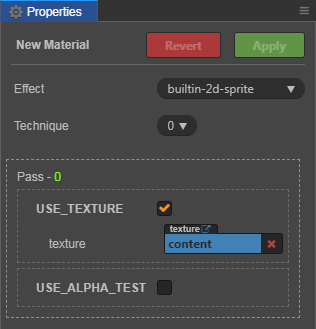

# Material 材质资源

材质资源可以用来控制渲染组件在场景中的视觉效果。简单来说材质就是用来指定物体表面的特性，如颜色、光亮程度、自发光度以及不透明度等。



## 创建材质资源

直接点击 **资源管理器** 左上方的 **+** 号按钮，然后选择 **Material** 即可创建新的材质资源。


另外一种方式是在 **资源管理器** 中选中要存放材质资源的文件夹，然后点击右键，选择 **新建 -> Material** 即可。

## 材质资源属性

| 属性       | 说明             |
| --------- | ---------------- |
| Effect    | Effect 下拉框会列出当前项目中所有的 Effect 资源，开发者可以选择当前材质使用的 Effect 资源。当切换了 Effect 后其他属性也会同步更新。<br>详情请参考 [Effect](./effect.md)。 |
| Technique | Technique 下拉框会列出当前使用的 Effect 资源中所有的 Technique。<br>Effect 资源中可能会存在多个 Technique，每个 Technique 适用于不同的情况，比如效果差一点但是性能更好的 Technique 更适合用于手机平台。<br>当切换了 Technique 后 Pass 列表也会同步更新。 |
| Pass      | Pass 列表会列出当前使用的 Technique 中所有的 Pass。<br>每个 Pass 可能会有不同的属性和定义，开发者可以分别设置这些属性和定义。如果属性是被定义包裹住的，需要先勾上定义才能看到对应的属性。 |

## 使用材质资源

1. 创建材质资源后，在 **资源管理器** 中选中新建的材质，然后在 **属性检查器** 中编辑材质的属性。编辑完成后点击右上方的 **应用** 按钮。
2. 在 **层级管理器** 中选中需要添加材质的渲染组件所在的节点，再将材质拖拽至 **属性检查器** 中渲染组件的 Materials 属性框即可。

    

## 通过脚本创建材质资源

通过脚本创建的材质分为 **共享材质** 和 **材质变体**，共享材质的修改会同步影响到材质变体。

创建共享材质需要指定使用的 effect 和 technique 索引。

- `cc.Material.createWithBuiltin(effectName: string, techniqueIndex = 0)`

- `cc.Material.create(effectAsset: cc.EffectAsset, techniqueIndex = 0)`

创建材质变体需要指定使用的 **共享材质** 和 **材质变体所属的渲染组件**。

- `cc.MaterialVariant.createWithBuiltin(materialName: string, owner: cc.RenderComponent)`
  
- `cc.MaterialVariant.create(material: cc.Material, owner: cc.RenderComponent)`

代码示例：

```js
// 创建一个共享材质，共享材质的修改将会同步到材质变体上
let material = cc.Material.createWithBuiltin('unlit');
// 材质 material 的修改会影响到 variant1 和 variant2
material.setProperty('diffuseColor', cc.Color.WHITE);

let variant1 = cc.MaterialVariant.create(material);
// 材质 variant1 修改的 diffuseColor 会覆盖掉材质 material 修改的 diffuseColor
variant1.setProperty('diffuseColor', cc.Color.RED);

let variant2 = cc.MaterialVariant.create(material);
// 材质 variant2 修改的 mainTiling 只会影响到 variant2
variant2.setProperty('mainTiling', cc.v2(0.5, 0.5));
```

## 在脚本中设置材质资源

渲染组件中使用的材质都是 **材质变体**，并且要保证这个材质变体 **只被自己所使用**。<br>
如果渲染组件中设置的材质是共享材质或者这个材质变体已经被其他渲染组件使用了，那么在设置的过程中渲染组件会根据传入的材质重新创建一个材质变体。

```js
let variant1 = cc.MaterialVariant.createWithBuiltin(cc.Material.BUILTIN_NAME.SPRITE);

// 设置材质到指定索引，一般来说 2d 渲染组件的 index 都是 0
// variant1 由于没有指定 owner render component，所以会直接被 renderComponent1 使用并且设置 owner 为 renderComponent1
renderComponent1.setMaterial(index, variant1);

// variant1 已经有 owner 了，所以内部会根据 variant1 创建一个新的材质变体
// 最好是自己新建一个 variant2 来进行设置
renderComponent2.setMaterial(index, variant1);

// 获取渲染组件中的材质
// material1 === variant1
// material2 !== variant1
let material1 = renderComponent1.getMaterial(index);
let material2 = renderComponent2.getMaterial(index);
```
