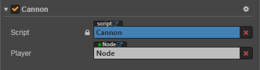
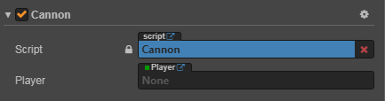
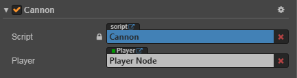

# 访问节点和组件

你可以在 **属性检查器** 里修改节点和组件，也能在脚本中动态修改。动态修改的好处是能够在一段时间内连续地修改属性、过渡属性，实现渐变效果。脚本还能够响应玩家输入，能够修改、创建和销毁节点或组件，实现各种各样的游戏逻辑。要实现这些效果，你需要先在脚本中获得你要修改的节点或组件。

在本篇教程，我们将介绍如何

- 获得组件所在的节点
- 获得其它组件
- 使用 **属性检查器** 设置节点和组件
- 查找子节点
- 全局节点查找
- 访问已有变量里的值

## 获得组件所在的节点

获得组件所在的节点很简单，只要在组件方法里访问 `this.node` 变量：

```js
start: function () {
    var node = this.node;
    node.x = 100;
}
```

## 获得其它组件

你会经常需要获得同一个节点上的其它组件，这就要用到 `getComponent` 这个 API，它会帮你查找你要的组件。

```js
start: function () {
    var label = this.getComponent(cc.Label);
    var text = this.name + 'started';

    // Change the text in Label Component
    label.string = text;
}
```

你也可以为 `getComponent` 传入一个类名。对用户定义的组件而言，类名就是脚本的文件名，并且 **区分大小写**。例如 `SinRotate.js` 里声明的组件，类名就是 `SinRotate`。

```js
var rotate = this.getComponent("SinRotate");
```

在节点上也有一个 `getComponent` 方法，它们的作用是一样的：

```js
start: function () {
    cc.log(this.node.getComponent(cc.Label) === this.getComponent(cc.Label));  // true
}
```

如果在节点上找不到你要的组件，`getComponent` 将返回 null，如果你尝试访问 null 的值，将会在运行时抛出 TypeError 这个错误。因此如果你不确定组件是否存在，请记得判断一下：

```js
start: function () {
    var label = this.getComponent(cc.Label);
    if (label) {
        label.string = "Hello";
    }
    else {
        cc.error("Something wrong?");
    }
}
```

## 获得其它节点及其组件

仅仅能访问节点自己的组件通常是不够的，脚本通常还需要进行多个节点之间的交互。例如，一门自动瞄准玩家的大炮，就需要不断获取玩家的最新位置。Cocos Creator 提供了一些不同的方法来获得其它节点或组件。

### 利用属性检查器设置节点

最直接的方式就是在 **属性检查器** 中设置你需要的对象。以节点为例，这只需要在脚本中声明一个 type 为 `cc.Node` 的属性：

```js
// Cannon.js

cc.Class({
    extends: cc.Component,
    properties: {
        // 声明 player 属性
        player: {
            default: null,
            type: cc.Node
        }
    }
});
```

这段代码在 `properties` 里面声明了一个 `player` 属性，默认值为 null，并且指定它的对象类型为 `cc.Node`。这就相当于在其它语言里声明了 `public cc.Node player = null;`。脚本编译之后，这个组件在 **属性检查器** 中看起来是这样的：


接着你就可以将 **层级管理器** 中的任意一个节点拖到这个 Player 控件：



这样一来它的 player 属性就会被设置成功，你可以直接在脚本里访问 player：

```js
// Cannon.js

cc.Class({
    extends: cc.Component,
    properties: {
        // 声明 player 属性
        player: {
            default: null,
            type: cc.Node
        }
    },

    start: function () {
        cc.log("The player is " + this.player.name);
    },

    // ...
});
```

### 利用属性检查器设置组件

在上面的例子中，如果你先通过 [模块化](./modular-script.md#require) 方式获取到脚本（例如 `Player.js`），然后再将 `Cannon.js` 中属性的 type 声明为 Player 脚本组件：

```js
// Cannon.js

// 通过模块化方式获取脚本 “Player”
var Player = require("Player");

cc.Class({
    extends: cc.Component,
    properties: {
        // 声明 player 属性，直接声明为组件类型
        player: {
            default: null,
            type: Player
        }
    },

    start: function () {
        cc.log("The player is " + this.player.name);
    },

    // ...
});
```

那么脚本编译之后，这个组件在 **属性检查器** 中看起来是这样的：



然后将挂载了 `Player.js` 的 **Player Node** 拖拽到这个组件的 `player` 属性框中：



这样 `player` 属性就相当于是这个节点上的 Player 脚本组件了，就不需要再自己手动调用 `getComponent` 来获取组件了。

还可以将属性的默认值由 `null` 改为数组 `[]`，这样你就能在 **属性检查器** 中同时设置多个对象。<br>
不过如果需要在运行时动态获取其它对象，还需要用到下面介绍的查找方法。

### 查找子节点

有时候，游戏场景中会有很多个相同类型的对象，像是炮塔、敌人和特效，它们通常都有一个全局的脚本来统一管理。如果用 **属性检查器** 来一个一个将它们关联到这个脚本上，那工作就会很繁琐。为了更好地统一管理这些对象，我们可以把它们放到一个统一的父物体下，然后通过父物体来获得所有的子物体：

```js
// CannonManager.js

cc.Class({
    extends: cc.Component,

    start: function () {
        var cannons = this.node.children;
        // ...
    }
});
```

你还可以使用 `getChildByName`：

```js
this.node.getChildByName("Cannon 01");
```

如果子节点的层次较深，你还可以使用 `cc.find`，`cc.find` 将根据传入的路径进行逐级查找：

```js
cc.find("Cannon 01/Barrel/SFX", this.node);
```

### 全局名字查找

当 `cc.find` 只传入第一个参数时，将从场景根节点开始逐级查找：

```js
this.backNode = cc.find("Canvas/Menu/Back");
```

## 访问已有变量里的值

如果你已经在一个地方保存了节点或组件的引用，你也可以直接访问它们，一般有两种方式：

### <a name="global_variable"></a>通过全局变量访问

> 你应当很谨慎地使用全局变量，当你要用全局变量时，应该很清楚自己在做什么，我们并不推荐滥用全局变量，即使要用也最好保证全局变量只读。

让我们试着定义一个全局对象 `window.Global`，这个对象里面包含了 `backNode` 和 `backLabel` 两个属性。

```js
// Globals.js, this file can have any name

window.Global = {
    backNode: null,
    backLabel: null,
};
```

由于所有脚本都强制声明为 "use strict"，因此定义全局变量时的 `window.` 不可省略。<br>
接着你可以在合适的地方直接访问并初始化 `Global`:

```js
// Back.js

cc.Class({
    extends: cc.Component,

    onLoad: function () {
        Global.backNode = this.node;
        Global.backLabel = this.getComponent(cc.Label);
    }
});
```

初始化后，你就能在任何地方访问到 `Global` 里的值：

```js
// AnyScript.js

cc.Class({
    extends: cc.Component,

    // start 会在 onLoad 之后执行，所以这时 Global 已经初始化过了
    start: function () {
        var text = 'Back';
        Global.backLabel.string = text;
    }
});
```

> 访问全局变量时，如果变量未定义将会抛出异常。<br>
> 添加全局变量时，请小心不要和系统已有的全局变量重名。<br>
> 你需要小心确保全局变量使用之前都已初始化和赋值。

### 通过模块访问

如果你不想用全局变量，你可以使用 `require` 来实现脚本的跨文件操作，让我们看个示例：

```js
// Global.js, now the filename matters

module.exports = {
    backNode: null,
    backLabel: null,
};
```

每个脚本都能用 `require` + 文件名(不含路径) 来获取到对方 exports 的对象。

```js
// Back.js

// this feels more safe since you know where the object comes from
var Global = require("Global");

cc.Class({
    extends: cc.Component,

    onLoad: function () {
        Global.backNode = this.node;
        Global.backLabel = this.getComponent(cc.Label);
    }
});
```

```js
// AnyScript.js

// this feels more safe since you know where the object comes from
var Global = require("Global");

cc.Class({
    extends: cc.Component,

    // start 会在 onLoad 之后执行，所以这时 Global 已经初始化过了
    start: function () {
        var text = "Back";
        Global.backLabel.string = text;
    }
});
```

更详细内容，请参考 [模块化](modular-script.md)。
