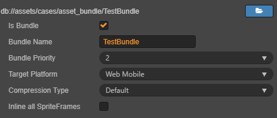
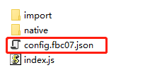

# 配置和加载 Asset Bundle

> 文：Santy-Wang、Xunyi

随着游戏玩法越来越丰富，游戏中的资源数量越来越多，开发者对于拆分包体的需求也越来越强烈。所以从 v2.4 开始，Cocos Creator 推出了 **Asset Bundle** 功能，支持 **代码**、**资源** 和 **场景** 的分包加载。

开发者可将项目中的部分场景、资源、代码等内容划分到不同的 Asset Bundle 中，这些 Asset Bundle 不会在游戏启动时加载，而是由开发者在游戏过程中手动调用 `loadBundle` 进行加载，从而有效降低游戏启动的时间，尽可能做到按需加载。

关于 Asset Bundle 的更多介绍，请参考 [Asset Bundle](../asset-manager/bundle.md)。

## 配置方法

Asset Bundle 是以 **文件夹** 为单位进行配置的。当我们在 **资源管理器** 中选中一个文件夹时，**属性检查器** 中就会出现一个 **配置为 Bundle** 的选项，勾选后会出现如下图的配置项：



| 配置项 | 功能说明|
| :---  | :---- |
| Bundle 名称   | Asset Bundle 构建后的名称，默认会使用这个文件夹的名字，可根据需要修改。 |
| Bundle 优先级 | Creator 开放了 10 个可供配置的优先级，构建时将会按照优先级 **从大到小** 的顺序对 Asset Bundle 依次进行构建。具体内容请参考 [Asset Bundle - 优先级](../asset-manager/bundle.md#%E4%BC%98%E5%85%88%E7%BA%A7)。 |
| 目标平台      | 不同平台可使用不同的配置，构建时将根据对应平台的设置来构建 Asset Bundle。|
| 压缩类型      | 决定 Asset Bundle 最后的输出形式，包括 **默认**、**无压缩**、**合并所有 JSON**、**小游戏分包**、**Zip** 5 种压缩类型。具体内容请参考 [Asset Bundle - 压缩类型](../asset-manager/bundle.md#%E5%8E%8B%E7%BC%A9%E7%B1%BB%E5%9E%8B) |
| 配置为远程包  | 是否将 Asset Bundle 配置为远程包，不支持 Web 平台。<br>若勾选了该项，则 Asset Bundle 在构建后会被放到 **remote** 文件夹，你需要将整个 **remote** 文件夹放到远程服务器上。<br>构建 OPPO、vivo、华为等小游戏平台时，若勾选了该项，则不会将 Asset Bundle 打包到 rpk 中。 |

配置完成后点击右上方的 **应用** 按钮，这个文件夹就被配置为 Asset Bundle 了，然后在 **构建发布** 面板选择对应的平台进行构建。

**注意**：
1. Creator 有 4 个 [内置 Asset Bundle](../asset-manager/bundle.md#%E5%86%85%E7%BD%AE-asset-bundle)，包括 **resources**、**internal**、**main**、**start-scene**，在设置 **Bundle 名称** 时请不要使用这四个名称。
2. [小游戏分包](../publish/subpackage.md) 只能放在本地，不能配置为远程包。所以当 **压缩类型** 设置为 **小游戏分包** 时，**配置为远程包** 项不可勾选。
3. Zip 压缩类型主要是为了降低网络请求数量，如果放在本地，不用网络请求，则没什么必要。所以要求与 **配置为远程包** 搭配使用。

## 构建

在构建时，配置为 Asset Bundle 的文件夹中的资源（包含场景、代码和其他资源）以及文件夹外的相关依赖资源都会被合并到同一个 Asset Bundle 文件夹中。比如场景 A 放在 a 文件夹中，当 a 文件夹配置为 Asset Bundle 后，场景 A 以及它所依赖的资源都会被合并到 Asset Bundle a 文件夹中。

构建完成后，这个 Asset Bundle 文件夹会被打包到对应平台发布包目录下的 **assets** 文件夹中。但有以下两种特殊情况：
- 配置 Asset Bundle 时，若勾选了 **配置为远程包**，则这个 Asset Bundle 文件夹会被打包到对应平台发布包目录下的 **remote** 文件夹中。
- 配置 Asset Bundle 时，若设置了 **压缩类型** 为 **小游戏分包**，则这个 Asset Bundle 文件夹会被打包到对应平台发布包目录下的 **subpackages** 文件夹中。

**assets**、**remote**、**subpackages** 这三个文件夹中包含的每个文件夹都是一个 Asset Bundle。

例如：将 example 工程中的 **cases/01_graphics** 文件夹在 Web Mobile 平台配置为 Asset Bundle，那么项目构建后将会在发布包目录下的 **assets** 中生成 **01_graphics** 文件夹，**01_graphics** 文件夹就是一个 Asset Bundle。


<!--
**注意**：在配置 Asset Bundle 时，若设置了 **压缩类型** 为 **小游戏分包**，那么请不要将构建后生成在 **subpackages** 文件夹中的 Asset Bundle 移出，对应平台比如微信小游戏会自行做相关处理。
-->

## 加载 Asset Bundle

引擎提供了一个统一的 API `cc.assetManager.loadBundle` 来加载 Asset Bundle，加载时需要传入 Asset Bundle 配置面板中的 **Bundle 名称** 或者 Asset Bundle 的 **url**。但当你复用其他项目的 Asset Bundle 时，则只能通过 **url** 进行加载。使用方法如下：

```js
cc.assetManager.loadBundle('01_graphics', (err, bundle) => {
    bundle.load('xxx');
});

// 当复用其他项目的 Asset Bundle 时
cc.assetManager.loadBundle('https://othergame.com/remote/01_graphics', (err, bundle) => {
    bundle.load('xxx');
});
```

另外，从 v2.4.3 开始，`cc.assetManager.loadBundle` 还支持传入用户空间中的路径来加载用户空间中的 Asset Bundle。通过对应平台提供的下载接口将 Asset Bundle 提前下载到用户空间中，然后再使用 `loadBundle` 进行加载，开发者就可以完全自己管理 Asset Bundle 的下载与缓存过程，更加灵活。例如：

```js
// 提前下载某个 Asset Bundle 到用户空间 pathToBundle 目录下。需要保证用户空间下的 Asset Bundle 和对应原始 Asset Bundle 的结构和内容完全一样
// ...

// 通过 Asset Bundle 在用户空间中的路径进行加载
// 原生平台
cc.assetManager.loadBundle(jsb.fileUtils.getWritablePath() + '/pathToBundle/bundleName', (err, bundle) => {
    // ...
});

// 微信小游戏平台
cc.assetManager.loadBundle(wx.env.USER_DATA_PATH + '/pathToBundle/bundleName', (err, bundle) => {
    // ...
});
```

**注意**：在配置 Asset Bundle 时，若勾选了 **配置为远程包**，那么构建时请在 **构建发布** 面板中填写 **资源服务器地址**。

在通过 API 加载 Asset Bundle 时，引擎并没有加载 Asset Bundle 中的所有资源，而是加载 Asset Bundle 的 **资源清单**，以及包含的 **所有脚本**。<br>
当 Asset Bundle 加载完成后，会触发回调并返回错误信息和 `cc.AssetManager.Bundle` 类的实例，这个实例就是 Asset Bundle API 的主要入口，开发者可以使用它去加载 Asset Bundle 中的各类资源。

### Asset Bundle 的版本

Asset Bundle 在更新上延续了 Creator 的 MD5 方案。当你需要更新远程服务器上的 Asset Bundle 时，请在 **构建发布** 面板中勾选 **MD5 Cache** 选项，此时构建出来的 Asset Bundle 中的 `config.json` 文件名会附带 Hash 值。如图所示：



在加载 Asset Bundle 时 **不需要** 额外提供对应的 Hash 值，Creator 会在 `settings.js` 中查询对应的 Hash 值，并自动做出调整。<br>
但如果你想要将相关版本配置信息存储在服务器上，启动时动态获取版本信息以实现热更新，你也可以手动指定一个版本 Hash 值并传入 `loadBundle` 中，此时将会以传入的 Hash 值为准：

```js
cc.assetManager.loadBundle('01_graphics', {version: 'fbc07'}, function (err, bundle) {
    if (err) {
        return console.error(err);
    }
    console.log('load bundle successfully.');
});
```

这样就能绕过缓存中的老版本文件，重新下载最新版本的 Asset Bundle。

## 加载 Asset Bundle 中的资源

在 Asset Bundle 加载完成后，返回了一个 `cc.AssetManager.Bundle` 类的实例。我们可以通过实例上的 `load` 方法来加载 Asset Bundle 中的资源，此方法的参数与 `cc.resources.load` 相同，只需要传入资源相对 Asset Bundle 的路径即可。但需要注意的是，路径的结尾处 **不能** 包含文件扩展名。

```js
// 加载 Prefab
bundle.load(`prefab`, cc.Prefab, function (err, prefab) {
    let newNode = cc.instantiate(prefab);
    cc.director.getScene().addChild(newNode);
});

// 加载 Texture
bundle.load(`image`, cc.Texture2D, function (err, texture) {
    console.log(texture)
});
```

与 `cc.resources.load` 相同，`load` 方法也提供了一个类型参数，这在加载同名资源或者加载 SpriteFrame 时十分有效。

```js
// 加载 SpriteFrame
bundle.load(`image`, cc.SpriteFrame, function (err, spriteFrame) {
    console.log(spriteFrame);
});
```

### 批量加载资源

Asset Bundle 提供了 `loadDir` 方法来批量加载相同目录下的多个资源。此方法的参数与 `cc.resources.loadDir` 相似，只需要传入该目录相对 Asset Bundle 的路径即可。

```js
// 加载 textures 目录下的所有资源
bundle.loadDir("textures", function (err, assets) {
    // ...
});

// 加载 textures 目录下的所有 Texture 资源
bundle.loadDir("textures", cc.Texture2D, function (err, assets) {
    // ...
});
```

### 加载场景

Asset Bundle 提供了 `loadScene` 方法用于加载指定 bundle 中的场景，你只需要传入 **场景名** 即可。<br>
`loadScene` 与 `cc.director.loadScene` 不同的地方在于 `loadScene` 只会加载指定 bundle 中的场景，而不会运行场景，你还需要使用 `cc.director.runScene` 来运行场景。

```js
bundle.loadScene('test', function (err, scene) {
    cc.director.runScene(scene);
});
```

## 获取 Asset Bundle

当 Asset Bundle 被加载过之后，会被缓存下来，此时开发者可以使用 Asset Bundle 名称来获取该 bundle。例如：

```js
let bundle = cc.assetManager.getBundle('01_graphics');
```

## 预加载资源

除了场景，其他资源也可以进行预加载。预加载的加载参数和正常加载时一样，不过因为预加载只会去下载必要的资源，并不会进行资源的反序列化和初始化工作，所以性能消耗更小，更适合在游戏过程中使用。

Asset Bundle 中提供了 `preload` 和 `preloadDir` 接口用于预加载 Asset Bundle 中的资源。具体的使用方式和 `cc.assetManager` 一致，详情可参考文档 [预加载与加载](../asset-manager/preload-load.md)。

## 释放 Asset Bundle 中的资源

在资源加载完成后，所有的资源都会被临时缓存到 `cc.assetManager` 中，以避免重复加载。当然，缓存中的资源也会占用内存，有些资源如果不再需要用到，可以通过以下三种方式进行释放：

1. 使用常规的 `cc.assetManager.releaseAsset` 方法进行释放。

    ```js
    bundle.load(`image`, cc.SpriteFrame, function (err, spriteFrame) {
        cc.assetManager.releaseAsset(spriteFrame);
    });
    ```

2. 使用 Asset Bundle 提供的 `release` 方法，通过传入路径和类型进行释放，只能释放在 Asset Bundle 中的单个资源。参数可以与 Asset Bundle 的 `load` 方法中使用的参数一致。

    ```js
    bundle.load(`image`, cc.SpriteFrame, function (err, spriteFrame) {
        bundle.release(`image`, cc.SpriteFrame);
    });
    ```

3. 使用 Asset Bundle 提供的 `releaseAll` 方法，此方法与 `cc.assetManager.releaseAll` 相似，`releaseAll` 方法会释放所有属于该 bundle 的资源（包括在 Asset Bundle 中的资源以及其外部的相关依赖资源），请慎重使用。

    ```js
    bundle.load(`image`, cc.SpriteFrame, function (err, spriteFrame) {
        bundle.releaseAll();
    });
    ```

**注意**：在释放资源时，Creator 会自动处理该资源的依赖资源，开发者不需要对其依赖资源进行管理。

更多资源释放相关的内容，可参考文档 [资源释放](../asset-manager/release-manager.md)。

## 移除 Asset Bundle

在加载了 Asset Bundle 之后，此 bundle 会一直存在整个游戏过程中，除非开发者手动移除。当手动移除了某个不需要的 bundle，那么此 bundle 的缓存也会被移除，如果需要再次使用，则必须再重新加载一次。

```js
let bundle = cc.assetManager.getBundle('bundle1');
cc.assetManager.removeBundle(bundle);
```

**注意**：在移除 Asset Bundle 时，并不会释放该 bundle 中被加载过的资源。如果需要释放，请先使用 Asset Bundle 的 `release` / `releaseAll` 方法：

```js
let bundle = cc.assetManager.getBundle('bundle1');
// 释放在 Asset Bundle 中的单个资源
bundle.release(`image`, cc.SpriteFrame);
cc.assetManager.removeBundle(bundle);

let bundle = cc.assetManager.getBundle('bundle1');
// 释放所有属于 Asset Bundle 的资源
bundle.releaseAll();
cc.assetManager.removeBundle(bundle);
```
