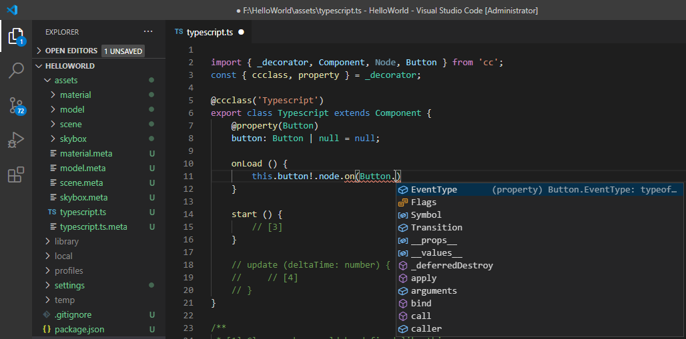
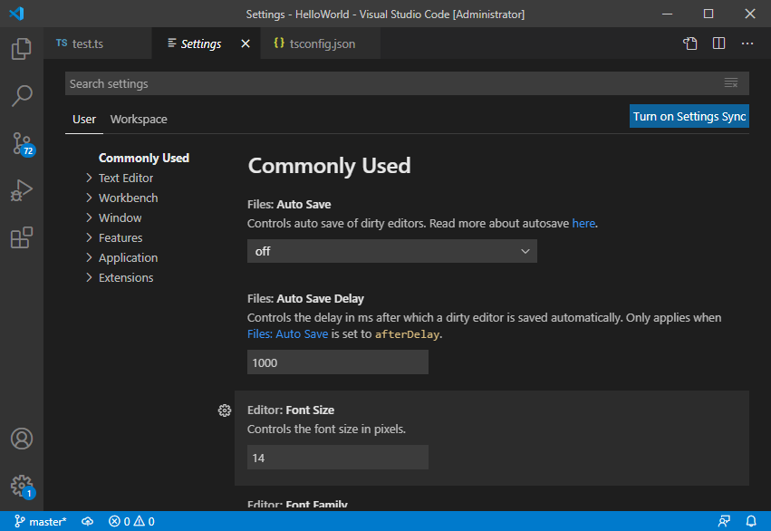
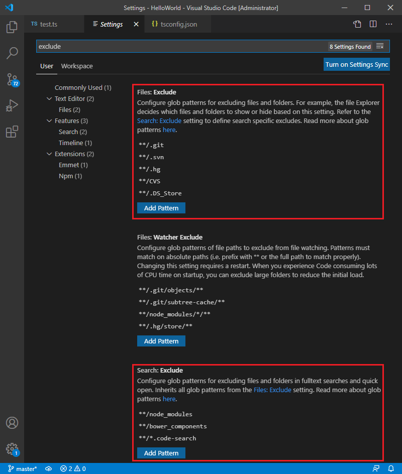
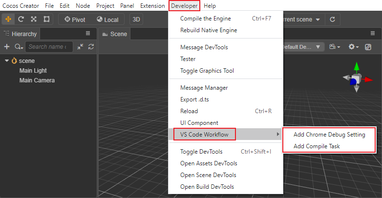
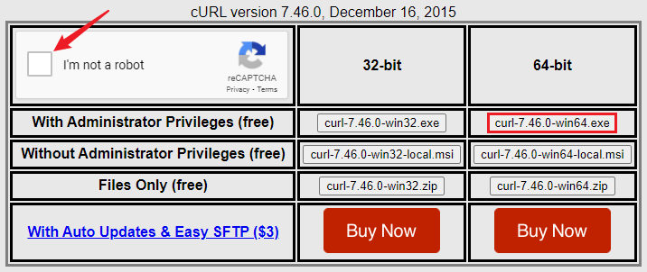
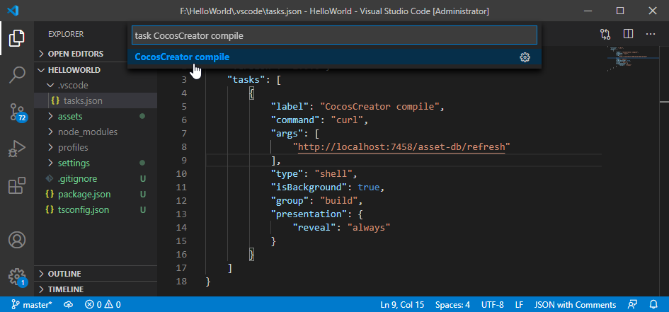
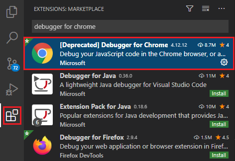
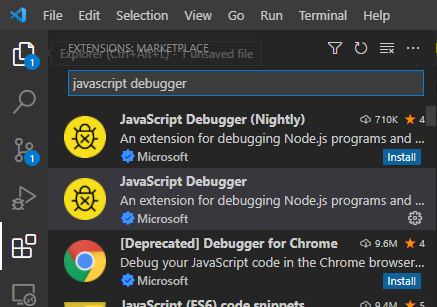
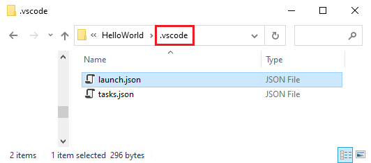
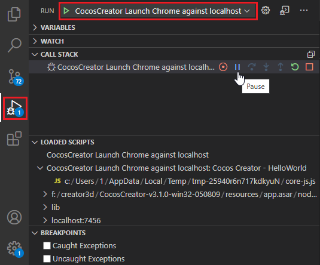

# 配置代码编辑环境

在 **偏好设置** 面板中指定了 [默认脚本编辑器](../editor/preferences/index.md#%E5%A4%96%E9%83%A8%E7%A8%8B%E5%BA%8F)，便可以在 **资源管理器** 中双击脚本文件打开代码编辑器快速编辑代码。本篇内容主要以 Visual Studio Code 为例介绍如何配置开发环境。

[Visual Studio Code](https://code.visualstudio.com/) （以下简称 VS Code）是微软推出的轻量化跨平台 IDE，支持 Windows、Mac、Linux 平台，安装和配置非常简单。使用 VS Code 管理和编辑项目脚本代码，可以轻松实现语法高亮、智能代码提示、网页调试等功能。

## 安装 VS Code

前往 VS Code 的 [官方网站](https://code.visualstudio.com/)，点击首页的下载链接即可下载。

MacOS 用户解压下载包后双击 **Visual Studio Code** 即可运行。

Windows 用户下载后运行 **VSCodeUserSetup.exe** 按提示完成安装即可运行。

## 智能提示数据

Cocos Creator 3.x 在创建项目时，项目目录下会自动生成一个 [tsconfig.json](tsconfig.md) 文件，里面配置了一个代码提示用的目录文件路径，用 VS Code 打开项目编写代码时便会自动提示 Cocos Creator 引擎 API。若项目升级，引擎 API 也会自动更新。

启动 VS Code 后选择主菜单的 **File -> Open Folder...**，在弹出的对话框中选择项目根目录，也就是 `assets`、`project.json` 所在的路径。然后新建一个脚本，或者打开原有的脚本进行编辑时，就会有语法提示了。



> **注意**：当使用自定义引擎，或者切换使用内置引擎/自定义引擎时，若出现 API 智能提示不更新的情况，请执行以下步骤以获得最新的代码智能提示：
>
> 1. 删除自定义引擎中 `bin` 目录（内置引擎是 `resources\resources\3d\engine\bin` 目录）下的 `cache` 文件夹
> 2. 在引擎目录下执行 `npm run build-declaration`

## 设置文件显示和搜索过滤

在 VS Code 的主菜单中选择 **文件（Windows）／Code（Mac）-> 首选项 -> 设置**，或者选择左下角  中的 **Setting** 选项，这个操作会打开用户配置文件 **USER SETTINGS**：



此时在上方的搜索框中输入 **exclude** 搜索，找到 **Files: Exclude** 和 **Search: Exclude** 模块：



然后点击 **添加模式** 补充以下内容中缺少的部分：

```json
{
    "files.exclude": {
        "**/.git": true,
        "**/.DS_Store": true,
        "**/*.meta": true,
        "library/": true,
        "local/": true,
        "temp/": true
    },

    "search.exclude": {
        "**/node_modules": true,
        "**/bower_components": true,
        "build/": true,
        "temp/": true,
        "library/": true,
        "**/*.anim": true
    }
}
```

以上字段将为 VS Code 设置搜索时排除的目录，以及在文件列表中隐藏的文件类型。由于 `build`、`temp`、`library` 都是编辑器运行时自动生成的路径，而且会包含我们写入的脚本内容，所以应该在搜索中排除。而 `assets` 目录下的每个文件都会生成一个 `.meta` 文件，一般来说我们不需要关心它的内容，只要让编辑器帮我们管理这些文件就可以了。

## VS Code 扩展使用

Cocos Creator 在顶部菜单栏的 **开发者 -> VS Code 工作流** 中集成了 **添加编译任务** 和 **添加 Chrome Debug 配置** 功能，以便更好地辅助开发：



- **添加编译任务**：用于在 VS Code 中触发 Creator 的脚本编译，详情请参考下文 **使用 VS Code 激活脚本编译** 部分的内容。

- **添加 Chrome Debug 配置**：用于调试网页版游戏，详情请参考下文 **使用 VS Code 调试网页版游戏** 部分的内容。

### 使用 VS Code 激活脚本编译

使用外部脚本编辑器修改项目脚本后，需要返回 Cocos Creator 以触发脚本编译。<br>
我们在 Creator 中提供了 **添加编译任务** 功能，通过一个预览服务器的 API 向特定地址发送请求来激活 Creator 的编译，这样在外部脚本编辑器修改了项目脚本后，执行 **编译任务** 便可触发脚本编译，不需要返回 Cocos Creator。

#### 安装 cURL

首先需要确保操作系统中可以运行 [cURL 命令](https://curl.haxx.se/)，如果在 Windows 操作系统的命令行中运行 `curl` 提示找不到命令，则需要先安装 curl 到操作系统：

- 前往 <http://www.confusedbycode.com/curl/>

- 点击下图箭头所示的控件，完成人机身份验证（若无法正常显示控件，请科学上网）

    

- 点击 `curl-7.46.0-win64.exe` 开始下载并安装

安装时请使用默认设置，安装完成后可以打开一个命令行窗口，输入 `curl`，如果提示 `curl: try 'curl --help' or 'curl --manual' for more information` 就表示安装成功了。

#### 添加 VS Code 编译任务

要在 VS Code 中激活脚本编译，需要执行以下步骤：

1. 在 Creator 顶部菜单栏点击 **开发者 -> VS Code Workflow -> 添加编译任务**，该操作会在项目目录的 `.vscode` 文件夹下添加 `tasks.json` 任务配置文件。

    

2. 在 VS Code 里按下快捷键 <kbd>Cmd/Ctrl + P</kbd>，激活 **快速打开** 输入框，然后输入 `task CocosCreator compile`，选择 `CocosCreator compile`。

    

    然后选择输出类型：

    

3. 任务运行完成，会在 VS Code 窗口下方的输出面板中显示结果（根据 VS Code 版本及配置的不同，输出结果也会有所差异）。

这样之后在 VS Code 编辑脚本完成后，执行第 2 个步骤便可触发 Creator 的脚本编译，不需要返回 Creator。

VS Code 还可以为编译任务配置快捷键，在主菜单中选择 **文件（Windows）／Code（Mac）-> 首选项 -> 键盘快捷方式**，或者选择左下角  中的 **键盘快捷方式** 选项，这个操作会打开快捷键配置文件。然后根据需要修改编译任务的快捷键，例如下图将其设置成了 <kbd>Cmd/Ctrl + Shift + B</kbd>：


之后在 VS Code 中按下快捷键 <kbd>Cmd/Ctrl + Shift + B</kbd> 便会自动显示 `CocosCreator compile`，不需要手动搜索。

更多关于 VS Code 中配置和执行任务的信息，请参考 [Integrate with External Tools via Tasks](https://code.visualstudio.com/docs/editor/tasks) 文档。

### 使用 VS Code 调试网页版游戏

VS Code 有着优秀的调试能力，我们可以直接在源码工程中调试网页版游戏程序。

首先需要安装：

- [Chrome（谷歌浏览器）](https://www.google.com/chrome/)

- VS Code 插件：

    - Debugger for Chrome

    点击 VS Code 左侧导航栏的 **扩展** 按钮打开扩展面板，在搜索框中输入 **Debugger for Chrome** 并点击安装。安装之后可能需要重启 VS Code 才能生效。

    

    - JavaScript Debugger：由于 Debug for Chrome 已废弃，开发者也可在 VS Code 的插件栏内搜索 **JavaScript Debugger** 以启用新的调试插件

    

接下来在 Cocos Creator 顶部菜单栏中点击 **开发者 -> VS Code 工作流 -> 添加 Chrome Debug 配置**，这个菜单命令会在项目文件夹下添加一个 `.vscode/launch.json` 文件作为调试器的配置：



之后便可以在 VS Code 中点击左侧栏的 **调试** 按钮打开调试面板，并在最上方的调试配置中选择 `Cocos Creator Launch Chrome against localhost`，然后点击左侧绿色的开始按钮进行调试。



调试的时候依赖 Cocos Creator 编辑器内置的 Web 服务器，所以需要在编辑器启动状态下才能进行调试。如果编辑器预览游戏时使用的端口不是默认端口，则需要手动修改 `launch.json` 里的 `url` 字段，将正确的端口添加上去。

调试过程中可以在源码文件上直接下断点，进行监控，是比使用 Chrome 内置的 DevTools 调试更方便和友好的工作流程。

## 学习 VS Code 的使用方法

前往 [VS Code 官网文档](https://code.visualstudio.com/Docs)，了解从编辑功能操作、个性化定制、语法高亮设置到插件扩展等各方面的使用方法。
