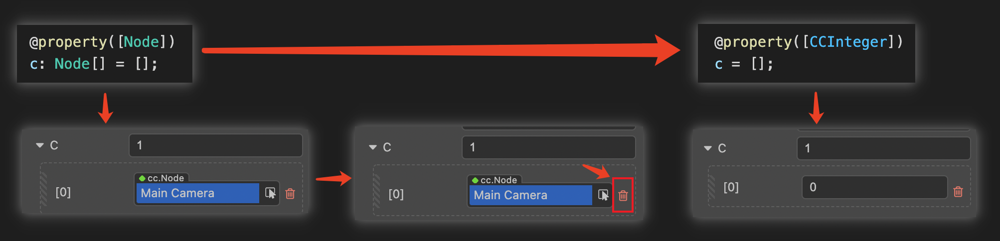

# 装饰器使用

## cc 类

将装饰器 [ccclass](#ccclass) 应用在类上时，此类称为 cc 类。<br>
cc 类注入了额外的信息以控制 Cocos Creator 3.0 对该类对象的序列化、编辑器对该类对象的展示等。因此，未声明 `ccclass` 的组件类，也无法作为组件添加到节点上。

### ccclass

cc 类的各种特性是通过 `ccclass(name)` 的参数来指定的。

参数 `name` 指定了 cc 类的名称，cc 类名是 **独一无二** 的。当需要获取相应的 cc 类时，可以通过其 cc 类名来查找，例如：

- 序列化。若对象是 cc 类对象，则在序列化时将记录该对象的 cc 类名，反序列化时将根据此名称找到相应的 cc 类进行序列化。

- 当 cc 类是组件类时，`Node` 可以通过组件类的 cc 类名查找该组件。

## cc 属性

当装饰器 [property](#property) 应用在 cc 类的属性或访问器上时，此属性称为 cc 属性。

与 cc 类类似，cc 属性注入了额外的信息以控制 Cocos Creator 3.0 对该属性的序列化、编辑器对该属性的展示等。

### property

cc 属性的各种特性是通过 `property()` 的参数来指定的。可选择参数可以参考：[属性参数](./reference/attributes.md)

property 写法参考如下：

```ts
@property({
    type: Node,
    visible: true,
})
targetNode: Node | null = null; // 等价于 targetNode: Node = null!;
```

接着，下方会罗列出一些常用属性参数写法。

### type

选项 `type` 指定了属性的 cc 类型。可以通过以下几种形式的参数指定类型：

- Cocos Creator 3.0 内置属性类型标识

  `CCInteger`、`CCFloat`、`CCBoolean`、`CCString` 是内置属性类型标识，一般作用于数组属性。非数组类型通常不用声明类型。
  - `CCInteger` 声明类型为 **整数**；
  - `CCFloat` 声明类型为 **浮点数**；
  - `CCString` 声明类型为 **字符串**；
  - `CCBoolean` 声明类型为 **布尔值**。

- 非内置属性类型标识的 cc 类属性

  所有的 cc 类属性 **都需要指定类型**，否则编辑器无法识别类型，序列化也无法写入正确类型。

- 数组

  当内置属性类型标识或者 cc 类作为数组元素时，属性会被指定为 **Cocos Creator 3.0 数组**。例如 `[CCInteger]`、`[Node]` 将分别以整数数组和节点数组的形式展示该属性。

若属性未指定 cc 类型，Cocos Creator 3.0 将从属性的默认值或初始化式的求值结果推导其 cc 类型：

- 若值的类型是 Javascript 原始类型 `number`、`string`、`boolean`，则其 cc 类型分别为 Creator 的浮点数、字符串，以及布尔值。
- 其他的则表示属性的类型是 **未定义** 的，编辑器上会提示 `Type(Unknown)` 字样。

> **注意**：
>
> 1. 当 Javascript 内置构造函数 `Number`、`String`、`Boolean` 用作 cc 类型时将给出警告，并且将分别视为 cc 类型中的 `CCFloat`、`CCString`、`CCBoolean`。已经初始化的数组属性修改类型后，需要手动清除掉原来的数组数据，重新赋值，否则会因为数据类型不一致，导致数据错乱。
>
>     
>
> 2. 需要给编辑器使用的序列化属性，属性名开头不应该带 `_`，否则会识别为 private 属性，private 属性不会在编辑器组件属性面板上显示。

下列代码演示了不同 cc 类型的 cc 属性声明：

```ts
import { _decorator, CCInteger, Node, Enum } from 'cc';
const { ccclass, property, integer, float, type } = _decorator;

enum A {
    c,
    d
}
Enum(A);

@ccclass
class MyClass {
    @property // Javascript 原始类型，根据默认值自动识别为 Creator 的浮点数类型。
    index = 0;

    @property(Node) // 声明属性 cc 类型为 Node。当属性参数只有 type 时可这么写，等价于 @property({type: Node})
    targetNode: Node | null = null; // 等价于 targetNode: Node = null!;

    // 声明属性 children 的 cc 类型为 Node 数组
    @property({
        type: [Node]
    }) 
    children: Node[] = [];

    @property({
        type: String,
    }) // 警告：不应该使用构造函数 String。等价于 CCString。也可以选择不声明类型                
    text = '';

    @property
    children2 = []; // 未声明 cc 类型，从初始化式的求值结果推断元素为未定义的数组

    @property
    _valueB = 'abc'; // 此处 '_' 开头的属性，只序列化，不会在编辑器属性面板显示

    @property({ type: A })
    accx : A = A.c;
}
```

为了方便，额外提供几种装饰器以快速声明 cc 类型。针对只定义了 type 的属性使用：

|  装饰器   | 对应的 property 写法   |
| :-------- | :---------------- |
| @type(t)  | @property(t)  |
| @integer  | @property(CCInteger)  |
| @float    | @property(CCFloat)    |

```ts
import { _decorator, CCInteger, Node } from 'cc';
const { ccclass, property, integer, float, type } = _decorator;
@ccclass
class MyClass {
    @integer // 声明属性的 cc 类型为整数
    index = 0;

    @type([Node]) // 声明属性 children 的 cc 类型为 Node 数组
    children: Node[] = [];

    @type(String) // 警告：不应该使用构造函数 String。等价于 CCString。也可以选择不声明类型                
    text = '';
    // Javascript 原始类型 `number`、`string`、`boolean` 通常可以不用声明
    // 可以直接写
    @property
    text = '';
}
```

<!-- ### 默认值

选项 `default` 指定了 cc 属性的默认值。详情可参考下方的 [default 参数](#default%E5%8F%82%E6%95%B0) 介绍。 -->

<!-- ### 构造函数

#### 通过 constructor 定义

CCClass 的构造函数使用 `constructor` 定义，为了保证反序列化始终能正确运行，`constructor` **不允许** 定义 **构造参数**。

> 开发者如果确实需要使用构造参数，可以通过 `arguments` 获取，但要记得如果这个类会被序列化，必须保证构造参数都缺失的情况下仍然能 new 出对象。 -->

<!-- ### default

`default` 用于声明属性的默认值，声明了默认值的属性会被 CCClass 实现为成员变量。默认值只有在 **第一次** 创建对象的时候才会使用，也就是说修改属性默认值并不会改变已经添加到场景中的组件属性的当前值。

> 当开发者在 **属性检查器** 中添加了一个组件，然后再回到脚本中修改属性默认值的话，**属性检查器** 中组件的属性值是不会发生变化的，因为组件中属性的当前值已经序列化到场景中，不再是第一次创建时用的默认值了。如果要强制把组件的所有属性设回默认值，可以在 **属性检查器** 中组件右上方的设置按钮中选择 **Reset**。

`default` 允许设置为以下几种值类型：

1. 任意 `number`、`string` 或 `boolean` 类型的值
2. `null` 或 `undefined`
3. 继承自 `ValueType` 的子类，如 `Vec3`、`Color` 或 `Rect` 的实例化对象：

    ```typescript
    @property({ type: Vec3 })
    pos = null;
    ```

4. 空数组 `[]` 或空对象 `{}` -->

### visible 参数

一般情况下，属性是否显示在 **属性检查器** 中取决于属性名是否以 `_` 开头。**如果是以 `_` 开头，则不显示**。

如果要强制显示在 **属性检查器** 中，可以设置 `visible` 参数为 true：

```typescript
@property({ visible: true })
private _num = 0;
```

如果要强制隐藏，可以设置 `visible` 参数为 false：

```typescript
@property({ visible: false })
num = 0;
```

### serializable 参数

属性默认情况下都会被序列化，序列化后就会将编辑器中设置好的属性值保存到场景等资源文件中，之后在加载场景时就会自动还原成设置好的属性值。如果不想序列化，可以设置 `serializable: false`。

```typescript
@property({ serializable: false })
num = 0;
```

### override 参数

所有属性都会被子类继承，如果子类要覆盖父类同名属性，需要显式设置 override 参数，否则会有重名警告：

```typescript
@property({ tooltip: "my id", override: true })
id = "";
```

更多参数内容请查阅 [属性参数](./reference/attributes.md)。
