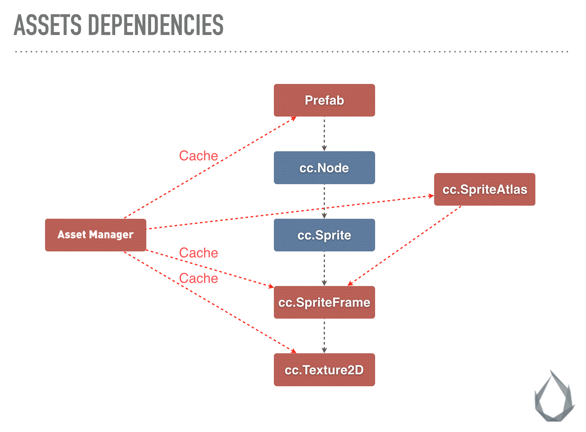

# 加载资源

## 动态加载 resources

通常我们会把项目中需要动态加载的资源放在 `resources` 目录下，配合 `cc.resources.load` 等接口动态加载。你只要传入相对 resources 的路径即可，并且路径的结尾处 **不能** 包含文件扩展名。

```javascript
// 加载 Prefab
cc.resources.load("test assets/prefab", function (err, prefab) {
    var newNode = cc.instantiate(prefab);
    cc.director.getScene().addChild(newNode);
});

// 加载 AnimationClip
var self = this;
cc.resources.load("test assets/anim", function (err, clip) {
    self.node.getComponent(cc.Animation).addClip(clip, "anim");
});
```

- 所有需要通过脚本动态加载的资源，都必须放置在 `resources` 文件夹或它的子文件夹下。`resources` 文件夹需要在 **assets 根目录** 下手动创建。如下所示：

  

  > **resources** 文件夹中的资源，可以引用文件夹外部的其它资源，同样也可以被外部场景或资源所引用。项目构建时，除了在 **构建发布** 面板中勾选的场景外，**resources** 文件夹中的所有资源，包括它们关联依赖的 **resources** 文件夹外部的资源，都会被导出。
  >
  > 如果一份资源仅仅是被 **resources** 中的其它资源所依赖，而不需要直接被 `cc.resources.load` 调用，那么 **请不要** 放在 resources 文件夹中。否则会增大 `config.json` 的大小，并且项目中无用的资源，将无法在构建的过程中自动剔除。同时在构建过程中，JSON 的自动合并策略也将受到影响，无法尽可能合并零碎的 JSON。

- Creator 相比之前的 Cocos2d-JS，资源动态加载的时候都是 **异步** 的，需要在回调函数中获得载入的资源。这么做是因为 Creator 除了场景关联的资源，没有另外的资源预加载列表，动态加载的资源是真正的动态加载。

  **注意**：从 v2.4 开始，`cc.loader` 等接口不再建议使用，请使用最新的 `cc.assetManager` 相关接口，升级文档请参考 [资源加载升级指南](../release-notes/asset-manager-upgrade-guide.md)。

### 加载 SpriteFrame

图片设置为 Sprite 后，将会在 **资源管理器** 中生成一个对应的 SpriteFrame。但如果直接加载 `test assets/image`，得到的类型将会是 `cc.Texture2D`。你必须指定第二个参数为资源的类型，才能加载到图片生成的 `cc.SpriteFrame`：

```javascript
// 加载 SpriteFrame
var self = this;
cc.resources.load("test assets/image", cc.SpriteFrame, function (err, spriteFrame) {
    self.node.getComponent(cc.Sprite).spriteFrame = spriteFrame;
});
```

> 如果指定了类型参数，就会在路径下查找指定类型的资源。当你在同一个路径下同时包含了多个重名资源（例如同时包含 player.clip 和 player.psd），或者需要获取 “子资源”（例如获取 Texture2D 生成的 SpriteFrame），就需要声明类型。

### 加载图集中的 SpriteFrame

对从 TexturePacker 等第三方工具导入的图集而言，如果要加载其中的 SpriteFrame，则只能先加载图集，再获取其中的 SpriteFrame。这是一种特殊情况。

```js
// 加载 SpriteAtlas（图集），并且获取其中的一个 SpriteFrame
// 注意 atlas 资源文件（plist）通常会和一个同名的图片文件（png）放在一个目录下, 所以需要在第二个参数指定资源类型
cc.resources.load("test assets/sheep", cc.SpriteAtlas, function (err, atlas) {
    var frame = atlas.getSpriteFrame('sheep_down_0');
    sprite.spriteFrame = frame;
});
```

### 资源释放

`cc.resources.load` 加载进来的单个资源如果需要释放，可以调用 `cc.resources.release`，`release` 可以传入和 `cc.resources.load` 相同的路径和类型参数。

```javascript
cc.resources.release("test assets/image", cc.SpriteFrame);
cc.resources.release("test assets/anim");
```

此外，你也可以使用 `cc.assetManager.releaseAsset` 来释放特定的 Asset 实例。

```javascript
cc.assetManager.releaseAsset(spriteFrame);
```

### 资源批量加载

`cc.resources.loadDir` 可以加载相同路径下的多个资源：

```javascript
// 加载 test assets 目录下所有资源
cc.resources.loadDir("test assets", function (err, assets) {
    // ...
});

// 加载 test assets 目录下所有 SpriteFrame，并且获取它们的路径
cc.resources.loadDir("test assets", cc.SpriteFrame, function (err, assets) {
    // ...
});
```

## 预加载资源

从 v2.4 开始，除了场景能够预加载之外，其他资源也可以预加载。预加载的加载参数与正常加载时一样，不过预加载只会去下载必要的资源，并不会进行资源的反序列化和初始化工作，所以性能消耗更小，适合游戏运行中使用。

`cc.resources` 提供了 `preload` 和 `preloadDir` 用于预加载资源。

```js
cc.resources.preload('test assets/image', cc.SpriteFrame);

// wait for while
cc.resources.load('test assets/image', cc.SpriteFrame, function (err, spriteFrame) {
    self.node.getComponent(cc.Sprite).spriteFrame = spriteFrame;
});
```

开发者可以使用预加载相关接口提前加载资源，不需要等到预加载结束即可使用正常加载接口进行加载，正常加载接口会直接复用预加载过程中已经下载好的内容，缩短加载时间。

关于预加载的说明，请参考 [预加载与加载](../asset-manager/preload-load.md)。

## 加载远程资源和设备资源

在目前的 Cocos Creator 中，我们支持加载远程贴图资源，这对于加载用户头像等需要向服务器请求的贴图很友好，需要注意的是，这需要开发者直接调用 `cc.assetManager.loadRemote` 方法。同时，如果开发者用其他方式下载了资源到本地设备存储中，也需要用同样的 API 来加载，上文中的 `cc.resources.load` 等 API 只适用于应用包内的资源和热更新的本地资源。下面是这个 API 的用法：

```javascript
// 远程 url 带图片后缀名
var remoteUrl = "http://unknown.org/someres.png";
cc.assetManager.loadRemote(remoteUrl, function (err, texture) {
    // Use texture to create sprite frame
});

// 远程 url 不带图片后缀名，此时必须指定远程图片文件的类型
remoteUrl = "http://unknown.org/emoji?id=124982374";
cc.assetManager.loadRemote(remoteUrl, {ext: '.png'}, function () {
    // Use texture to create sprite frame
});

// 用绝对路径加载设备存储内的资源，比如相册
var absolutePath = "/dara/data/some/path/to/image.png"
cc.assetManager.loadRemote(absolutePath, function () {
    // Use texture to create sprite frame
});

// 远程音频
remoteUrl = "http://unknown.org/sound.mp3";
cc.assetManager.loadRemote(remoteUrl, function (err, audioClip) {
    // play audio clip
});

// 远程文本
remoteUrl = "http://unknown.org/skill.txt";
cc.assetManager.loadRemote(remoteUrl, function (err, textAsset) {
    // use string to do something
});
```

目前的此类手动资源加载还有一些限制，对开发者影响比较大的是：

1. 这种加载方式只支持图片、声音、文本等原生资源类型，不支持 SpriteFrame、SpriteAtlas、Tilemap 等资源的直接加载和解析。（如需远程加载所有资源，可使用 [Asset Bundle](asset-bundle.md#%E5%8A%A0%E8%BD%BD-asset-bundle-%E4%B8%AD%E7%9A%84%E8%B5%84%E6%BA%90))
2. Web 端的远程加载受到浏览器的 [CORS 跨域策略限制](https://developer.mozilla.org/en-US/docs/Web/HTTP/Access_control_CORS)，如果对方服务器禁止跨域访问，那么会加载失败，而且由于 WebGL 安全策略的限制，即便对方服务器允许 http 请求成功之后也无法渲染。

## 资源的依赖和释放

在加载完资源之后，所有的资源都会临时被缓存到 `cc.assetManager` 中，以避免重复加载资源时发送无意义的 http 请求，当然，缓存的内容都会占用内存，有些资源可能开发者不再需要了，想要释放它们，这里介绍一下在做资源释放时需要注意的事项。

**首先最为重要的一点就是：资源之间是互相依赖的。**

比如下图，Prefab 资源中的 Node 包含 Sprite 组件，Sprite 组件依赖于 SpriteFrame，SpriteFrame 资源依赖于 Texture 资源，而 Prefab，SpriteFrame 和 Texture 资源都被 cc.assetManager 缓存起来了。这样做的好处是，有可能有另一个 SpriteAtlas 资源依赖于同样的一个 SpriteFrame 和 Texture，那么当你手动加载这个 SpriteAtlas 的时候，就不需要再重新请求贴图资源了，cc.assetManager 会自动使用缓存中的资源。



**接下来要介绍问题的另一个核心：JavaScript 中无法跟踪对象引用。**

在 JavaScript 这种脚本语言中，由于其弱类型特性，以及为了代码的便利，往往是不包含内存管理功能的，所有对象的内存都由垃圾回收机制来管理。这就导致 JS 层逻辑永远不知道一个对象会在什么时候被释放，这意味着引擎无法通过类似引用计数的机制来管理外部对象对资源的引用，也无法严谨地统计资源是否不再被需要了。

在 v2.4 之前，Creator 很长时间里选择让开发者控制所有资源的释放，包括资源本身和它的依赖项，你必须手动获取资源所有的依赖项并选择需要释放的依赖项，例如如下形式：

```javascript
// 直接释放某个贴图
cc.loader.release(texture);
// 释放一个 prefab 以及所有它依赖的资源
var deps = cc.loader.getDependsRecursively('prefabs/sample');
cc.loader.release(deps);
// 如果在这个 prefab 中有一些和场景其他部分共享的资源，你不希望它们被释放，可以将这个资源从依赖列表中删除
var deps = cc.loader.getDependsRecursively('prefabs/sample');
var index = deps.indexOf(texture2d._uuid);
if (index !== -1)
    deps.splice(index, 1);
cc.loader.release(deps);
```

这种方案给予了开发者最大的控制权力，对于小型项目来说工作良好，但随着 Creator 的发展，项目的规模不断提升，场景所引用的资源不断增加，而其他场景可能也复用了这些资源，这会造成释放资源的复杂度越来越高，开发者需要掌握所有资源的使用非常困难。为了解决这个痛点，Asset Manager 提供了一套基于引用计数的资源释放机制，让开发者可以简单高效地释放资源，不用担心项目规模的急剧膨胀。

这一套方案所做的工作是通过 AssetManager 加载资源时，对资源的依赖资源进行分析记录，并增加引用。而在通过 AssetManager 释放资源时，拿到记录的依赖资源，取消引用，并根据依赖资源的引用数，尝试自动去释放依赖资源。所以这个方案引擎只对资源的静态引用进行了分析，也就是说如果开发者在游戏运行过程中动态加载了资源并设置给场景或其他资源，则这些动态加载出来的资源引擎是没有记录的，这些资源需要开发者进行管理。每一个资源对象都提供了两个方法 `addRef`，`decRef`，你可以使用这两个接口来对动态资源的引用进行控制，比如说：

```js
cc.resources.load('image', cc.SpriteFrame, (err, spriteFrame) => {
    this.spriteFrame = spriteFrame;
    spriteFrame.addRef();
});
```

因为 texture 是动态加载进来的，而不是一开始就被组件所引用，所以这个 texture 是没有记录的，他的引用计数是 0，为了避免这个 texture 被其他地方误释放，开发者需要手动执行 `addRef` 操作为其增加一个引用。而在你不再需要使用这个资源时，你需要执行 `decRef` 为其减少一个引用：

```js
this.spriteFrame.decRef();
this.spriteFrame = null;
```

详细的资源释放机制请参考 [资源释放](../asset-manager/release-manager.md)。

**最后一个值得关注的要点：JavaScript 的垃圾回收是延迟的。**

想象一种情况，当你释放了 cc.assetManager 对某个资源的引用之后，由于考虑不周的原因，游戏逻辑再次请求了这个资源。此时垃圾回收还没有开始（垃圾回收的时机不可控），当出现这个情况时，意味着这个资源还存在内存中，但是 cc.assetManager 已经访问不到了，所以会重新加载它。这造成这个资源在内存中有两份同样的拷贝，浪费了内存。如果只是一个资源还好，但是如果类似的资源很多，甚至不止一次被重复加载，这对于内存的压力是有可能很高的。如果观察到游戏使用的内存曲线有这样的异常，请仔细检查游戏逻辑，避免释放近期内将要复用的资源，如果没有的话，垃圾回收机制是会正常回收这些内存的。
