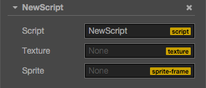
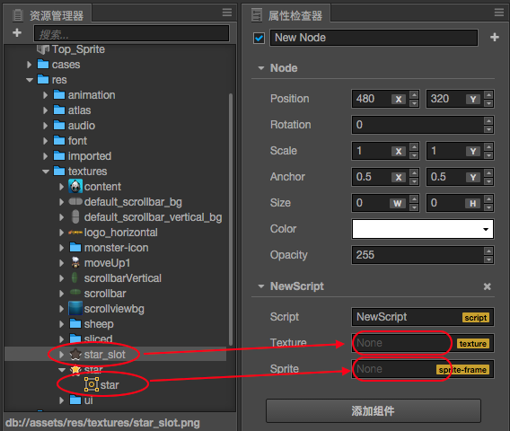

# 获取和加载资源

Cocos Creator 有一套统一的资源管理机制，在本篇教程，我们将介绍

- 资源的分类
- 如何在 **属性检查器** 里设置资源
- 动态加载资源
- 加载远程资源和设备资源
- 资源的依赖和释放

## 资源的分类

目前的资源分成两种，一种叫做 **Asset**，一种叫做 **Raw Asset**。

### Asset

Creator 提供了名为 "Asset" 的资源类型，`cc.SpriteFrame`、`cc.AnimationClip`、`cc.Prefab` 等资源都属于 Asset。Asset 的加载是统一并且自动化的，相互依赖的 Asset 能够被自动预加载。

> 例如，当引擎在加载场景时，会先自动加载场景关联到的资源，这些资源如果再关联其它资源，其它也会被先被加载，等加载全部完成后，场景加载才会结束。

脚本中可以这样定义一个 Asset 属性：

```javascript
// NewScript.js

cc.Class({
    extends: cc.Component,
    properties: {

        spriteFrame: {
            default: null,
            type: cc.SpriteFrame
        },

    }
});
```

### <a name="raw-asset"></a>Raw Asset

Cocos2d 的一些旧 API 并没有使用上面提到的 Asset 对象，而是直接用 URL 字符串指代资源。为了兼容这些 API，我们把这类资源叫做 "Raw Asset"。图片（`cc.Texture2D`），声音（`cc.AudioClip`），粒子（`cc.ParticleAsset`）等资源都是 Raw Asset。Raw Asset 在脚本里由一个 url 字符串来表示，当你要在引擎中使用 Raw Asset，只要把 url 传给引擎的 API，引擎内部会自动加载这个 url 对应的资源。

当你在脚本里声明一个类型是 `cc.Texture2D` 的 Raw Asset，一开始可能会想这样定义：

```javascript
cc.Class({
    extends: cc.Component,
    properties: {

        textureURL: {
            default: null,
            type: cc.Texture2D
        }

    }
});
```

这样写的问题在于，在代码中 `textureURL` 实际上是一个字符串，而不是 `cc.Texture2D` 的实例。为了不混淆 type 的语义，在 CCClass 中声明 Raw Asset 的属性时，要用 `url: cc.Texture2D` 而不是 `type: cc.Texture2D`。

```javascript
cc.Class({
    extends: cc.Component,
    properties: {

        textureURL: {
            default: "",
            url: cc.Texture2D
        }

    }
});
```

## 如何在属性检查器里设置资源

不论是 Asset 还是 Raw Asset，只要在脚本中定义好类型，就能直接在 **属性检查器** 很方便地设置资源。假设我们有这样一个组件：

```javascript
// NewScript.js

cc.Class({
    extends: cc.Component,
    properties: {

        textureURL: {
            default: "",
            url: cc.Texture2D
        },
        spriteFrame: {
            default: null,
            type: cc.SpriteFrame
        },

    }
});
```

将它添加到场景后，**属性检查器** 里是这样的：



接下来我们从 **资源管理器** 里面分别将一张 Texture 和一个 SpriteFrame 拖到 **属性检查器** 的对应属性中：



结果如下：


这样就能在脚本里直接拿到设置好的资源：

```javascript
    onLoad: function () {
        var spriteFrame = this.spriteFrame;
        var textureURL = this.textureURL;

        spriteFrame.setTexture(textureURL);
    }
```

在 **属性检查器** 里设置资源虽然很直观，但资源只能在场景里预先设好，没办法动态切换。如果需要动态切换，你需要看看下面的内容。

## 动态加载

动态加载资源要注意两点，一是所有需要通过脚本动态加载的资源，都必须放置在 `resources` 文件夹或它的子文件夹下。`resources` 需要在 assets 文件夹中手工创建，并且必须位于 assets 的根目录，就像这样：


这里的 `image/image`(SpriteFrame), `prefab`, `anim`, `font` 都是常见的 Asset，而 `atom`(particle), `audio` 则是常见的 Raw Asset。

> **resources** 文件夹中的资源，可以引用文件夹外部的其它资源，同样也可以被外部场景或资源引用到。项目构建时，除了已在 **构建发布** 面板勾选的场景外，**resources** 文件夹中的所有资源，连同它们关联依赖的 **resources** 文件夹外部的资源，都会被导出。
>
> 如果一份资源仅仅是被 resources 中的其它资源所依赖，而不需要直接被 `cc.loader.loadRes` 调用，那么 **请不要** 放在 resources 文件夹里。否则会增大包体和 settings.js 的大小，并且项目中无用的资源，将无法在构建的过程中自动剔除。同时在构建过程中，JSON 的自动合并策略也将受到影响，无法尽可能将零碎的 JSON 合并起来。

第二个要注意的是 Creator 相比之前的 Cocos2d-html5，资源动态加载的时都是 **异步** 的，需要在回调函数中获得载入的资源。这么做是因为 Creator 除了场景关联的资源，没有另外的资源预加载列表，动态加载的资源是真正的动态加载。

### 动态加载 Asset

Creator 提供了 `cc.loader.loadRes` 这个 API 来专门加载那些位于 resources 目录下的 Asset。和 `cc.loader.load` 不同的是，loadRes 一次只能加载单个 Asset。调用时，你只要传入相对 resources 的路径即可，并且路径的结尾处 **不能** 包含文件扩展名。

```javascript
// 加载 Prefab
cc.loader.loadRes("test assets/prefab", function (err, prefab) {
    var newNode = cc.instantiate(prefab);
    cc.director.getScene().addChild(newNode);
});

// 加载 AnimationClip
var self = this;
cc.loader.loadRes("test assets/anim", function (err, clip) {
    self.node.getComponent(cc.Animation).addClip(clip, "anim");
});

// 加载 SpriteAtlas（图集），并且获取其中的一个 SpriteFrame
// 注意 atlas 资源文件（plist）通常会和一个同名的图片文件（png）放在一个目录下, 所以需要在第二个参数指定资源类型
cc.loader.loadRes("test assets/sheep", cc.SpriteAtlas, function (err, atlas) {
    var frame = atlas.getSpriteFrame('sheep_down_0');
    sprite.spriteFrame = frame;
});
```

#### 加载独立的 SpriteFrame

图片设置为 Sprite 后，将会在 **资源管理器** 中生成一个对应的 SpriteFrame。但如果直接加载 `test assets/image`，得到的类型将会是 cc.Texture2D。你必须指定第二个参数为资源的类型，才能加载到图片生成的 cc.SpriteFrame：

```javascript
// 加载 SpriteFrame
var self = this;
cc.loader.loadRes("test assets/image", cc.SpriteFrame, function (err, spriteFrame) {
    self.node.getComponent(cc.Sprite).spriteFrame = spriteFrame;
});
```

> 如果指定了类型参数，就会在路径下查找指定类型的资源。当你在同一个路径下同时包含了多个重名资源（例如同时包含 player.clip 和 player.psd），或者需要获取“子资源”（例如获取 Texture2D 生成的 SpriteFrame），就需要声明类型。

#### 资源释放

`loadRes` 加载进来的单个资源如果需要释放，可以调用 `cc.loader.releaseRes`，`releaseRes` 可以传入和 `loadRes` 相同的路径和类型参数。

```javascript
cc.loader.releaseRes("test assets/image", cc.SpriteFrame);
cc.loader.releaseRes("test assets/anim");
```

此外，你也可以使用 `cc.loader.releaseAsset` 来释放特定的 Asset 实例。

```javascript
cc.loader.releaseAsset(spriteFrame);
```

### 动态加载 Raw Asset

Raw Asset 可以直接使用 url 从远程服务器上加载，也可以从项目中动态加载。对远程加载而言，原先 Cocos2d 的加载方式不变，使用 cc.loader.load 即可。对项目里的 Raw Asset，加载方式和 Asset 一样：

```javascript
// 加载 Texture，不需要后缀名
cc.loader.loadRes("test assets/image", function (err, texture) {
    ...
});
```

#### cc.url.raw

Raw Asset 加载成功后，如果需要传给一些 url 形式的 API，还是需要给出完整路径才行。你需要用 `cc.url.raw` 进行一次 url 的转换：

```javascript
// 原 url 会报错！文件找不到
var texture = cc.textureCache.addImage("resources/test assets/image.png");

// 改用 cc.url.raw，此时需要声明 resources 目录和文件后缀名
var realUrl = cc.url.raw("resources/test assets/image.png");
var texture = cc.textureCache.addImage(realUrl);
```

### 资源批量加载

`cc.loader.loadResDir` 可以加载相同路径下的多个资源：

```javascript
// 加载 test assets 目录下所有资源
cc.loader.loadResDir("test assets", function (err, assets) {
    // ...
});

// 加载 sheep.plist 图集中的所有 SpriteFrame
cc.loader.loadResDir("test assets/sheep", cc.SpriteFrame, function (err, assets) {
    // assets 是一个 SpriteFrame 数组，已经包含了图集中的所有 SpriteFrame。
    // 而 loadRes('test assets/sheep', cc.SpriteAtlas, function (err, atlas) {...}) 获得的则是整个 SpriteAtlas 对象。
});
```

## 加载远程资源和设备资源

在目前的 Cocos Creator 中，我们支持加载远程贴图资源，这对于加载用户头像等需要向服务器请求的贴图很友好，需要注意的是，这需要开发者直接调用 `cc.loader.load`。同时，如果用户用其他方式下载了资源到本地设备存储中，也需要用同样的 API 来加载，上文中的 `loadRes` 等 API 只适用于应用包内的资源和热更新的本地资源。下面是这个 API 的用法：

```javascript
// 远程 url 带图片后缀名
var remoteUrl = "http://unknown.org/someres.png";
cc.loader.load(remoteUrl, function (err, texture) {
    // Use texture to create sprite frame
});

// 远程 url 不带图片后缀名，此时必须指定远程图片文件的类型
remoteUrl = "http://unknown.org/emoji?id=124982374";
cc.loader.load({url: remoteUrl, type: 'png'}, function () {
    // Use texture to create sprite frame
});

// 用绝对路径加载设备存储内的资源，比如相册
var absolutePath = "/dara/data/some/path/to/image.png"
cc.loader.load(absolutePath, function () {
    // Use texture to create sprite frame
});
```

目前的此类手动资源加载还有一些限制，对用户影响比较大的是：

1. 原生平台远程加载不支持图片文件以外类型的资源
2. 这种加载方式只支持 raw asset 资源类型，不支持 SpriteFrame、SpriteAtlas、Tilemap 等资源的直接加载和解析（需要后续版本中的 Assets Bundle 支持）
3. Web 端的远程加载受到浏览器的 [CORS 跨域策略限制](https://developer.mozilla.org/en-US/docs/Web/HTTP/Access_control_CORS)，如果对方服务器禁止跨域访问，那么会加载失败，而且在 WebGL 渲染模式下，即便对方服务器允许 http 请求成功之后也无法渲染，这是 WebGL 的安全策略的限制

## 资源的依赖和释放

在加载完资源之后，所有的资源都会临时被缓存到 `cc.loader` 中，以避免重复加载资源时发送无意义的 http 请求，当然，缓存的内容都会占用内存，有些资源可能用户不再需要了，想要释放它们，这里介绍一下在做资源释放时需要注意的事项。

**首先最为重要的一点就是：资源之间是互相依赖的。**

比如下图，Prefab 资源中的 Node 包含 Sprite 组件，Sprite 组件依赖于 SpriteFrame，SpriteFrame 资源依赖于 Texture 资源，而 Prefab，SpriteFrame 和 Texture 资源都被 cc.loader 缓存起来了。这样做的好处是，有可能有另一个 SpriteAtlas 资源依赖于同样的一个 SpriteFrame 和 Texture，那么当你手动加载这个 SpriteAtlas 的时候，就不需要再重新请求贴图资源了，cc.loader 会自动使用缓存中的资源。


在搞明白资源的相互引用之后，资源释放的问题也就呼之欲出了，当你选择释放一个 Prefab 时，我们是不会自动释放它依赖的其他资源的，因为有可能这些依赖资源还有其他的用处。所以用户在释放资源时经常会问我们，为什么我都把资源释放了，内存占用还是居高不下？原因就是真正占用内存的贴图等基础资源并不会随着你释放 Prefab 或者 SpriteAtlas 而被释放。

**接下来要介绍问题的另一个核心：JavaScript 中无法跟踪对象引用。**

在 JavaScript 这种脚本语言中，由于其弱类型特性，以及为了代码的便利，往往是不包含内存管理功能的，所有对象的内存都由垃圾回收机制来管理。这就导致 JS 层逻辑永远不知道一个对象会在什么时候被释放，这意味着引擎无法通过类似引用计数的机制来管理外部对象对资源的引用，也无法严谨得统计资源是否不再被需要了。基于以上的原因，目前 cc.loader 的设计实际上是依赖于用户根据游戏逻辑管理资源，用户可以决定在某一时刻不再需要某些资源以及它依赖的资源，立即将它们在 cc.loader 中的缓存释放。也可以选择在释放依赖资源的时候，防止部分共享资源被释放。下面是一个简单的示例：

```javascript
// 直接释放某个贴图
cc.loader.release(texture);
// 释放一个 prefab 以及所有它依赖的资源
var deps = cc.loader.getDependsRecursively('prefabs/sample');
cc.loader.release(deps);
// 如果在这个 prefab 中有一些和场景其他部分共享的资源，你不希望它们被释放，有两种方法：
// 1. 显式声明禁止某个资源的自动释放
cc.loader.setAutoRelease(texture2d, false);
// 2. 将这个资源从依赖列表中删除
var deps = cc.loader.getDependsRecursively('prefabs/sample');
var index = deps.indexOf(texture2d._uuid);
if (index !== -1)
    deps.splice(index, 1);
cc.loader.release(deps);
```

**最后一个值得关注的要点：JavaScript 的垃圾回收是延迟的。**

想象一种情况，当你释放了 cc.loader 对某个资源的引用之后，由于考虑不周的原因，游戏逻辑再次请求了这个资源。此时垃圾回收还没有开始（垃圾回收的时机不可控），或者你的游戏逻辑某处，仍然持有一个对于这个旧资源的引用，那么意味着这个资源还存在内存中，但是 cc.loader 已经访问不到了，所以会重新加载它。这造成这个资源在内存中有两份同样的拷贝，浪费了内存。如果只是一个资源还好，但是如果类似的资源很多，甚至不止一次被重复加载，这对于内存的压力是有可能很高的。如果观察到游戏使用的内存曲线有这样的异常，请仔细检查游戏逻辑，是否存在泄漏，如果没有的话，垃圾回收机制是会正常回收这些内存的。

以上就是管理资源依赖和释放时需要注意的细节，这部分的功能和 API 设计还没有完全定案，我们还是希望尽力给大家带来尽可能方便的引擎 API，所以后续也会尝试一些其他的办法提升友好度，届时会更新这篇文档。
