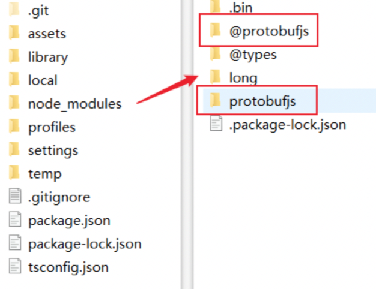

# 示例：外部模块使用案例

本章节通过案例讲解如何在 Cocos Creator 项目中使用 npm 模块，如果不知道 npm 该如何获取，请查看 [获取 npm 包](./config.md)。

## ESM 与 CJS 交互规则

Cocos Creator 3.x 如何使用 npm，最大的问题在于 ESM 与 CJS 模块交互。如果还不了解这两个模块在 Cocos Creator 里是如何定义的，请查看 [模块](./spec.md) 一节。其实，ESM 和 CJS 模块的交互方式在 [Node.js 官方文档](https://nodejs.org/api/esm.html#esm_interoperability_with_commonjs) 就有提到。在这里我简单的概括以下几点：

- CommonJS 模块由 `module.exports` 导出，在导入 CommonJS 模块时，可以使用 ES 模块默认的导入方式或其对应的 sugar 语法形式导入。

    ```ts
    import { default as cjs } from 'cjs';
    // 语法糖形式
    import cjsSugar from 'cjs';
    console.log(cjs); // <module.exports>
    console.log(cjs === cjsSugar); // true
    ```

- **ESM** 模块的 `default` 导出指向 **CJS** 模块的 `module.exports`。
- 非 `default` 部分的导出，Node.js 通过静态分析将其作为独立的 ES 模块提供。

接下来看一个代码片段：

```js
// foo.js
module.exports = {
    a: 1,
    b: 2,
}

module.exports.c = 3;

// test.mjs

// default 指向 module.exports
import foo from './foo.js'; // 等价于 import { default as foo } from './foo.js'
console.log(JSON.stringify(foo)); // {"a":1,"b":2,"c":3}

// 导入 foo 模块的所有导出
import * as module_foo from './foo.js'
console.log(JSON.stringify(module_foo)); // {"c":3,"default":{"a":1,"b":2,"c":3}}

import { a } from './foo.js'
console.log(a); // Error: a is not defined

// 根据上方第三点，c 有独立导出
import { c } from './foo.js'
console.log(c); // 3
```

## npm 模块使用案例

### 案例一：protobufjs 使用

首先，需要获取到 [protobufjs](https://www.npmjs.com/package/protobufjs) 包。在项目目录下打开终端，执行 `npm i protobufjs`。如果这个项目属于多人协作，甚至可以把 `protobufjs` 这个包作为依赖写入 `package.json`，通过在上述命名行里加入 `npm install --save protobufjs` 即可利用命令行自动写入到 `package.json` 中。执行完之后，就可以在项目录下的 `node_module` 文件夹里查找到 `protobufjs` 相关文件夹。



有了 `protobufjs` 模块包之后。其次，判断模块格式。

- 查看 `package.json` 文件里的 `main` 字段，判定入口文件 `index.js`；
- 查看 `package.json` 文件里的 `type` 字段，观察到没有 `type` 字段；

鉴别模块格式，可以推断出，这是一个 **CJS** 模块。顺便一提，在包里是能看到每一个 js 文件都对应一个 .d.ts 文件，说明 `protobufjs` 包里自带了 `TypeScript` 声明文件，方便导入 `protobufjs` 模块后可以通过代码提示获取内部接口。

接着，在 `index.js` 可以看到它导出写法。

```js
"use strict";
module.exports = require("./src/index");
```

确定了模块格式和导出方式。接下来，就是脚本资源里如何使用 `protobufjs` 这个模块了。

首先，在 `assets` 下创建一个 `test.ts` 脚本。接着，在脚本的头部写入下列代码：

```ts
// 大部分 npm 模块都可以通过直接导入模块名的方式来使用。
import protobufjs from 'protobufjs';
console.log(protobufjs);
```

在 Chrome 运行后，控制台输出如下：


可能有部分同学，在书写 `import protobufjs from 'protobufjs'` 时就已经报红，提示模块没有默认导出（`has no default export`），这是因为 **CJS** 没有 `default` 导出，而 **ESM** 和 **CJS** 交互的时候是将 `module.exports` **视为** `export default`，并不是代表 **CJS** 模块具备真实默认导出。因此，如果要保持原来的写法，可以对 TypeScript 进行配置，具体请查看 [TypeScript 配置](#TypeScript-配置)。

接下来，就可以直接使用 `protobufjs` 提供的所有模块了。当然，如果只需要特定子模块功能，例如 `light` 和 `minimal`，可以直接导入包中的子路径。

```ts
// 使用 light 版本
import protobuf from 'protobufjs/light.js';
// 使用 minimal 版本
import protobuf from 'protobufjs/minimal.js';
```

> **注意**：就 protobufjs 和许多经典的 npm 包而言，当导入包中的子路径时，后缀是需要的。详情请参考 [Cocos Creator 模块规范](./spec.md)。

#### TypeScript 配置

当在 TypeScript 里导入没有默认导出的模块时，通常会出现 `Module '"/${project_path}/protobufjs"' has no default export.`。这是因为目前 `protobufjs` 仅提供了 CommonJS 模块，而 Cocos Creator 是通过 “默认导入” 来访问 CommonJS 模块的，但是 CommonJS 模块确实没有 “默认导出” 这种说法。此时，可以通过编辑项目目录中的 `tsconfig.json` 文件，将 `"compilerOptions"` 字段中的 `"allowSyntheticDefaultImports"` 选项设置为 `true`。如果没有该字段，可以自行补上。

```json5
{
  /* Base configuration. Do not edit this field. */
  "extends": "./temp/tsconfig.cocos.json",

  "compilerOptions": {
      "allowSyntheticDefaultImports": true, // 需要开启
  }
}
```

### 案例二：将 protobuf 中的 proto 文件编译成 JavaScript 文件

本节主要讲述如何将 proto 文件编译成 JavaScript 文件。其实在翻阅 protobufjs 文档的时候，可以发现它自身有提供 [命令行工具](https://www.npmjs.com/package/protobufjs#command-line) 转换静态模块以及 ts 声明文件。本次以新建一个 3.0 的空项目 example 为例，演示整个流程。

首先，通过 npm 安装 `protobufjs` 并将它写入项目目录下的 `package.json` 的依赖项。

其次，在项目目录下新建 Proto 目录并定义几个 proto 文件。

```proto
// pkg1.proto

package pkg1;
syntax = "proto2";
message Bar {
    required int32 bar = 1;
}

// pkg2.proto

package pkg2;
syntax = "proto2";
message Baz {
	required int32 baz = 1;
}

// unpkg.proto 不属于任何的包

syntax = "proto2";
message Foo {
    required int32 foo = 1;
}
```

接着，在 package.json 中定义。

```json
"scripts": {
    "build-proto:pbjs": "pbjs --dependency protobufjs/minimal.js --target static-module --wrap commonjs --out ./Proto.js/proto.js ./Proto/*.proto",
    "build-proto:pbts": "pbts --main --out ./Proto.js/proto.d.ts ./Proto.js/*.js"
},
```

其中，第一段指令 `build-proto:pbjs` 的大致意思是将 proto 文件编译成 js。`--dependency protobufjs/minimal.js` 这一块参数其实是因为执行时 `require` 到了 `protobufjs`，但是我们需要用的只是它的子模块 `minimal.js`。然后，将 js 生成到 Proto.js 文件夹中（注意：如果没有 Proto.js 文件夹，需手动创建）。第二段指令 `build-proto:pbts` 则是根据第一段的输出来生成类型声明文件。

根据以上步骤则成功完成了 proto 文件转换成 js 文件的过程。接着，可以在项目 `assets` 下脚本里引入 js 文件。

```ts
import proto from '../Proto.js/proto.js';
console.log(proto.pkg1.Bar);
```

此处还是要声明一下，如果有同学在导入的时候出现报红现象，提示 proto 没有默认导出，解决方案有两种。

- 通过向 `tsconfig.json` 增加允许对包含默认导出的模块使用默认导入字段来解决

    ```json
    "compilerOptions": {
      "allowSyntheticDefaultImports": true,
    }
    ```

- 增加默认导出

    在项目目录下创建一个 Tools/wrap-pbts-result.js 文件，脚本代码如下：

    ```js
    const fs = require('fs');
    const ps = require('path');
    const file = ps.join(__dirname, '..', 'Proto.js', 'proto.d.ts');
    const original = fs.readFileSync(file, { encoding: 'utf8' });
    fs.writeFileSync(file, `
    namespace proto {
        ${original}
    }
    export default proto;
    `);
    ```

    将原来的 `build-proto:pbts` 命令改为：

    ```json
    "build-proto:pbts": "pbts --main --out ./Proto.js/proto.d.ts ./Proto.js/*.js && node ./Tools/wrap-pbts-result.js"
    ```

最终，就可以直接运行了。完整项目内容请参考：[npm-case](https://github.com/cocos-creator/example-3d/tree/master/npm-case)。

> **注意**：打包出来的 js 文件即可以放在项目 `assets` 目录下，也可以放在项目其它位置。`assets` 目录下的 js 文件不再需要勾选导出为插件，请各位悉知。

### 案例三：lodash-es 使用

同 [案例一：protobufjs 使用](#案例一：protobufjs-使用) 方法类似，安装 `lodash-es` 包。得知入口文件是 `lodash.js`，入口文件里也自动帮忙将其下所有子模块以 **ESM** 模块格式导出，再根据 `type` 也印证了当前是 **ESM** 模块。因此，可以直接导入任何模块。还是以 `assets` 下的 `test.ts` 脚本资源为例，引入 `lodash` 内的子模块。

```ts
import { array, add } from 'lodash-es';
```

此时，会发现代码层面会报错，但是实际却能够运行。这是因为，两者在语言类型上就有明显区分，JavaScript 是动态类型，TypeScript 是静态类型，因此，在使用 js 脚本的时候，是无法获知导出模块的具体类型的，此时最好的办法就是声明一份类型定义文件 .d.ts。幸运的是，但我们将鼠标移到报错处的时候，有提示可以通过执行 `npm i --save-dev @types/lodash-es` 来安装 `lodash` 模块的类型声明文件。安装完之后，重启 VS Code 就会发现报错消失了，同时还有了代码提示。

### 案例四：web3 使用

根据上述 `protobufjs` 案例，以同样的方式安装 `web3` 包。利用相同检测方法，判定 `web3` 为 **CJS** 模块。根据同样方式导入：

```ts
import web3 from 'web3';
```

回到编辑器后发现，还是出现了如下一大堆报错：


这是因为该包是专门为 Node 定制的，内部引用了 Node.js 的内置模块，这些模块是无法在 Creator 里使用导致了报错。通常这些包也会兼顾 Web 用户。当我们直接导入该包的时候，包的入口直接指向的是 Node 版本，而把 Web 版本放在包下的 `dist/**.js` 或者 `dist/**.min.js` 文件里。针对这种情况就需要对症下药，导入包里提供的 Web 定制版本：

```ts
import web3 from 'web3/dist/web3.min.js';
```

这时候发现编辑器不报错了，但是代码提示：`Could not find a declaration file for module 'web3/dist/web3.min.js'. '/${project_path}/node_modules/web3/dist/web3.min.js' implicitly has an 'any' type.`。

这是因为即使这些包有类型说明，也是为那个入口的 Node 版本而做的类型说明。一般情况下，两个版本的接口定义是一样的，因此我们只要 “借用” Node 版本的类型说明就好了。就是任意新建个 .d.ts 到项目里，写：

```ts
// 为模块 "<包名>/dist/**.js" 补充类型说明
declare module "<包名>/dist/**.js" {
    export * from "<包名>"; // “偷” 主入口的类型说明
}
```

> **注意**：是不是每用一个包都得确认它是为谁而做？目前确实是的。这种情况正在改善，因为在新版的 Node 里，package.json 有加入一个很好的机制来告诉用户什么情况应该使用哪个版本。

### 特殊案例：firebase 使用

这个案例是一个较为特殊的案例，接着，了解一下这个案例的特殊性。根据上述方式安装好 `firebase` 包，根据 `package.json` 文件对包进行分析，可以得出这个包采用是 **CJS** 格式。根据入口文件，可以推断为此包是为 Node 定制的（这个可以根据 [案例四：web3 使用](#案例四：web3-使用) 方式测试），因此，得选用 Web 定制版本 `index.esm.js`。神奇的地方就在这里，`index.esm.js` 是一个 **ESM** 模块，Creator 里将这个包识别为 **CJS** 模块，但是它又是 **ESM** 模块，自然会导致出错。

针对这样的案例，目前还没有处理，建议的解决方案是用户自行通过 `rollup` 等打包工具，打包成一个独立的 js 文件作为 **非 npm 模块使用**。
