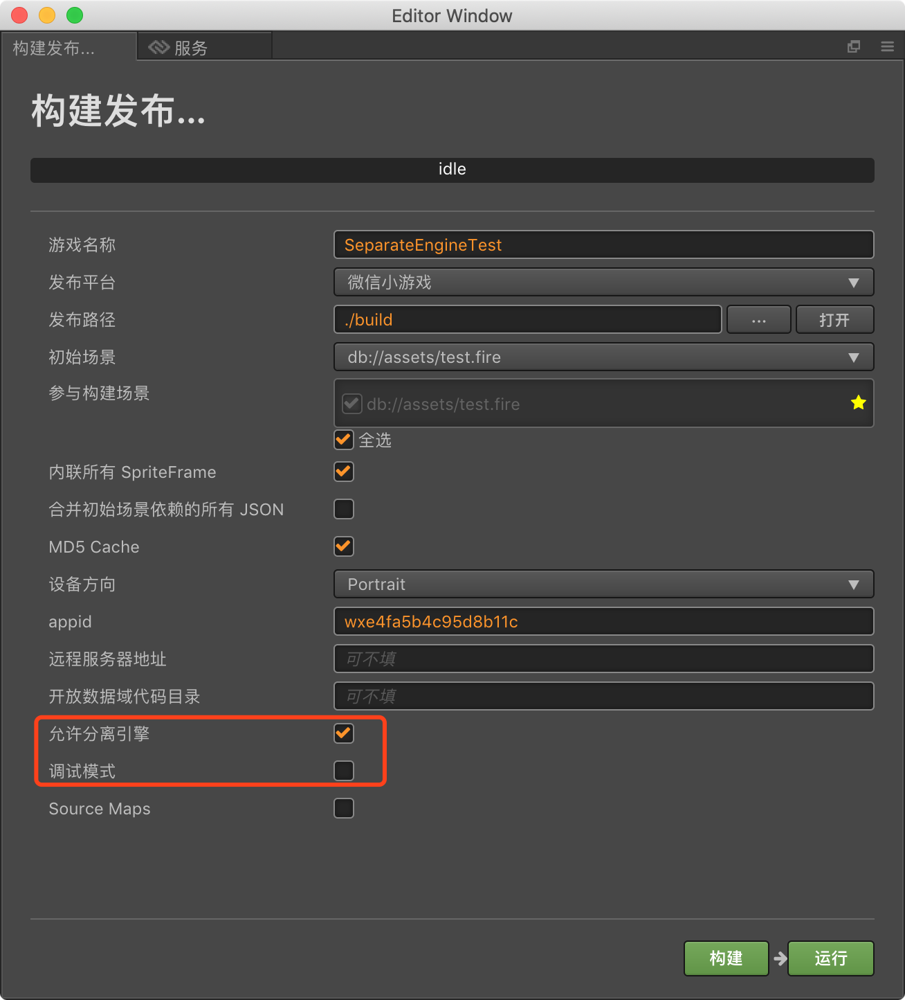

# 引擎分离功能

#### 什么是引擎分离功能？

&ensp;&ensp;引擎分离是 **Cocos Creator v2.1.2** 新增功能，该功能是与 [CocosCreatorEngine 插件](https://mp.weixin.qq.com/wxopen/plugindevdoc?appid=wxe4fa5b4c95d8b11c&token=&lang=zh_CN) 进行搭配使用，启用后会去根据 game.json 中配置的版本号，去下载在 CocosCreatorEngine 插件线上已发布对应的完整引擎包，来减小每个小游戏的首包大小。

#### 如何使用：

在构建微信小游戏平台面板上，勾选允许分离引擎即可（**该功能仅支持 Cocos Creator 正式版本和非调试模式**）

### 兼容旧版本
由于该功能只支持 **Cocos Creator v2.1.2** 以上的版本，不过旧版本的用户可以通过下载兼容插件来使用该功能。

**旧版本兼容插件地址**: https://github.com/knoxHuang/plugin-wechat-engine-separation

