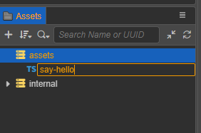
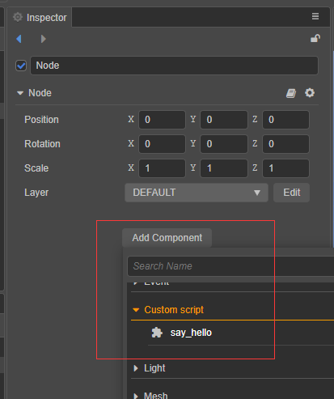
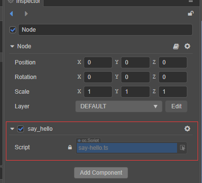
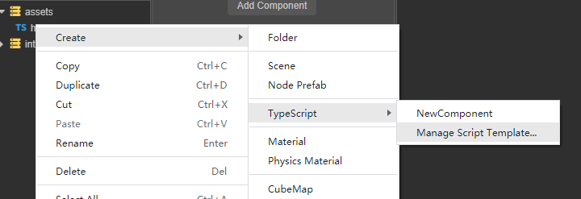
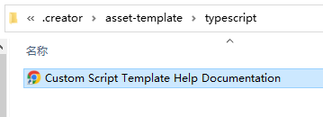
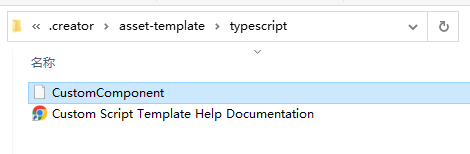
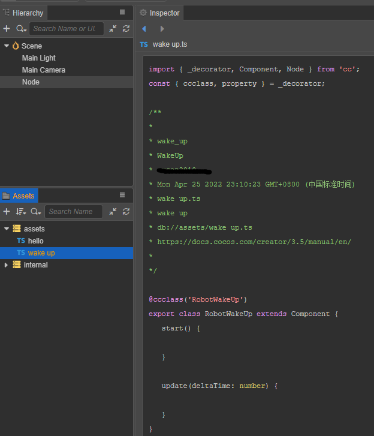

# 创建脚本

## 创建组件脚本

在 Cocos Creator 中，脚本也是资源的一部分。在 **资源管理器** 中创建的脚本，默认是一个 NewComponent 组件，我们称之为组件脚本。可通过以下两种方式创建：

- **资源管理器** 面板空白位置或某个文件夹资源下右击菜单，选择 **Create** > **TypeScript** > **NewComponent**。
- **资源管理器** 左上角的 **+** 按钮，点击后选择 **TypeScript** > **NewComponent**。


在创建脚本时，名称不能为空，输入框默认为 `NewComponent`。我们将其修改为 `say-hello` ，可以看到在 **资源管理器** 中生成了一个名为 `say-hello` 的脚本文件。




新建后的初始脚本代码如下：

```ts
import { _decorator, Component, Node } from 'cc';
const { ccclass, property } = _decorator;

@ccclass('say_hello')
export class say_hello extends Component {
    start() {

    }

    update(deltaTime: number) {
        
    }
}
```
**注意点**

> 项目中所有脚本的类名 `ClassName` （如上例中的 'say_hello'） 不允许重复，即使脚本文件在不同的目录下，各自的代码里也不允许有相同的类名。

> 脚本文件名称和脚本的类名不同，在输入初始的文件名之后，文件名会被处理为类名，处理的逻辑详见下文 **类名的生成**。脚本文件生成后，对文件的后续操作**脚本重命名**，新的文件名不会再去生成并替换代码里的类名，不再影响了。

> 我们推荐用户使用 TypeScript 来编写脚本，目前 **资源管理器** 中仅支持创建 TypeScript 文件。但如果用户想要使用 JavaScript 来编写脚本的话，可以直接在操作系统的文件夹中创建 JavaScript 文件，或在其他代码编辑软件中创建 JavaScript 文件。


## 类名的生成
在获得初始文件名数据后，会生成两种规则的类名 `ClassName`，并以变量的方式提供给**脚本模板**。

- 下划线格式，变量名为 `<%UnderscoreCaseClassName%>`。这种格式是为了保持类名尽可能地与文件名一致，保持一致的好处是有利于代码全局搜索和替换。
- 驼峰格式，变量名为 `<%CamelCaseClassName%>`。这种格式是为了保持与主流的脚本标准一致，首字母大写的驼峰格式。

## 添加脚本到场景节点中

**将脚本添加到场景节点中，实际上就是为这个节点添加一个脚本组件。**
在 **层级管理器** 选中某个节点，此时 **属性检查器** 面板会显示该节点的属性。以下两种添加方式：

- 直接将 **资源管理器** 中的脚本拖拽当前节点的到 **属性检查器** 中，即为挂载了一个组件。

- 点击 **属性检查器** 最下方的 **添加组件** 按钮，选择 **自定义脚本 -> say_hello**，即为挂载组件。

    
    

## 编辑脚本

开发者可根据自己的需求，选择自己喜爱的代码编辑软件（如：Vim、Sublime Text、Web Storm、VSCode 等）进行脚本编辑。编辑器的 **偏好设置** > **外部程序** 可设置指定的脚本打开工具。


外部程序配置完成后，在**资源管理器**中双击脚本资源，便会用指定的程序打开该脚本。
编辑脚本代码保存后，鼠标点击回到编辑器，编辑器会自动检测到脚本的改动，重新对其进行编译后使用。

编写脚本代码，可阅读以下文档了解相关内容：

- [配置代码编辑环境](coding-setup.md)
- [脚本基础](basic.md)

脚本文件创建成功后，再对文件进行重命名，或者对代码里的类名进行修改，文件名和类名均不会再互相影响。

- 以 `say-hello` 为例，我们在 **资源管理器** 中将其重命名为 `hello`。
重新选中该资源，查看 **属性检查器**，代码还是显示 `class say_hello`，不会变动。
重新选中 **层级管理器** 上刚添加组件的节点 **Node**，查看 **属性检查器**，组件名称还是显示 `say_hello`，不会变动。

我们继续双击当前的 `hello` 资源，将类名改为 **say**，保存后回到编辑器：

```ts
import { _decorator, Component, Node } from 'cc';
const { ccclass, property } = _decorator;

@ccclass('say')
export class say extends Component {
    start() {

    }

    update(deltaTime: number) {
        
    }
}
```

同样的脚本文件名 `hello` 不会变化。节点 **Node** 里的组件名称变为 **say**。


## <a id="custom-script-template">脚本模板</a>

从编辑器 v3.3 开始，支持在项目中管理不同的脚本模板。

- 新建一个项目，新项目不会自动创建自定义脚本模板所在的目录 `.creator/asset-template/typescript` 。
- 可以手动创建上述目录。也可以通过 **资源管理器** 的右击菜单里的菜单，点击后才生成目录。



默认的 `NewComponent` 脚本模板仍在引擎内置资源目录下 `resources\3d\engine\editor\assets\default_file_content\ts`。
文件代码为：

```ts
import { _decorator, Component, Node } from 'cc';
const { ccclass, property } = _decorator;

@ccclass('<%UnderscoreCaseClassName%>')
export class <%UnderscoreCaseClassName%> extends Component {
    start() {

    }

    update(deltaTime: number) {
        
    }
}

/**
 * COMMENTS_GENERATE_IGNORE
 * Use "COMMENTS_GENERATE_IGNORE" tag if you do not want later created scripts to contain these comments.
 * 
 * Predefined Variables
 * You can use predefined variables below to setup your scripting preference. For example, whether to use camel case style.
 * 
 * <%UnderscoreCaseClassName%>, class name in underscore format, like 'new_component'
 * <%CamelCaseClassName%>, class name in camel format, like 'NewComponent'
 * <%Author%>, Who create this file
 * <%DateTime%>, when create this file
 * <%FileBasename%>, creating file name with extension
 * <%FileBasenameNoExtension%>, creating file name without extension
 * <%URL%>, url of this file in COCOS ASSET URL format
 * <%ManualUrl%>, url of office help document, like 'https://docs.cocos.com/creator/manual/en/'
 *
 * 
 * Example:
 * 
  @ccclass('<%UnderscoreCaseClassName%>')
  export class <%UnderscoreCaseClassName%> extends Component {
  
    // class member could be defined like this.
    dummy = '';

    // Use 'property' decorator if your want the member to be serializable.
    @property
    serializableDummy = 0;

    start () {
        // Your initialization goes here.
    }

    update (deltaTime: number) {
        // Your update function goes here.
    }

  }
 *
 * Learn more about scripting: <%ManualUrl%>scripting/
 * Learn more about CCClass: <%ManualUrl%>scripting/decorator.html
 * Learn more about life-cycle callbacks: <%ManualUrl%>scripting/life-cycle-callbacks.html
 */

```
**注意点**

> 脚本模板中大量的注释并不会生成到脚本文件中，因为在注释里我们使用了关键词标注 `COMMENTS_GENERATE_IGNORE` 只要此关键词在某段注释里，那么生成脚本文件就会将该段注释忽略掉。

> `Predefined Variables` 我们准备了一些预制的变量，在生成脚本文件的时候可以作为辅助的信息，比如作者 `<%Author%>`。

> 特别准备了两种类名格式：`<%UnderscoreCaseClassName%>` 和 `<%CamelCaseClassName%>`。名称前后仍可以添加自定义的前缀或后缀，如加个 `Robot` 前缀 `Robot<%CamelCaseClassName%>`

> 通过点击右击菜单的方式，项目自定义脚本模板目录下会自动生成一个文档网址快捷链接，双击即会调出浏览器打开指定网页。 `Custom Script Template Help Documentation`



### 添加脚本模板

我们从复制上述内置 `NewComponent` 模板的代码进行修改，类名为驼峰格式，加 `Robot` 前缀，文件另存为无后缀名的文件 `CustomComponent`， 保存在项目自定义脚本模板的路径下，即 `.creator/asset-template/typescript/CustomComponent`。 



`CustomComponent` 模板内容修改为：

```ts
import { _decorator, Component, Node } from 'cc';
const { ccclass, property } = _decorator;

/**
 * 
 * <%UnderscoreCaseClassName%>
 * <%CamelCaseClassName%>
 * <%Author%>
 * <%DateTime%>
 * <%FileBasename%>
 * <%FileBasenameNoExtension%>
 * <%URL%>
 * <%ManualUrl%>
 *
 */

@ccclass('Robot<%CamelCaseClassName%>')
export class Robot<%CamelCaseClassName%> extends Component {
    start() {

    }

    update(deltaTime: number) {
        
    }
}

```
那么最后的我们新建一个 `wake up` 脚本资源看看，效果如下图:


