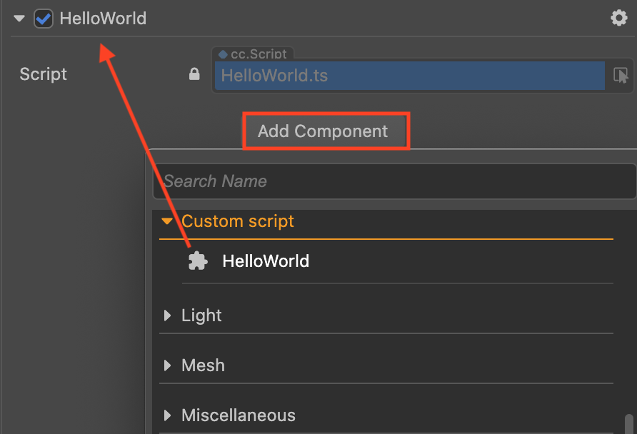
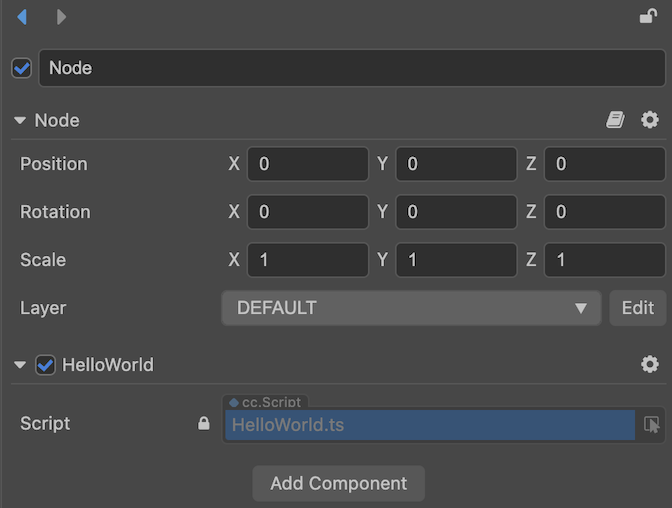
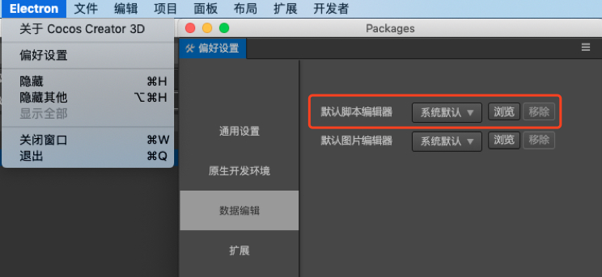

# 创建脚本

## 创建组件脚本

在 Cocos Creator 中，脚本也是资源的一部分。你可以在资源编辑器中通过点击"创建"按钮来添加并选择 TypeScript 来创建一份组件脚本。此时你会在你的资源编辑器中得到一份新的脚本：


一份简单的组件脚本如下：

```TypeScript
import { _decorator, Component, Node } from 'cc';
const { ccclass, property } = _decorator;

@ccclass('NewScript')
export class NewScript extends Component {
    /* class member could be defined like this */
    // dummy = '';

    /* use `property` decorator if your want the member to be serializable */
    // @property
    // serializableDummy = 0;

    start () {
        // Your initialization goes here.
    }

    // update (deltaTime: number) {
    //     // Your update function goes here.
    // }
}
```

请注意，我们更推荐用户使用 TypeScript 来编写脚本，但如果用户想要使用 JavaScript 来编写脚本的话，可以直接在操作系统的文件夹中创建 js 文件，也可以在代码编辑器中创建 js 文件。

## 编辑脚本

用户可根据自己的需求，选择自己喜爱的文本工具（如：Vim、Sublime Text、Web Storm、VSCode 等）进行脚本编辑，请先到 [设置](#默认脚本编辑工具配置) 中进行设置。

通过双击脚本资源，可以直接打开脚本编辑器进行编辑。当编辑完脚本并保存，Cocos Creator 会自动检测到脚本的改动，并迅速编译。

在代码编写之前，请先阅读 [脚本基础](basic.md) 了解更多关于脚本的内容。

## 添加脚本到场景节点中

将脚本添加到场景节点中，实际上就是为这个节点添加一份组件。我们先将刚刚创建出来的 **NewScript.js** 重命名为 **say-hello.js**。然后选中我们希望添加的场景节点，此时该节点的属性会显示在 **属性检查器** 中。在 **属性检查器** 的最下方有一个 **添加组件** 的按钮，点击按钮并选择 **添加用户脚本 -> say-hello** 来添加我们刚刚编写的脚本组件。



如果一切顺利，你将会看到你的脚本显示在 **属性检查器** 中：



**注意**：用户也可以通过直接拖拽脚本资源到 **属性检查器** 的方式来添加脚本。

## 默认脚本编辑工具配置


