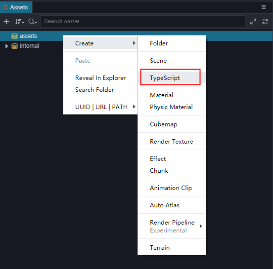
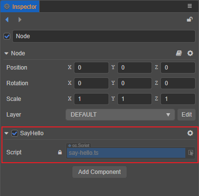
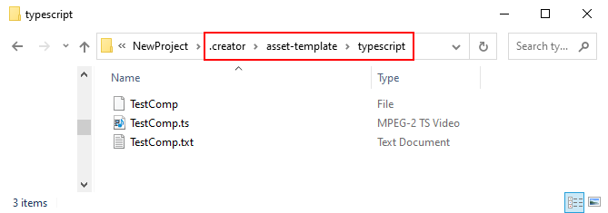
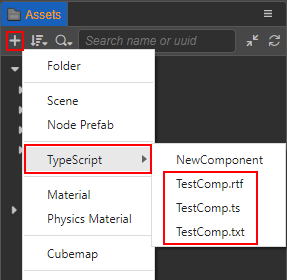
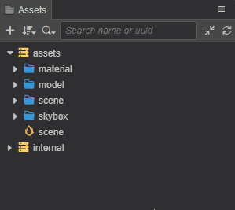

# 创建脚本

## 创建组件脚本

在 Cocos Creator 中，脚本也是资源的一部分。在 **资源管理器** 中创建的脚本，默认是一个 NewComponent 组件，我们称之为组件脚本。可通过以下两种方式创建：

- 在 **资源管理器** 中选中想要放置组件脚本的文件夹，然后右键点击并选择 **TypeScript** 即可。
- 直接点击 **资源管理器** 左上角的 **+** 按钮，然后选择 **TypeScript** 即可。



在创建脚本时，名称不能为空，默认为 `NewComponent`。我们将创建的组件脚本命名为 `say-hello`，可以看到在 **资源管理器** 中生成了一个名为 `say-hello` 的脚本文件：


一份基础的组件脚本如下：

```ts
import { _decorator, Component, Node } from 'cc';
const { ccclass, property } = _decorator;

/**
 * Predefined variables given by default, for some project management needs.
 * 
 * Name = SayHello
 * DateTime = Thu Jul 29 2021 15:19:02 GMT+0800 (中国标准时间)
 * Author = <%Author%> // 若未登录则该字段为空
 * FileBasename = say-hello.ts
 * FileBasenameNoExtension = say-hello
 * URL = db://assets/say-hello.ts
 * ManualUrl = https://docs.cocos.com/creator/3.4/manual/zh/
 *
 */
 
@ccclass('SayHello')
export class SayHello extends Component {
    // [1]
    // dummy = '';

    // [2]
    // @property
    // serializableDummy = 0;

    start () {
        // [3]
    }

    // update (deltaTime: number) {
    //     // [4]
    // }
}

/**
 * [1] Class member could be defined like this.
 * [2] Use `property` decorator if your want the member to be serializable.
 * [3] Your initialization goes here.
 * [4] Your update function goes here.
 *
 * Learn more about scripting: https://docs.cocos.com/creator/3.4/manual/zh/scripting/
 * Learn more about CCClass: https://docs.cocos.com/creator/3.4/manual/zh/scripting/decorator.html
 * Learn more about life-cycle callbacks: https://docs.cocos.com/creator/3.4/manual/zh/scripting/life-cycle-callbacks.html
 */
```

创建脚本时，其初始文件名会处理为它的 `className`，`className` 在项目中不允许重复。需要注意的是，重命名创建后的脚本文件，不会自动同步更新 `className`，详情请参考下文 **脚本重命名** 部分的内容。

> **注意**：我们更推荐用户使用 TypeScript 来编写脚本，目前 **资源管理器** 中仅支持创建 TypeScript 文件。但如果用户想要使用 JavaScript 来编写脚本的话，可以直接在操作系统的文件夹中创建 JavaScript 文件，也可以在代码编辑器中创建 JavaScript 文件。

## 编辑脚本

开发者可根据自己的需求，选择自己喜爱的文本工具（如：Vim、Sublime Text、Web Storm、VSCode 等）进行脚本编辑，请在编辑器菜单栏 **偏好设置** 的 [外部程序](../editor/preferences/index.md#%E5%A4%96%E9%83%A8%E7%A8%8B%E5%BA%8F) 中设置脚本编辑器。

然后双击脚本资源，可以直接打开脚本编辑器进行编辑。编辑完脚本并保存，然后返回编辑器，Cocos Creator 会自动检测到脚本的改动，并迅速编译。

在代码编写之前，可先阅读以下文档了解更多关于脚本的内容：

- [配置代码编辑环境](coding-setup.md)
- [脚本基础](basic.md)

## 添加脚本到场景节点中

将脚本添加到场景节点中，实际上就是为这个节点添加一个脚本组件。在 **层级管理器** 中选中希望添加脚本的场景节点，此时该节点的属性会显示在 **属性检查器** 中，添加脚本组件包括以下两种方式：

1. 直接将 **资源管理器** 中的脚本拖拽到 **属性检查器** 中。

    

2. 点击 **属性检查器** 最下方的 **添加组件** 按钮，然后选择 **自定义脚本 -> SayHello** 来添加我们刚刚编写的脚本组件，或者也可以直接搜索 **SayHello** 来添加。

    

## 脚本重命名

脚本组件的组件名是以脚本中定义的类名为准的，而不是脚本文件名。创建脚本时，脚本文件会按照以下规则生成脚本类名：

- 使用大驼峰式命名法
- 头部不能有数字
- 不含特殊字符
- 以脚本文件名中的符号和空格作为间隔，每个间隔后的首字母大写。例如脚本文件名为 `say-hello`，脚本类名则为 `SayHello`。

之后如果有对脚本文件名/脚本类名进行二次修改，这两者之间并不会自动同步，如果需要的话，可以手动同步。<br>
以上文中的 `say-hello.ts` 为例，若我们在 **资源管理器** 中将其重命名为 `hello`，可以看到 **属性检查器** 中的脚本组件名还是原来的 **SayHello**，只有脚本名称变成了 `hello`：


若我们双击打开 `say-hello.ts`，将类名改为 **Hello**：

```TypeScript
import { _decorator, Component, Node } from 'cc';
const { ccclass, property } = _decorator;

@ccclass('Hello')
export class Hello extends Component {}
```

保存脚本后返回编辑器，可以看到 **属性检查器** 中的脚本组件名变成了 **Hello**，但是脚本文件名还是原来的 `say-hello`：


## 自定义脚本模板

从 v3.3 开始，Creator 支持在项目中自定义脚本模板。操作步骤如下：

1. 在项目目录下新建 `.creator/asset-template/typescript` 目录，并在 `typescript` 目录下添加包含了自定义脚本模板内容的文本文件，该文件可以是任意格式或者不带格式的文件。

    

    自定义脚本模板的内容可参考引擎目录下 `resources\3d\engine\editor\assets\default_file_content\ts` 文件，其中包含了默认给定的几个预设参数，用于满足部分项目管理的需求：

    ```ts
    /**
    * Predefined variables
    * Name = <%Name%>
    * DateTime = <%DateTime%>
    * Author = <%Author%>
    * FileBasename = <%FileBasename%>
    * FileBasenameNoExtension = <%FileBasenameNoExtension%>
    * URL = <%URL%>
    * ManualUrl = <%ManualUrl%>
    *
    */
    ```

2. 然后回到编辑器，可以看到在 **资源管理器** 创建资源菜单的 **TypeScript** 下出现了二级菜单，其中包含了原先编辑器自带的组件脚本模板（`NewComponent`），以及在上个步骤中添加的三个自定义脚本模板：

    

    创建自定义脚本时，编辑器会读取自定义脚本模板中的文本内容，并将其处理为 TypeScript 脚本：

    
