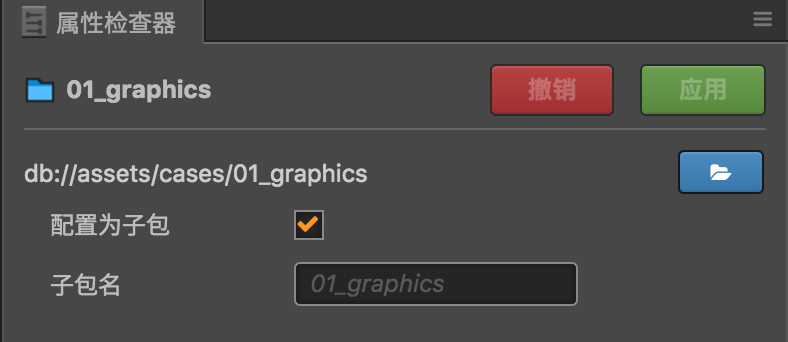
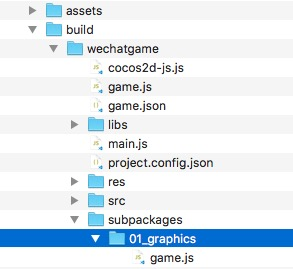
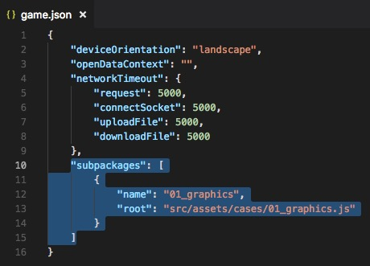
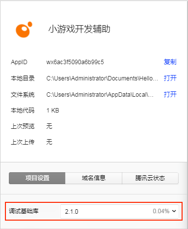
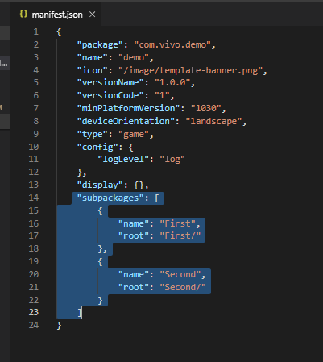

# 分包加载

随着游戏玩法越来越丰富，游戏的代码量也越来越大，开发者对于扩大包大小的需求越来越强烈，同时微信小游戏也支持了分包加载的功能。所以 Cocos Creator 推出了 **分包加载** 这样一个功能，该功能支持 **代码** 和 **资源** 的分包加载。其中 **资源分包** 从 **v2.0.7** 开始支持。分包加载目前只支持各类小游戏，如微信小游戏、OPPO 小游戏等。

分包加载，即把游戏内容按一定规则拆分在几个包里，在首次启动的时候只下载必要的包，这个必要的包称为 **主包**，开发者可以在主包内触发下载其他子包，这样可以有效降低首次启动的消耗时间。

## 配置方法

Cocos Creator 的分包是以文件夹为单位来配置的，当我们选中一个文件夹时，在 **属性检查器** 中会出现文件夹的相关配置选项：



勾选 **配置为子包** 后，点击右上方的 **应用**，这个文件夹下的资源（包含代码和其他资源）就会被当做是子包的内容了。**子包名** 会在加载子包时作为加载的名字传入，默认会使用这个文件夹的名字。

**注意**：配置为子包后，只有原生资源，例如图片和音频会被最终放到子包中。Prefab、AnimationClip 等 JSON 类型的资源仍然会放在主包里。

## 构建

分包的作用只会在项目构建后才会体现，预览的时候还是按照整包来进行加载的。项目构建后会在发布包目录下的 **subpackages** 生成对应的分包文件夹。

**例如**：将 example 工程中的 **cases/01_graphics** 文件夹配置为子包，那么项目构建后将会在发布包目录下的 **subpackages** 生成 **01_graphics** 文件夹。

  

构建发布时，会对 **cases/01_graphics** 子包文件夹下所有的 **代码** 和 **资源** 进行以下的相关处理：

  - **代码**：**cases/01_graphics** 文件夹下的所有代码会合并成一个命名为 **01_graphics/game.js** 的入口脚本文件，并且会将这些代码从主包中剔除。
  - **资源**：会把 **cases/01_graphics** 子包资源从发布包目录下的 **res/raw-assets** 文件夹移动到发布包目录下的 **subpackages/01_graphics** 目录下。

## 加载子包

引擎提供了一个统一的 api `cc.loader.downloader.loadSubpackage` 来加载子包文件里面的资源（包含代码和其他资源）。`loadSubpackage` 需要传入一个子包的名字，这个名字即是之前用户在项目中配置的子包名字，默认为子包文件夹的名字。

当子包加载完成后，会触发回调，如果加载失败的话，会返回一个错误信息。

```javascript
cc.loader.downloader.loadSubpackage('01_graphics', function (err) {
    if (err) {
        return console.error(err);
    }
    console.log('load subpackage successfully.');
});
```

如果加载成功，子包中的脚本将被执行，子包的资源加载路径将被添加到引擎中。开发者就可以用和访问主包完全一样的方式访问这个子包中的所有资源，无需关心这些资源原先是在主包还是在子包中。

## 微信小游戏

在微信小游戏的构建中，子包的配置也会按照规则自动生成到微信小游戏发布包目录下的 **game.json** 配置文件中。



**注意**：微信小游戏需要特定的版本才能支持分包功能。微信 6.6.7 客户端，2.1.0 及以上基础库开始支持，请更新至最新客户端版本，开发者工具请使用 1.02.1806120 及以上版本。更新了开发者工具后不要忘记修改开发者工具中的 **详情 -> 项目设置 -> 调试基础库** 为 2.1.0 及以上：



### 分包加载包大小的限制

目前微信小游戏分包大小有以下限制：

- 整个微信小游戏所有分包大小不超过 **20M**
- 单个分包不限制大小
- 主包大小不能超过 **4M**

具体请参考 [微信小游戏分包加载官方文档](https://developers.weixin.qq.com/minigame/dev/guide/base-ability/sub-packages.html)。

## vivo 小游戏

在 vivo 小游戏的构建中，子包的配置也会按照规则自动生成到 vivo 小游戏发布包 qgame/src 目录下的 **manifest.json** 配置文件中。



**注意**：

- Creator **v2.1.3** 开始支持 vivo 小游戏分包加载。
- **快应用 & vivo 小游戏调试器** 从 **1051** 版本开始支持 vivo 小游戏分包加载。低于 1051 的版本虽然不支持分包加载，但是也做了兼容处理，如果勾选了分包也不会影响游戏正常运行。具体可参考 [vivo 分包加载-运行时兼容](https://minigame.vivo.com.cn/documents/#/lesson/base/subpackage?id=%e8%bf%90%e8%a1%8c%e6%97%b6%e5%85%bc%e5%ae%b9)。
- 与微信小游戏不同的是，项目构建后分包文件夹是生成在发布包 qgame 目录下的 **src** 目录。

  

### 分包加载包大小的限制

目前 vivo 小游戏分包大小限制为 20M（主包限制 4M 及分包大小限制 16M）。

具体请参考 [vivo 小游戏分包加载官方文档](https://minigame.vivo.com.cn/documents/#/lesson/base/subpackage)。
