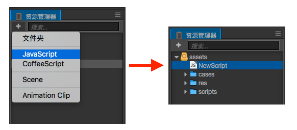
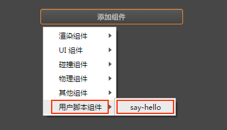
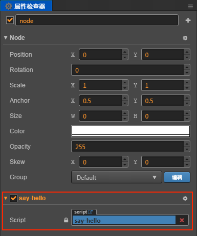

# 创建和使用组件脚本

## 创建组件脚本

在 Cocos Creator 中，脚本也是资源的一部分。用户可以在 **资源管理器** 中通过点击 **创建** 按钮选择添加 JavaScript 或者 TypeScript 来创建一份组件脚本。此时在 **资源管理器** 中便可以看到创建了一个新的脚本：



一份简单的组件脚本如下：

打开新建的脚本，在脚本中已经有了预先设置好的一些代码块，如下所示：

```js
cc.Class({
    extends: cc.Component,

    properties: {
        // foo: {
        //     // ATTRIBUTES:
        //     default: null,        // The default value will be used only when the component attaching
        //                           // to a node for the first time
        //     type: cc.SpriteFrame, // optional, default is typeof default
        //     serializable: true,   // optional, default is true
        // },
        // bar: {
        //     get () {
        //         return this._bar;
        //     },
        //     set (value) {
        //         this._bar = value;
        //     }
        // },
    },

    // LIFE-CYCLE CALLBACKS:

    // onLoad () {},

    start () {

    },

    // update (dt) {},
});
```

## 编辑脚本

用户可根据自己的需求，选择自己喜爱的文本工具（如：Vim, Sublime Text, Web Storm, VSCode...）进行脚本编辑，请先到 [设置](../getting-started/basics/editor-panels/preferences.md#%E6%95%B0%E6%8D%AE%E7%BC%96%E8%BE%91) 中进行设置。

通过双击脚本资源，可以直接打开脚本编辑器进行编辑。当编辑完脚本并保存，再次返回 Creator 编辑器界面时，Creator 会自动检测到脚本的改动，并迅速编译。

## 添加脚本到场景节点中

将脚本添加到场景节点中，实际上就是为这个节点添加一份组件。我们先将刚刚创建出来的 **NewScript.js** 重命名为 **say-hello.js**。然后选中我们希望添加的场景节点，此时该节点的属性会显示在 **属性检查器** 中。在 **属性检查器** 的最下方有一个 **添加组件** 按钮，点击按钮并选择 **添加用户脚本组件 -> say-hello** 来添加我们刚刚编写的脚本组件。



如果一切顺利，你将会看到你的脚本显示在 **属性检查器** 中：



**注意**：用户也可以通过直接拖拽脚本资源到 **属性检查器** 的方式来添加脚本。

---

继续前往 [使用 cc.Class 声明类型](class.md)。
