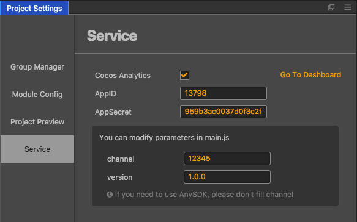

# Cocos 数据统计（Cocos Analytics）

Cocos 数据统计用于记录玩家的游戏行为，并且在后台提供了数据分析支持。Cocos Creator 能一键集成数据统计的 SDK，目前支持网页预览以及发布到 Web，iOS 和安卓平台。

打开 **项目设置** 面板，位于`菜单栏 - 项目 - 项目设置`。在 **服务** 一栏可以勾选 **Cocos 数据统计** 的配置项：

 - 打开后台： 
   点击后将跳转到数据统计后台，方便查看统计结果
 - AppID 和 AppSecret： 
   请填入在后台申请的帐号信息，默认为公用帐号
 - channel 和 version： 
   请填入渠道 ID 和版本号。这两个参数可以自己任意设置，只要自己在获取统计结果时能够区分就行。在原生平台上，渠道 ID 如果为空并且由 AnySDK 打包，启动时就会自动读取 AnySDK 打包后的渠道 ID。

游戏加载后，统计 SDK 会在项目构建后的 main.js 文件中初始化，并且传入上面设置的参数。如果有批量发布的需要，也可以手动在 main.js 中修改这些参数。初始化后，你就能直接调用统计的 SDK，发送各种统计数据给服务器。

详细的产品和 API 说明，请阅读 [产品文档](https://analytics.cocos.com/docs)
