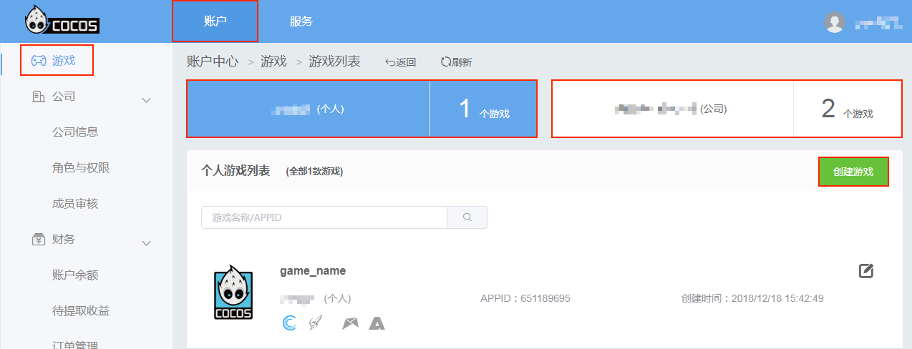
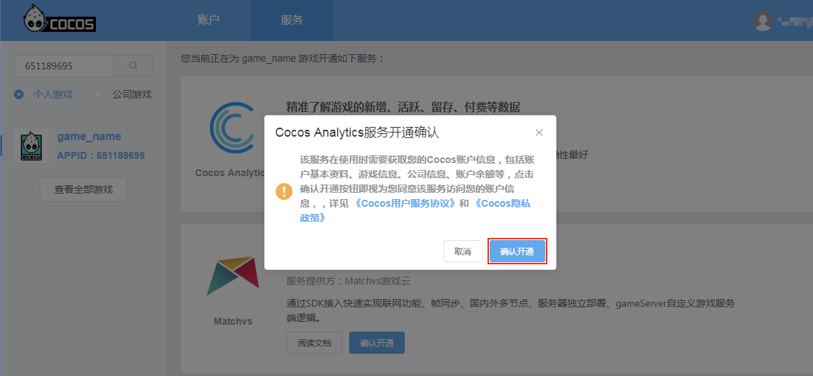
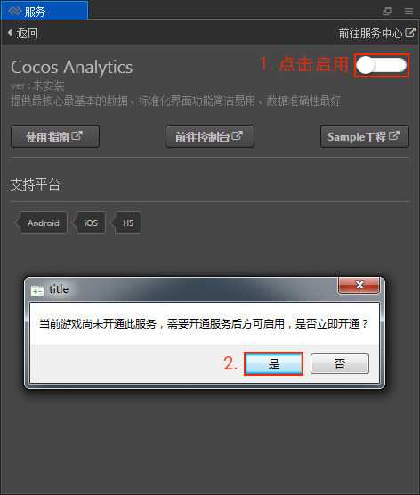
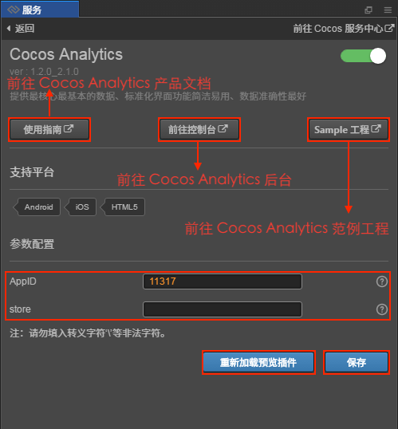
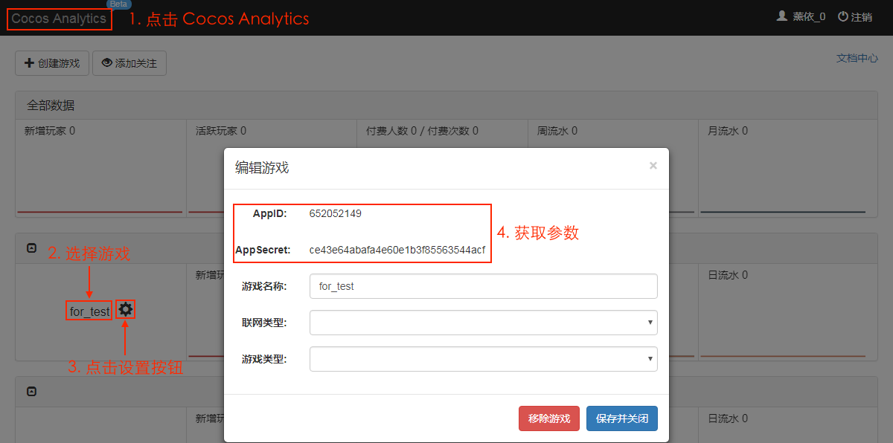

# Cocos 数据统计（Cocos Analytics）

Cocos 数据统计用于记录玩家的游戏行为，并且在后台提供了数据分析支持。目前支持 Android／iOS／Web 平台。

本文档基于 **v2.0.7** 编写，若用户使用的版本在 v2.0.7 之前，请参考 [旧版本文档](https://github.com/cocos-creator/creator-docs/blob/3e87b0f25c73e74acdc316c141971c592fc8f982/zh/sdk/cocos-analytics.md)。

## 操作流程

1、在 [Cocos 账户中心](https://auth.cocos.com/#/) 点击侧边栏的 **游戏**  标签，根据需要选择个人/公司游戏，然后点击 **创建游戏**。在创建游戏面板根据要求填写必须的参数，然后点击 **提交**，游戏就创建完成了。

2、游戏创建完成后，需要 **开通 Cocos Analytics 服务**。点击游戏或者点击上方的 **服务** 标签，跳转到服务面板。找到 Cocos Analytics，点击 **开通服务**，可以看到页面中的 Cocos Analytics 服务显示 **已开通**。

3、打开 Creator，点击 **菜单栏的 -> 面板 -> 服务** 项，打开 **服务** 面板。设置 Cocos AppID，详情可参考 [Cocos 服务面板设置](cocos-services.md)。然后选择 **Cocos Analytics** 项，进入 Cocos Analytics 服务设置面板。

4、点击右上角的启用按钮以启用统计服务。（如果之前没有在 Cocos 账户中心开通统计服务，即第 2 个步骤，那么在启用统计服务的时候会弹出是否开通服务的提示框，根据提示进行操作即可。）

5、启用完成之后，在服务面板可以看到新增了 **参数配置** 项，填入参数。

**获取参数方式如下：**

  - **AppID** 和 **AppSecret**：点击 Cocos Analytics 服务面板右上角的 **前往服务中心**，跳转到 [Cocos 账户中心](https://auth.cocos.com/#/)。然后切换到 **账户** 标签，点击游戏右边的 **编辑** 按钮进入游戏编辑窗口，即可获取 **AppID** 和 **AppSecret** 参数。如下图：

    
  - **channel** 和 **store**：channel 为广告联盟的广告渠道 ID。store 为游戏分发渠道 ID。这两个参数用户可以任意设置，只要在获取统计结果时能够区分即可。

6、参数配置完成之后点击 **保存**。然后打开 **构建发布** 面板根据用户需要选择 **Android／iOS／Web** 平台进行构建编译。构建出来的发布包已经自动集成了 Cocos Analytics 服务。

游戏加载后，统计 SDK 会在项目构建后的 main.js 文件中初始化，并且传入上面设置的参数。如果有批量发布的需要，也可以手动在 main.js 中修改这些参数。初始化后便可以直接调用统计的 SDK，发送各种统计数据给服务器。

## 各平台接入集成

根据游戏需求，参考以下文档来进行接入集成。  

- [Android 平台接入集成](https://n-analytics.cocos.com/docs/android/index.html)
- [iOS 平台接入集成](https://n-analytics.cocos.com/docs/ios/index.html)
- [Web 平台接入集成](https://n-analytics.cocos.com/docs/h5/index.html)

详细的产品和 API 说明，请参考 [Cocos Analytics 产品文档](https://n-analytics.cocos.com/docs/)

## 相关参考链接

- [Cocos 账户中心](https://auth.cocos.com/#/)
- [Cocos Analytics 后台](https://n-analytics.cocos.com/#/)
- [Cocos Analytics 产品文档](https://n-analytics.cocos.com/docs)
- [Android 平台接入集成](https://n-analytics.cocos.com/docs/android/index.html)
- [iOS 平台接入集成](https://n-analytics.cocos.com/docs/ios/index.html)
- [Web 平台接入集成](https://n-analytics.cocos.com/docs/h5/index.html)
- [Cocos Analytics 范例工程初始项目](https://github.com/cocos-creator/tutorial-dark-slash)
- [Cocos Analytics 范例工程完成项目](https://github.com/cocos-creator/tutorial-dark-slash/tree/analytics)
