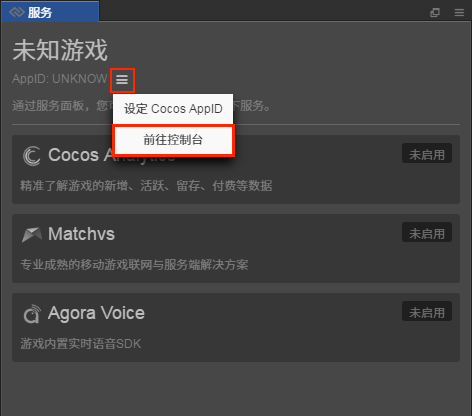
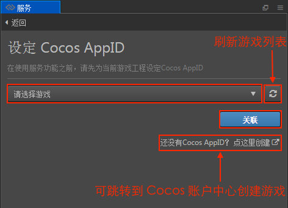
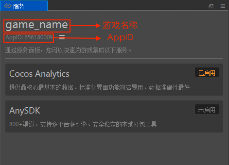
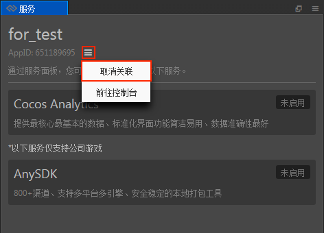

# 服务面板

Cocos Creator 从 v2.0.7 开始在 **菜单栏 -> 面板** 中新增了 **服务** 面板，通过 **服务** 面板，用户可以快速的为游戏集成服务。

**服务** 面板目前支持集成以下两种服务：

- [AnySDK](anysdk.md)
- [Cocos 数据统计](cocos-analytics.md)

## 使用方式

1、打开 Cocos Creator，选择 **菜单栏 -> 面板 -> 服务**，打开 **服务** 面板。点击 **服务** 面板上方的  按钮，选择 **前往控制台**，前往 [Cocos 账户中心](https://auth.cocos.com/#/) 注册用户账号。

账号注册完成后根据需要创建个人／公司游戏：

2、游戏创建完成之后，返回 Cocos Creator 的 **服务** 面板，点击  按钮，选择 **设定 AppID**，跳转到 **设定 Cocos AppID** 面板。选择游戏，然后点击 **关联** 按钮。

可以通过点击 **还没有 Cocos AppID？点这里创建** 按钮跳转到 Cocos 账户中心创建游戏。

3、AppID 设置完成之后会自动跳转到 **服务** 页面，可以看到页面左上方已经显示了游戏名称以及 AppID。

如果需要切换游戏的话，可以再次点击  按钮，选择 **取消关联**。然后再次进入 **设定 Cocos AppID** 面板重新选择游戏。

**注意**：因为各服务的类别不同，在使用方式上也有一定的区别。具体各服务的集成请参考以下文档：

- [AnySDK](anysdk.md)
- [Cocos 数据统计](cocos-analytics.md)