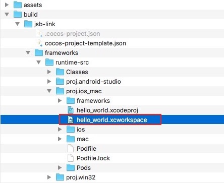

# Facebook 直播和广告

Cocos Creator 从 v2.0.6 开始支持一键集成 Facebook 服务，包括 **Facebook Live Video** 和 **Facebook Audience Network**。这两个 SDK 目前支持 Android 和 iOS 平台。

Creator 为用户完成的主要工作包括：

- 在 Cocos Creator 项目设置面板中提供一键式集成 Facebook Live Video 和 Facebook Audience Network，并且自动进行了初始化，用户能直接调用相关的 API

用户需要完成的工作：

- 调用 Facebook Live Video 和 Facebook Audience Network 的 API，访问相关功能

## Facebook 服务集成操作步骤

1、使用 Cocos Creator 打开项目工程，点击 **菜单栏 -> 项目 -> 项目设置 -> 服务**，在 **服务** 面板中有一个 **Facebook 服务**。


选中 **Facebook 服务**，可以看到下方有三个选项，分别为：

- **AppID**：在 [Facebook 开发者后台](https://developers.facebook.com/) 的 **我的应用** 中创建一款新应用（或者之前创建过的就应用也可以）。创建完成后上方的 **应用编号** 即是 AppID。
- **Facebook Live Video**：将 Facebook Live Video 集成到项目工程中
- **Facebook Audience Network**：将 Facebook Audience Network 集成到项目工程中

2、在 **项目设置 -> 服务** 中设置好需要集成的 SDK 后，打开 **构建发布** 面板，发布平台选择 **Android／iOS** 平台，其他参数用户可根据需要自行配置。配置完成后点击 **构建**。

**注意**：在 **构建 iOS 平台之前** 需要先下载 Facebook 服务相关的依赖，执行如下的命令。具体可参考 [CocoaPods 官方网站](https://cocoapods.org/)。

  ```bash
  # Xcode 8 + 9
  $ sudo gem install cocoapods
  ```

  若运行该命令时出现如下报错：

  

  可运行以下命令解决：

  ```bash
  $ gem source -r https://rubygems.org/
  $ gem source -a http://rubygems.org/
  $ sudo gem install cocoapods
  ```

  点击 **构建** 之后，若构建失败并且在 **控制台** 出现 `Some error have occurred while adding Facebook Audience Network iOS SDK undefined`，则国内用户需要保证在命令行中执行的命令能启用墙外代理。然后重启 Creator，并删除之前的发布包，再次执行 **构建**。

3、 构建完成后在发布包目录的 src 目录下可以看到生成了 **fb-live-stream.js** 和 **CCAds.js** 两个文件，分别对应的是 Creator 完成的对 **Facebook Live Video** 和 **Facebook Audience Network** 的封装。


**注意**：

- 首次编译 Android 平台需要用 Android Studio 打开构建后的工程以下载所需的支持包。（如果下载失败的话建议切换网络或者设置一下 Android Studio 的 HTTP 代理）
- 在使用 Xcode 编译 iOS 平台的时候需要打开的是 `.xcworkspace` 文件而不是 `.xcodeproj` 文件。



## 调用相关 API

### Facebook Live Video

可以通过 `fb.liveStream` 模块去访问 Facebook Live Video：

- `fb.liveStream.startLive();`：开始播放
- `fb.liveStream.stopLive();`：停止播放
- `fb.liveStream.pauseLive();`：暂停播放
- `fb.liveStream.resumeLive();`：恢复播放

具体的使用方式可参考 [范例工程](https://github.com/cocos-creator/facebook_demo) 中的 [/assets/script/live_scene.js](https://github.com/cocos-creator/facebook_demo/blob/master/assets/script/live_scene.js) 文件。

### Facebook Audience Network

Facebook Audience Network 分别有以下三种：

- `cc.Ads.Banner`：弹出底部广告条
- `cc.Ads.RewardedVideo`：弹出奖励视频窗口广告
- `cc.Ads.Interstitial`：弹出插屏广告

以弹出底部广告条 `cc.Ads.Banner` 为例，用户可以通过创建一个新的 `cc.Ads.Banner` 对象的实例，然后根据自己的需要去调用。示例代码如下：

```js
banner_click(event){
    let banner = new cc.Ads.Banner(this.placementId.BANNER, cc.Ads.BANNER_POSITION.ALIGN_PARENT_BOTTOM);
    this.banner = banner;
    banner.on("onAdLoaded", () => {
        cc.log("banner onAdLoaded");
        this.status_tips.string = "banner loaded";
    }, this.node);

    banner.on("onError", (eCode) => {
        cc.log("banner onError");
        this.status_tips.string = "banner onError";
    }, this.node);

    banner.on("onAdClicked", () => {
        cc.log("banner onAdClicked");
        this.status_tips.string = "banner onAdClicked";
    }, this.node);

    banner.show().then(() => {
        cc.log("banner show-------");
    }).catch((e) => {
        cc.log("banner reject ", e);
    });
},
```

`cc.Ads.RewardedVideo` 和 `cc.Ads.Interstitial` 的调用方式与 `cc.Ads.Banner` 类似，具体可以参考 [范例工程](https://github.com/cocos-creator/facebook_demo) 中的 [/assets/script/an_scene.js](https://github.com/cocos-creator/facebook_demo/blob/master/assets/script/an_scene.js) 文件。或者参考 Facebook 官方文档 [Audience Network](https://developers.facebook.com/docs/audience-network/)。

## 参考链接

- Cocos Creator 提供的 [Facebook 服务集成范例工程](https://github.com/cocos-creator/facebook_demo)，包含了 **Facebook Live Video** 和 **Facebook Audience Network** 的使用示例。
- [Facebook 开发者后台](https://developers.facebook.com/)
- [Facebook Audience Network](https://developers.facebook.com/docs/audience-network/)
