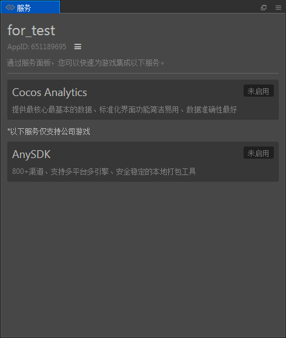
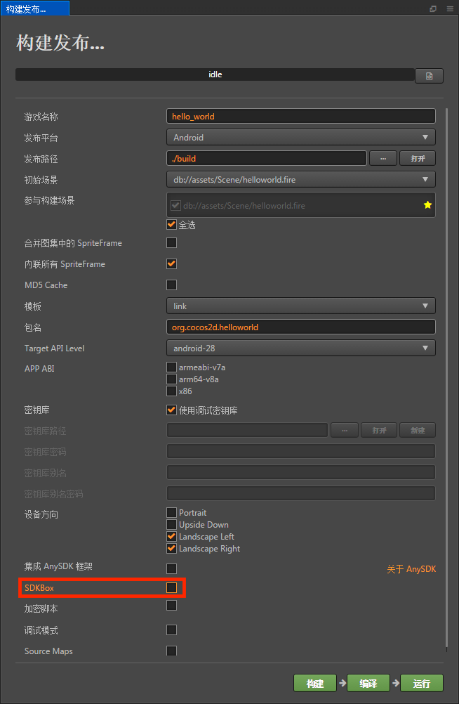

# SDK 集成

SDK 可通过以下几种方式集成

- 通过 **菜单栏 -> 面板 -> 服务** 可集成 Cocos 数据统计、Matchvs 以及 Agore Voice 服务。

  

  详情请参考：
    - [服务面板设置](cocos-services.md)
    - [Cocos 数据统计](cocos-analytics.md)
    - [Matchvs](http://doc.matchvs.com/QuickStart/QuickStart-CocosCreator)
    - [Agore Voice](https://docs.agora.io/cn/Interactive%20Gaming/game_c?platform=Cocos%20Creator)

- 通过勾选 **菜单栏 -> 项目 -> 项目设置 -> 服务 -> Facebook 服务** 可集成 Facebook 直播和广告。详情请参考 [Facebook 直播和广告](fb-an-and-live.md)。

  

- 通过在 **构建发布** 面板勾选 SDKBox 可集成 SDKBox。详情请参考 [SDKBox](sdkbox.md)。

  
