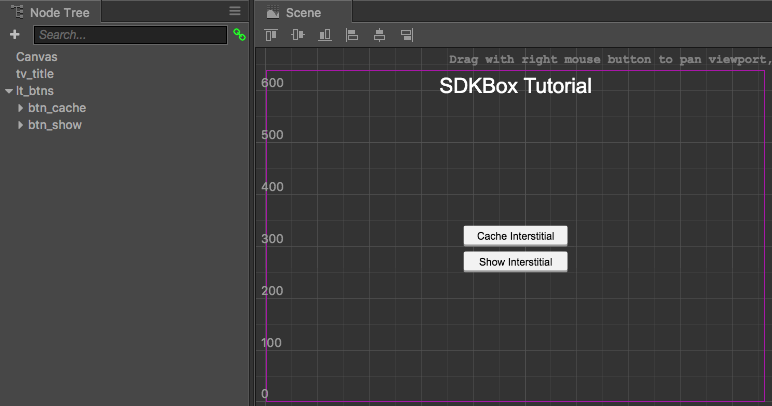
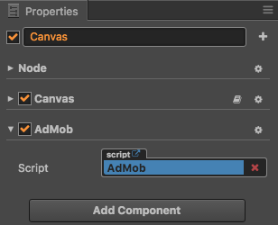
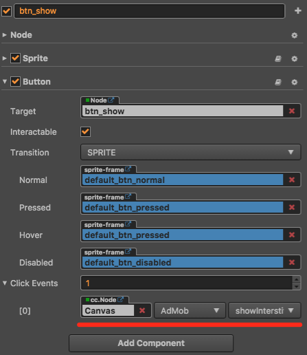

# SDKBox


SDKBox 是免费的让移动游戏开发人员简单轻松集成第三方 SDK 的工具，主要面向海外的各种平台和服务。支持苹果和谷歌的 IAP 内购等近 30 种 SDK，所有的 SDK 都经过严格的测试与官方认证。SDKBox 目前只支持 Android 和 iOS 平台。请访问 [SDKBox 主页](http://www.sdkbox.com/) 获取更多的信息。

## 集成 SDKBox

1. 使用 Creator 打开需要集成 SDKBox 的项目工程，从 **菜单栏 — 项目** 中打开 **构建发布** 面板，在 **构建发布** 面板中选择 **iOS/Android** 平台，并勾选 SDKBox，然后点击 **构建**。

2. 构建完成之后会自动弹出一个 **Install SDKBox Plugin？** 的选择框，选择 **Yes** 来打开 SDKBox 窗口，然后点击 import 来导入所需的插件。具体的操作流程可点击 [视频](https://gfycat.com/entirelinearbeetle) 参考。


## 使用指南

当 SDKBox 集成完成之后，就可以开始使用 SDK 的 API 了，这里将以 AdMob 作为示例。

### 添加按钮

首先在 **场景编辑器** 中添加两个按钮节点：



点击 **层级管理器** 左上方的 **+** 按钮，然后点击 **创建 UI 节点 -> Button**，即可在场景编辑器中添加 Button 节点。

### 添加 JavaScript 脚本组件

在 **属性检查器** 中点击左上方的 **+** 按钮，然后选择 **JavaScript** 来创建一个脚本。将脚本重命名为 `AdMob.js`，并且添加以下函数，记得要在 `onLoad` 函数中初始化 AdMob。

```js
cc.Class({
    extends: cc.Component,

    onLoad: function () {
        //Add this line to onLoad
        this.admobInit();
    },

    ...

    admobInit: function() {
        //finish it after import admob, let it empty for now
    },

    cacheInterstitial: function() {
        //finish it after import admob, let it empty for now
    },

    showInterstitial: function() {
        //finish it after import admob, let it empty for now
    },

    ...

});
```

然后在 **层级管理器** 中选中 Canvas 节点。点击 **属性检查器** 最下方的 **添加组件** 按钮，选择 **用户脚本组件 -> AdMob**：


即可添加 AdMob 脚本组件到 Canvas 节点：



### 添加按钮点击事件

在 **层级管理器** 中选中之前创建的 Button 节点，可以看到在 **属性检查器** 中有一个 Button 组件。然后设置 Click Events 属性，将挂载了 AdMob 脚本组件的 Canvas 节点拖拽到 Click Events 属性的 cc.Node 中，如下图所示。具体的内容可参考 [Button 事件](../components/button.md#button-%E4%BA%8B%E4%BB%B6)。




### 配置 AdMob

根据 AdMob 账号配置发布包目录下的 `./build/jsb-link/res/sdkbox_config.json` 文件，填写 AppID、广告 ID 等。可以通过点击编辑器右上方的 **工程目录** 按钮来打开工程文件夹。

### 编译项目

配置完成之后，再次打开 **构建发布** 面板，去掉 SDKBox 的勾选，然后点击面板下方的构建 -> 编译 -> 运行。而 iOS 平台在构建完成之后则需要使用 Xcode 打开发布包目录 `./build/jsb-link/frameworks/runtime-src/proj.ios_mac` 目录下的 `.xcodeproj` 文件进行编译和运行。

运行完成后点击 Cache Interstitial 按钮，然后再点击 Show Interstitial 按钮，即可显示广告。

### 参考代码

可参考的完整的 `AdMob.js` 代码如下：

```js
cc.Class({
    extends: cc.Component,

    onLoad: function () {
        //Add this line to onLoad
        this.admobInit();
    },

    admobInit: function() {
        if(cc.sys.isMobile) {
            var self = this
            sdkbox.PluginAdMob.setListener({
                adViewDidReceiveAd: function(name) {
                    self.showInfo('adViewDidReceiveAd name=' + name);
                },
                adViewDidFailToReceiveAdWithError: function(name, msg) {
                    self.showInfo('adViewDidFailToReceiveAdWithError name=' + name + ' msg=' + msg);
                },
                adViewWillPresentScreen: function(name) {
                    self.showInfo('adViewWillPresentScreen name=' + name);
                },
                adViewDidDismissScreen: function(name) {
                    self.showInfo('adViewDidDismissScreen name=' + name);
                },
                adViewWillDismissScreen: function(name) {
                    self.showInfo('adViewWillDismissScreen=' + name);
                },
                adViewWillLeaveApplication: function(name) {
                    self.showInfo('adViewWillLeaveApplication=' + name);
                }
            });
            sdkbox.PluginAdMob.init();
        }
    },

    cacheInterstitial: function() {
        if(cc.sys.isMobile) {
            sdkbox.PluginAdMob.cache('gameover');
        }
    },

    showInterstitial: function() {
        if(cc.sys.isMobile) {
            sdkbox.PluginAdMob.show('gameover');
        }
    },

});
```

## 相关参考链接

- [SDKBox 主页](http://www.sdkbox.com/)
- [开通服务](http://www.sdkbox.com/integrations)
- 在 Cocos Creator 中使用 SDKBox 的工作流程和详细指南请参阅 [SDKBox 官方文档](http://docs.sdkbox.com/zh/qa/cocos_creator/)。
