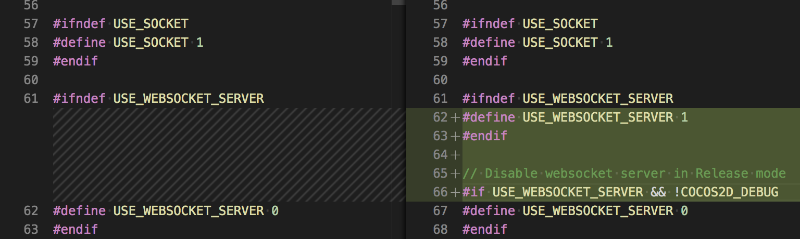

# 使用 WebSocket 服务器

开发者可以在游戏进程中启动一个 **WebSocket 服务器**，提供 **RPC 接口**。通过完善和调用这些 **RPC 接口**，开发者能够对游戏进程内部状态进行监控，增加对游戏进程状态的管理能力。

## 如何启用

**WebSocket 服务器** 默认是剔除的，需要设置宏 `USE_WEBSOCKET_SERVER = 1` 以启用。可以通过以下两种方式启用。

### 全平台启用 —— 修改默认值

在 `ccConfig.h` 中，设置 `USE_WEBSOCKET_SERVER` 的值为 `1`。



> **注意**：由于在 **Release** 模式下通常很少保留 **WebSocket 服务器**，修改中建议包含：

```c++
#if USE_WEBSOCKET_SERVER && !COCOS2D_DEBUG
#define USE_WEBSOCKET_SERVER 0
#endif
```

修改默认值会影响所有平台，如果不明确是否需要在所有平台启用，可以参考下面的方式，只针对特定平台开启。

### 特定平台启用

在一些情况下，只有特定的平台需要开启 **WebSocket 服务器**，此时需要通过不同的方式来设置 `USE_WEBSOCKET_SERVER`。

- Visual Studio

  编辑项目属性，如下图所示：

  

- Android

  编辑 `proj.android-studio/app/jni/Application.mk`，如下图所示：

  

- Xcode

  编辑项目属性，如下图所示：

  

只有通过上面的配置，才能在 JS 代码中调用 `WebSocketSever`。

## 如何调用 WebSocket 服务器接口

可参考下方实例代码：

```js
// 在原生平台的 Release 模式下或者在 Web/微信小游戏等平台中，WebSocketServer 可能没有定义
if (typeof WebSocketServer == "undefined") {
    console.error("WebSocketServer is not enabled!");
    return;
}

let s = new WebSocketServer();
s.onconnection = function (conn) {
    conn.ondata = function (data) {
        conn.send(data, (err) => {});
    }
    conn.onclose = function () {
        console.log("connection gone!");
    };
};

s.onclose = function () {
  console.log("server is closed!");
}
s.listen(8080, (err) => {
   if (!err);
   console.log("server booted!");
});
```

## API

接口定义如下：

```typescript
/**
 * 服务器对象
 */
class WebSocketServer {
    /**
     * 关闭服务
     */
    close(cb?: WsCallback): void;
    /**
     * 监听并启动服务
     */
    listen(port: number, cb?: WsCallback): void;
    /**
     * 处理新的请求
     */
    set onconnection(cb: (client: WebSocketServerConnection) => void);
    /**
     * 设置服务器关闭回调
     */
    set onclose(cb: WsCallback);
    /**
     * 获取所有的连接对象
     */
    get connections(): WebSocketServerConnection[];
}

/**
 * 服务器中客户端的连接对象
 */
class WebSocketServerConnection {
    /**
     * 关闭连接
     */
    close(cb?: WsCallback): void;
    /**
     * 发送数据
     */
    send(data: string|ArrayBuffer, cb?: WsCallback): void;

    set ontext(cb: (data: string) => void);
    set onbinary(cb: (data: ArrayBuffer) => void);
    set ondata(cb: (data: string|ArrayBuffer) => void);
    set onconnect(cb: () => void;);
    set onclose(cb: WsCallback);
    set onerror(cb: WsCallback);

    get readyState(): number;
}

interface WsCallback {
    (err?: string): void;
} 
```

## 参考链接

- 接口设计参考了 [nodejs-websocket](https://www.npmjs.com/package/nodejs-websocket#server)
