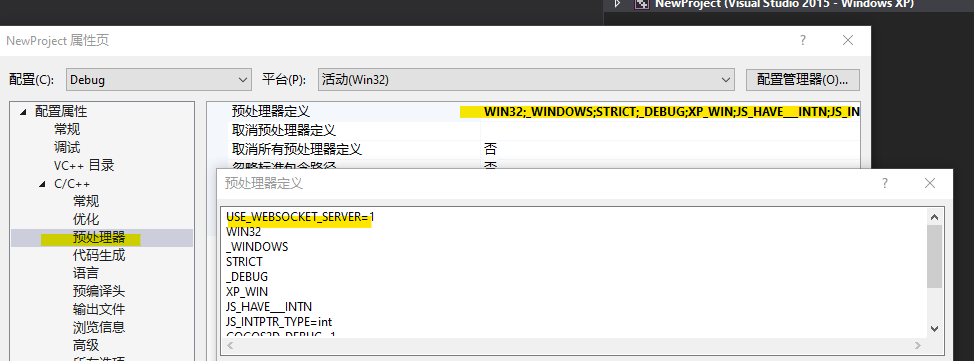
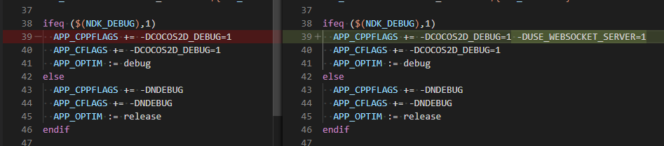

# 使用 WebSocket 服务器

开发者可以在游戏进程中启动一个`WebSocket服务器`，对外提供 `RPC接口`。 通过完善和调用这些 `RPC接口`，开发者能够对游戏进程内部的状态监控和控制，增加对开发者对游戏进程状态的控制能力。 

## 如何开启

`WebSocket服务器` 默认是关闭的，需要额外开启。 

### 修改默认值

在 `ccConfig.h` 中， 设置 `USE_WEBSOCKET_SERVER` 的值为 `1`.


需要注意上示的修改中包含

```c
#if USE_WEBSOCKET_SERVER && COCOS2D_DEBUG
#define USE_WEBSOCKET_SERVER 0
#endif
``` 
由于在 `Release` 模式中通常很少有需要保留 `WebSocketServer` 的情形，所以建议剔除。

### 根据平台开启开启

在一些情况下，只需要在特定的平台开启`WebSocket`服务器。 此时需要通过不同的方式，设置 `USE_WEBSOCKET_SERVER`。

#### Visual Studio

编辑 `Vistual Studio`项目属性



#### Android

编辑 `proj.android-studio/app/jni/Application.mk`



#### Xcode

编辑项目属性


只有通过上面的配置，才能在JS代码中调用 `WebSocketSever`. 

## 如何调用 WebSocket 服务器接口

通过`Demo`可以快速了解如何使用

```js

// 在 Native 的 Release 模式下 或者 浏览器/微信小游戏 等平台中， WebSocketServer 没有定义
if(typeof WebSocketServer == "undefined") {
    console.error("WebSocketServer is not enabled!");
    return;
}


let s = new WebSocketServer();
s.onconnection = function(conn) {
    conn.ondata = function(data) {
        conn.send(data, (err)=>{});
    }
    conn.onclose = function() { console.log("connection gone!");} ;
};

s.onclose = function() {
  console.log("server is closed!")
}
s.listen(8080, (err) => {
   if(!err) console.log("server booted!");
});
```
## API

```typescript

interface WsCallback {
    (err?:string):void
} 
/**
* 服务器对象
*/
class WebSocketServer {
    /**
    * 关闭服务
    */
    close(cb?:WsCallback):void;
    /**
    * 监听并启动服务
    */
    listen(port:number, cb? :WsCallback): void;
    /**
    * 处理新的请求
    */
    set onconnection(cb:(client:WebSocketServerConnection)=>void);
    /**
    * 设置服务器关闭回调
    */
    set onclose(cb: WsCallback);
    /**
    * 获取所有的连接对象
    */
    get connections(): WebSocketServerConnection[];
}

/**
* 服务器中客户端的连接对象
*/
class WebSocketServerConnection {
    /**
    * 关闭连接
    */
    close(cb?: WsCallback):void;
    /**
    * 发送数据
    */
    send(data:string|ArrayBuffer, cb?:WsCallback):void;

    set ontext(cb: (data:string)=>void);
    set onbinary(cb: (data:ArrayBuffer)=>void);
    set ondata(cb: (data:string|ArrayBuffer)=>void);
    set onconnect(cb: ()=>void;);
    set onclose(cb: WsCallback);
    set onerror(cb: WsCallback);

    get readyState():number;
}


```


## 参考链接

- 接口设计参考了 [nodejs-websocket](https://www.npmjs.com/package/nodejs-websocket#server)
- 原始 [PR](https://github.com/cocos-creator/cocos2d-x-lite/pull/1921)

