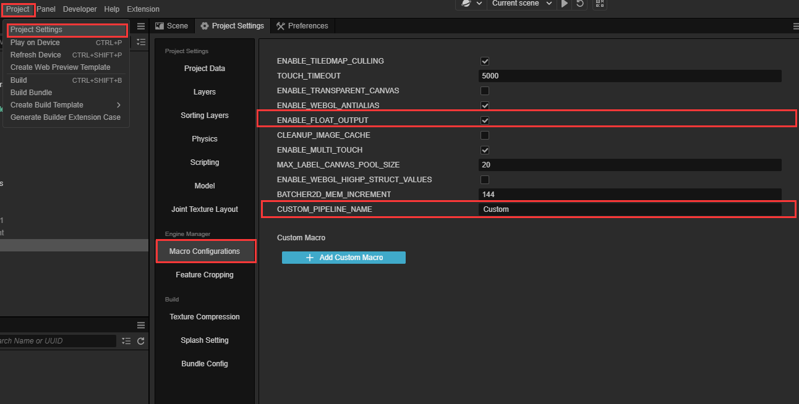
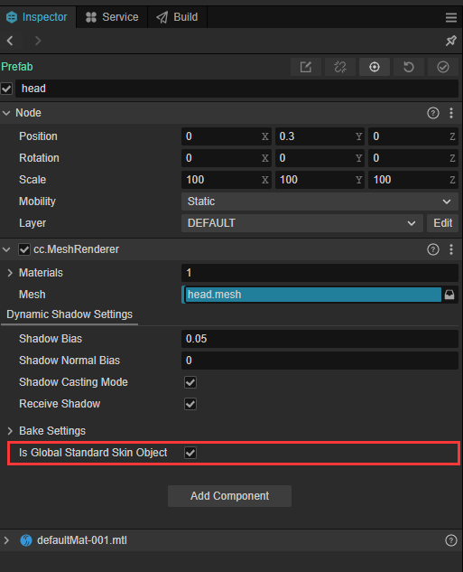
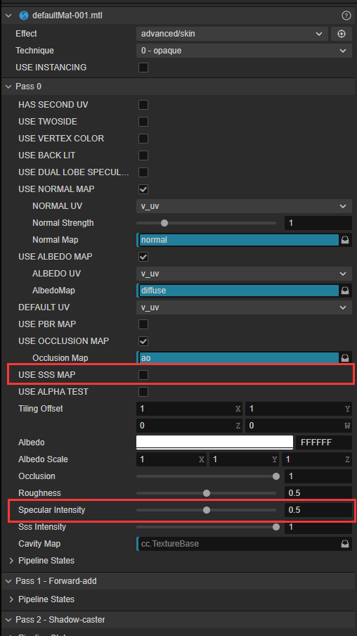

# 皮肤材质

在游戏中皮肤如果使用普通的 BRDF 材质往往表现不够红润和通透，因为现实中皮肤结构比较复杂，我们需要引用 Separable Subsurface Scattering 可分离次表面散射，还原皮肤的 SSS 效果，并使表现层次更丰富。

## 使用皮肤材质

1. 使用皮肤材质需要开启自定义管线。详细操作步骤请参考[自定义管线的功能开启](../../render-pipeline/custom-pipeline.md#功能开启)。

2. 使用皮肤材质需要一些额外的宏定义配置。在 **项目** 中选中 **项目设置**，然后点击 **引擎管理器** 的 **宏配置** 侧边选项。

    - 勾选 **ENABLE_FLOAT_OUTPUT** 选项。如果不勾选，引擎每次启动也会自动检测是否有皮肤材质并更改此选项以保障正确的效果，但会产生警告信息。

    

3. 使用皮肤材质需要为模型添加 **skin** 材质：

    - 新建材质。新建材质请参考 [材质资源](../../asset/material.md#材质创建)
    - 在材质中的 **effect** 选择 **advanced/skin**。

    

4. 指定某个模型为全局 **skin** 模型：**可选项，通常是指定头或身体对应的模型**。
    引擎需要知道皮肤材质对应的模型尺度以正确计算皮肤散射光照。若无勾选任何模型，会自动选择使用 skin 材质的模型来进行计算。

    - 选中皮肤模型的 **节点**, 在 **属性检查器** 中找到 **cc.MeshRenderer** 组件,在组件配置菜单中勾选 **Is Global Standard Skin Object** 选项。

    > **注意**：场景中只能在一个渲染组件中勾选 **Is Global Standard Skin Object**。重复在其他渲染组件中勾选会导致上一次勾选失效。

    

## 调整 **skin** 参数

1. **skin** 全局面板中的配置。

    - 在 **skin** 面板中调整皮肤效果。skin 配置面板请参考 [skin配置面板](../../concepts/scene/skin.md)。

2. **skin** 材质中的配置。

    - 针对单个模型调整皮肤材质强度时，可以在皮肤材质的 **属性查看器** 中找到 **Sss Intensity** 进行设置，也可以为皮肤材质添加一张 **USE SSS MAP** 图，精确的控制面部各个器官的皮肤效果强度。

    
