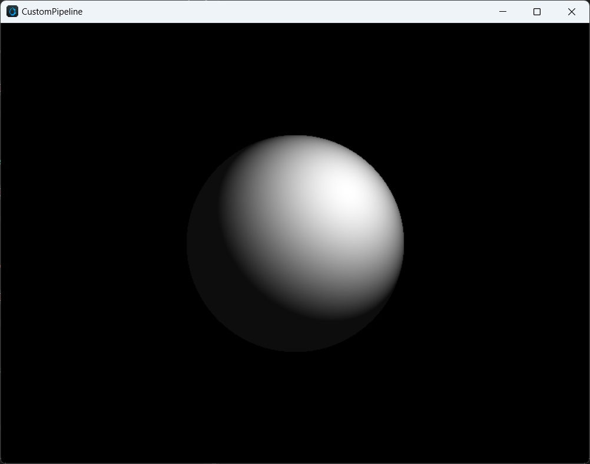

# 计算着色器

计算着色器（Compute Shader，以下简称 CS）是 GPU 上执行通用计算任务的编程模型。Cocos CS 继承 GLSL 语法与内置变量，添加方式与光栅化 Shader 相同以 effect 形式呈现，**仅支持在自定义管线**中使用。Compute Shader 无光栅化过程，输入输出均为内存数据。通过多线程完成并行处理，处理大量数据时非常高效。

## Effect 定义方式

定义方式同光栅化 Shader，在计算着色器下配置 PipelineState 无意义。

```
CCEffect %{
  techniques:
  - name: opaque
    passes:
    - compute: compute-main           // 定义 cs 入口
      pass: user-compute              // 定义 layout
      properties: &props
        mainTexture: { value: grey }  // 注册着色器材质面板资源属性
}%
CCProgram compute-main %{
  precision highp float;
  precision mediump image2D;
  layout(local_size_x = 8, local_size_y = 4, local_size_z = 1) in;
  
  #pragma rate mainTexture batch
  uniform sampler2D mainTexture;

  #pragma rate outputImage pass
  layout (rgba8) writeonly uniform image2D outputImage;

  void main () {
    imageStore(outputImage, ivec2(gl_GlobalInvocationID.xy), vec4(1, 0, 0, 1));
  }
}%
```

如要查看更多语法，请移步 [着色器语法](./effect-syntax.md)

## 输入输出

CS 输入输出包含内置输入变量与着色器资源。

内置输入包含以下部分，与 GLSL 语义相同：

```
in uvec3 gl_NumWorkGroups;
in uvec3 gl_WorkGroupID;
in uvec3 gl_LocalInvocationID;
in uvec3 gl_GlobalInvocationID;
in uint  gl_LocalInvocationIndex;
layout(local_size_x = X, local_size_y = Y, local_size_z = Z) in;
```

着色器资源包含：
- UniformBuffer
- StorageBuffer
- ImageSampler
- StorageImage
- SubpassInput

CS 无内置输出，可通过 StorageBuffer / Image 输出。

## 着色器资源

CS 目前支持 **PerPass**，**PerBatch** 两种频率的资源绑定，如下所示：

```c
#pragma rate mainTexture batch
uniform sampler2D mainTexture;

#pragma rate outputImage pass
layout (rgba8) writeonly uniform image2D outputImage;
```

其中 PerPass 资源可以定义为需要管线跟踪处理同步问题的资源，PerBatch 通常为常量数据、静态纹理，可通过 Material 进行修改绑定。

PerBatch mainTexture 在 properties 中绑定后，可在材质面板中配置。

PerPass outputImage 需要在管线中声明并由 ComputePass 引用，并由 RenderGraph 管理数据的读写同步以及 ImageLayout，详见后文示例。

## 管线集成

Cocos 自定义管线添加 CS 过程分为三步：

1. 添加 Compute Pass，其中 `passName` 为当前 Pass 的 LayoutName，需要与 Effect 中的 pass 字段对应。

  ```ts
  const csBuilder = pipeline.addComputePass('passName');
  ```

2. 声明、引用资源，并关联资源访问类型与 Shader 资源槽位。

  ```cpp
  const csOutput = 'cs_output';
  if (!pipeline.containsResource(csOutput)) {
      pipeline.addStorageTexture(csOutput,
          gfx.Format.RGBA8,
          width, height,
          rendering.ResourceResidency.MANAGED);
  } else {
      pipeline.updateStorageTexture(csOutput,
          width, height,
          gfx.Format.RGBA8);
  }

  csBuilder.addStorageImage(csOutput,  // 资源名
      rendering.AccessType.WRITE,      // 内存访问类型
      'outputImage');                  // 着色器资源名
  ```

3. 添加 Dispatch 调用实例，设置 Dispatch 参数，绑定材质

  ```cpp
  csBuild.addQueue().addDispatch(x, y, z, rtMat);
  ```

## 平台支持

### 特性支持

|          | WebGL | WebGL2 | Vulkan | Metal | GLES3  | GLES2 |
| -------- | ----- | ------ | ------ | ----- | ------ | ----- |
| 支持情况 | N     | N      | Y      | Y     | Y(3.1) | N     |

可通过 `device.hasFeature(gfx.Feature.COMPUTE_SHADER)` 查询。

### 约束限制

- `maxComputeSharedMemorySize`: 本地共享内存的最大字节数。
- `maxComputeWorkGroupInvocations`: 一个 WorkGroup 内的最大调用次数，即 Local WorkGroup 体积
- `maxComputeWorkGroupSize`: Local WorkGroup 三维数组限制
- `maxComputeWorkGroupCount`: Dispatch 三维数组限制

可通过 `device.capabilities` 查询。

### 平台差异

Cocos Creator 会将 Cocos CS 转化为平台对应版本的 glsl shader，因此为了能够保证各个平台的兼容性，需要尽量满足所有平台的限制要求，包括：
1. Vulkan 与 GLES 要求显式标明 Storage Image 的 Format 标识符，详细参考 GLSE 语法标准。
2. GLES 要求显式标明 Stroage 资源的 Memory 标识符，目前仅支持 readonly 与 writeonly。此外需要显式标识默认精度。

### 优化建议

1. 进行屏幕空间图像后处理时，可优先考虑 Fragment Shader。避免 RenderTarget 结果中途切换 CS 进行写操作。
2. 避免使用较大的工作组，尤其在使用 shared memory 情况下，每个 WorkGroup 大小建议不超过 64。

## 示例

下文展示了一个通过 ComputePass 实现的单个球 1 rpp 的简单光线追踪演示代码，使用到了 UniformBuffer，ImageSampler 与 StorageImage，其中 Effect Pass 声明部分如下：

```yaml
techniques:
- name: opaque
  passes:
  - compute: compute-main
    pass: user-ray-tracing
    properties: &props
      mainTexture: { value: grey }
```

`compute-main` 实现部分如下：

```c
precision highp float;
precision mediump image2D;

layout(local_size_x = 8, local_size_y = 4, local_size_z = 1) in;

#pragma rate tex batch
uniform sampler2D tex;

#pragma rate constants pass
uniform constants {
  mat4 projectInverse;
};

#pragma rate outputImage pass
layout (rgba8) writeonly uniform image2D outputImage;

void main () {
  vec3 spherePos = vec3(0, 0, -5);
  vec3 lightPos = vec3(1, 1, -3);
  vec3 camPos = vec3(0, 0, 0);
  float sphereRadius = 1.0;
  
  vec4 color = vec4(0, 0, 0, 0);
  
  ivec2 screen = imageSize(outputImage);
  ivec2 coords = ivec2(gl_GlobalInvocationID.x, gl_GlobalInvocationID.y);
  vec2 uv = vec2(float(coords.x) / float(screen.x), float(coords.y) / float(screen.y));
  
  vec4 ndc = vec4(uv * 2.0 - vec2(1.0), 1.0, 1.0);
  vec4 pos = projectInverse * ndc;
  vec3 camD = vec3(pos.xyz / pos.w);
  vec3 rayL = normalize(camD - camPos);
  
  vec3 dirS = spherePos - camPos;
  vec3 rayS = normalize(dirS);
  float lenS = length(dirS);
  
  float dotLS = dot(rayL, rayS);
  float angle = acos(dotLS);
  float projDist = lenS * sin(angle);
  
  if (projDist < sphereRadius) {
    // intersection
    vec3 rayI = rayL * (lenS * dotLS - sqrt(sphereRadius * sphereRadius - projDist * projDist));
  
    vec3 N = normalize(rayI - dirS);
    vec3 L = normalize(lightPos - rayI);
    color = vec4(vec3(max(dot(N, L), 0.05)), 1.0);
  }
  
  imageStore(outputImage, coords, color);
}
```

管线 API 调用如下：

```ts
export function buildRayTracingComputePass(
    camera: renderer.scene.Camera,
    pipeline: rendering.Pipeline) {
    // 获取屏幕长宽
    const area = getRenderArea(camera,
        camera.window.width,
        camera.window.height);
    const width = area.width;
    const height = area.height;
 
    // 声明 RT Storage Image 资源
 const csOutput = 'rt_output';
    if (!pipeline.containsResource(csOutput)) {
        pipeline.addStorageTexture(csOutput,
            gfx.Format.RGBA8,
            width, height,
            rendering.ResourceResidency.MANAGED);
    } else {
        pipeline.updateStorageTexture(csOutput,
            width, height,
            gfx.Format.RGBA8);
    }
    
    // 声明 Compute Pass, layout 需要与 Effect 中 pass 字段保持一致
 const cs = pipeline.addComputePass('user-ray-tracing');
    // 更新相机投影参数
    cs.setMat4('projectInverse', camera.matProjInv);
    // 声明当前 Compute Pass 对 Storage Image 引用
    cs.addStorageImage(csOutput, rendering.AccessType.WRITE, 'outputImage');
    // 添加 Dispatch 参数, 绑定 Material
    cs.addQueue()
        .addDispatch(width / 8, height / 4, 1, rtMat);
    // 返回当前 Image 资源名，用于后续 Post Processing 处理
    return csOutput;
}
```

Compute Pass 需要用户完成对 PerPass 资源的更新与绑定，PerBatch 的资源会由材质系统完成绑定，最终经过 FullScreen Blit 到屏幕的效果:


