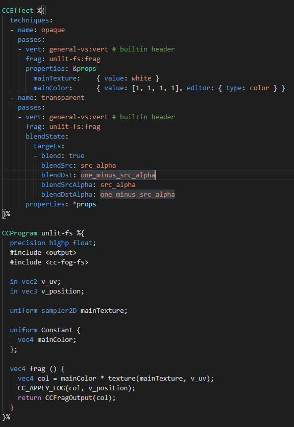

## 创建着色器资源

在 Cocos Creator 中的着色器称之为 **Cocos Effect**，资源类型为 **EffectAsset**，可以通过点击 **资源管理器** 右上角的 **+** 或者在 **资源管理器** 任意空白区域右键，选择 **Effect** 即可创建 **Cocos Effect**。

默认情况下，引擎会创建最简单的着色器模板：

若要基于内置着色器修改，可从项目内 Asset\internal\effects 内拷贝到外界进行修改。

了解更多内置着色器的内容：[内置着色器](effect-buildin.md) 。

