# 基于物理的光照模型（Physically Based Rendering - PBR）

Cocos Creator 从 v3.0 开始提供了基于物理渲染（PBR）的光照着色器：`builtin-standard.effect`。PBR 根据现实中光线传播原理和能量守恒定律，模拟出近似于真实物理光照的效果。

PBR 的优势在于：

- 真实性：基于物理原理的渲染让最终效果更加逼真
- 一致性：美术制作流程规范化、制作标准统一化
- 复用性：模型材质与光照环境分离，在所有 PBR 项目中均可复用

## 使用 PBR 制作材质和纹理

在 **资源管理器** 面板中手动创建的材质，默认使用的是 `builtin-standard.effect` 着色器，我们称之为 PBR 材质，PBR 材质使用 PBR 流程中的 Metal/Roughness 工作流。

在使用 PBR 材质进行渲染时，为获得正确的渲染效果，至少需要设置材质的 **固有色（Albedo）**、**粗糙度（Roughness）** 和 **金属度（Metallic）**。这些都可以在材质资源属性面板中进行设置：

除了在材质属性面板中直接赋予数值以外，也可以为材质的固有色（Albedo）、粗糙度（Roughness）、金属度（Metallic）赋予 **贴图**，以更精准地进行材质表达。除此之外，可以为材质赋予法线（Normal）贴图以获得更多表面结构细节，环境光遮蔽（Ambient Occlusion） **贴图** 以获得细节明暗关系，自发光（Emissive）贴图以获得自发光效果。

接下来我们以下图为例，看一下通过设置上述材质参数获得的效果：

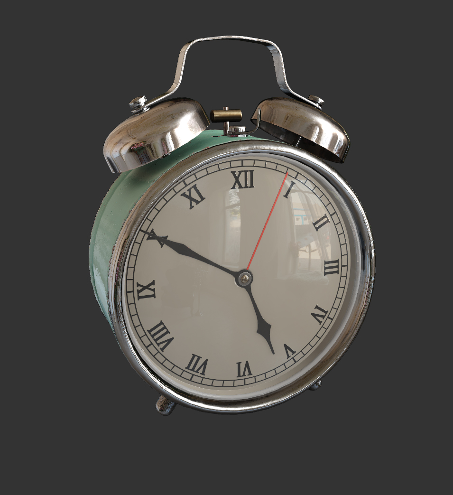

### 固有色（Albedo）

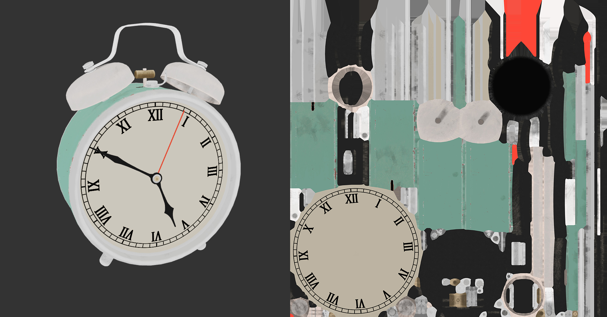

固有色（Albedo）用于表达材质在没有光照情况下所表达的颜色信息。美术上，可以将固有色理解为用肉眼观察时材质所表达的颜色信息。

在 PBR 流程中，固有色代表的是材质 **非金属** 部分的 **漫反射**（Diffuse）颜色，与材质 **金属** 部分的 **高光**（Specular）颜色的集合。

> **注意**：在 Metal / Roughness 工作流中，所有金属的漫反射（Diffuse）颜色都是黑色，肉眼所见的颜色表现是由金属反射光线所产生的。而在非 Metal / Roughness 工作流中，金属的颜色是由高光（Specular）颜色决定。使用非 Metal / Roughness 工作流制作的颜色贴图，将不能在 Creator 默认的 PBR 材质中正确渲染金属的颜色信息。

用户可以在材质属性面板的 **Albedo** 属性中直接设置固有色颜色，也可以勾选 `USE ALBEDO MAP`，为材质指定一张 sRGB 颜色空间的 RGBA 贴图。

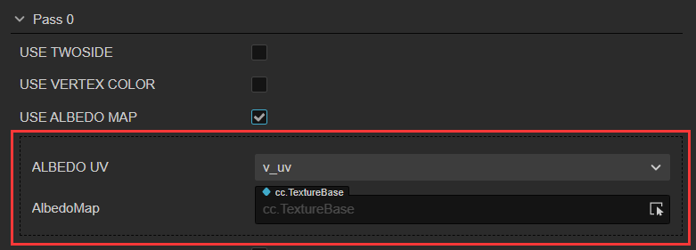

依据标准 PBR 流程的制作准则，为了获得符合物理现实的渲染效果，在制作固有色贴图的过程中需要注意：
- 固有色的 sRGB 数值最高不超过 **240**，根据材质的不同最低不低于 **30~50**。
- 在表达金属的固有色时，需要遵循金属 **70%~100%** 镜面反射率的物理规律，其 sRGB 取值范围为 **180~255**。

### 粗糙度（Roughness）

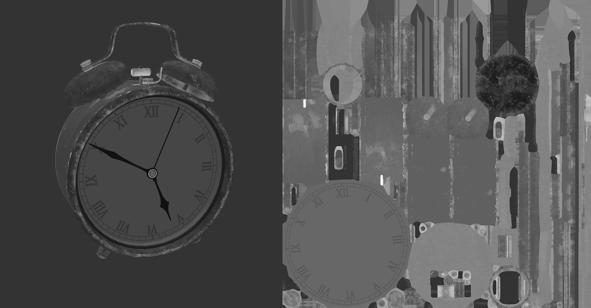

粗糙度（Roughness）用于表达材质因其表面细微的结构细节所导致的反光强弱程度，其取值范围为 [0, 1]。

- 当粗糙度设置为 0 时，表示材质表面绝对光滑，镜面反射率达到 100%。
- 当粗糙度设置为 1 时，表示材质表面绝对粗糙，镜面反射率为 0%

用户可以在材质属性面板的 `Roughness` 参数中直接赋予粗糙度数值，或者使用一张 sRGB 颜色空间的 RGBA 贴图的**绿通道**表达粗糙度值。在 Cocos Creator 默认 PBR 材质中，可以通过以下方式使用这张贴图：

1. 在 **资源管理器** 中选中 PBR 材质资源，然后在 **属性检查器** 中勾选 **USE PBR MAP** 属性，将 RGBA 贴图拖拽到出现的 **PbrMap** 属性框中；
2. 然后勾选 **USE METALLIC ROUGHNESS MAP**，将 RGBA 贴图再次拖拽到出现的 **MetallicRoughnessMap** 属性框中。

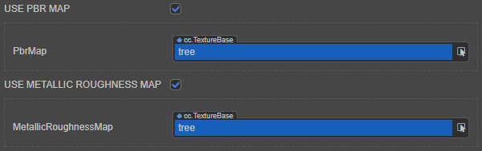

### 金属度（Metallic）

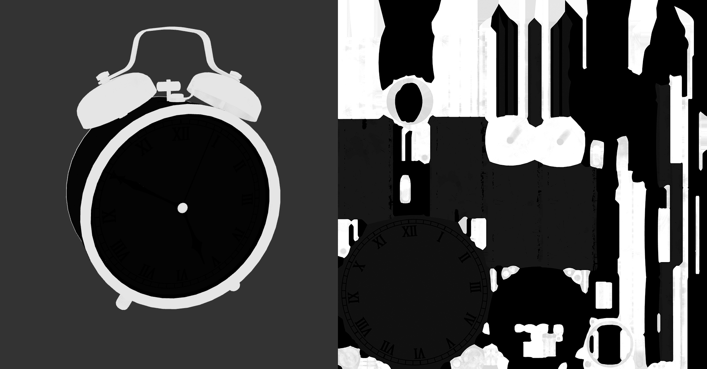

金属度（Metallic）用于表达材质的金属属性，其取值范围为 [0, 1]。在使用过程中，通常设置为 0 或者 1。

- 当金属度为 **0** 时，表示材质为非金属。
- 当金属度为 **1** 时，表示材质为金属。
- 当金属度为 **0~1** 之间的浮点数时，通常用于表示表面带有非金属脏迹的金属。

> **注意**：当金属度设置为 1 时，材质被认定为金属。因为随着金属度的提升，材质会发生以下变化，进而使其表现出金属的特征：
>
> - 固有色比金属度为 0 时的明度和饱和度更低；
> - 材质高光部分的颜色混合了材质的固有色；
> - 反射光更趋近于固有色。

用户可以在材质属性面板的 **Metallic** 属性中直接设置金属度。或者为材质指定一张 sRGB 颜色空间的 RGBA 贴图，通过贴图的 **蓝通道** 表达金属度，操作步骤如下：

1. 在 **资源管理器** 中选中 PBR 材质资源，然后在 **属性检查器** 中勾选 **USE PBR MAP** 属性，将 RGBA 贴图拖拽到出现的 **PbrMap** 属性框中；
2. 然后勾选 **USE METALLIC ROUGHNESS MAP**，将 RGBA 贴图再次拖拽到出现的 **MetallicRoughnessMap** 属性框中。

### 环境光遮蔽（Ambient Occlusion）

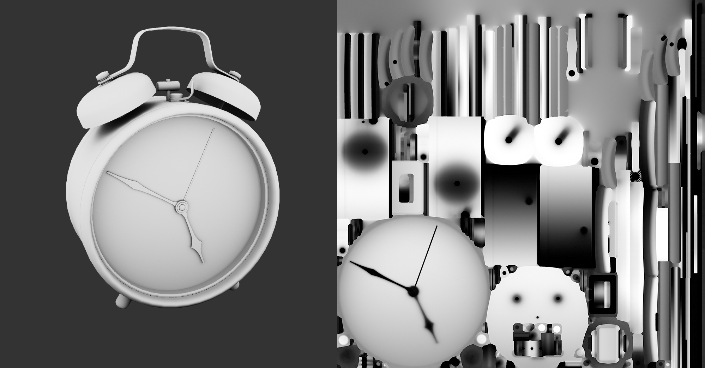

环境光遮蔽（Ambient Occlusion）用于表达材质因表面的结构细节所导致的明暗关系。美术上，可以将环境光遮蔽理解为模型自身结构所产生的阴影。

用户可以为 PBR 材质指定一张 sRGB 颜色空间的 RGBA 贴图，通过贴图的 **红通道** 表达环境光遮蔽关系，操作步骤如下：

1. 在 **资源管理器** 中选中 PBR 材质资源，然后在 **属性检查器** 中勾选 **USE PBR MAP** 属性，将 RGBA 贴图拖拽到出现的 **PbrMap** 属性框中；
2. 然后勾选 **USE METALLIC ROUGHNESS MAP**，将 RGBA 贴图拖拽到出现的 **MetallicRoughnessMap** 属性框中；
3. 勾选 **USE OCCLUSION MAP**，将 RGBA 贴图拖拽到出现的 **OcclusionMap** 属性框中。、

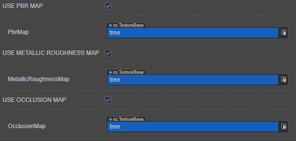

### 法线（Normal）

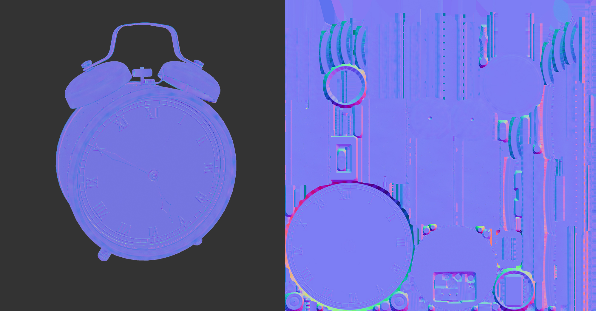

法线（Normal）贴图是一张用 sRGB 颜色空间的 RGB 数值代表模型切线空间的顶点坐标位置的贴图。其作用是将贴图中的顶点坐标数据叠加到模型自身的顶点坐标数据上参与 PBR 光影的计算，使顶点数量较低的低模也能够表现顶点数量较高的高模的光影变化效果。美术上，可以将法线贴图理解为一张表达物体表面结构细节的贴图。

法线贴图通常有两种制作方法：
1. 分别制作一个顶点数量较高的高模和一个顶点数量较低的低模，将高模的顶点坐标数据烘培到一张使用低模的 UV 的贴图上
2. 将一张图片资源的类型转换为法线贴图

   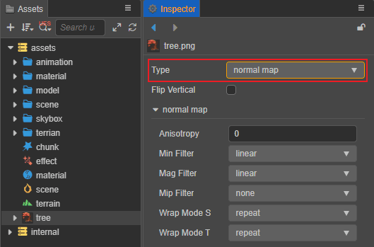

> **注意**：在从高模烘培法线时，请确保烘培器使用右手坐标系（Y 轴向上）和 MIKK 切线空间算法。

### 自发光（Emissive）

自发光颜色（Emissive）表达材质自身作为光源向外发光的颜色信息。

用户可以在材质属性面板的 **Emissive** 属性中直接设置自发光。或者为 PBR 材质指定一张 sRGB 颜色空间的 RGBA 贴图，操作步骤如下：

1. 在 **资源管理器** 中选中 PBR 材质资源，然后在 **属性检查器** 中勾选 **USE EMISSIVE MAP** 属性，将 RGBA 贴图拖拽到出现的 **EMISSIVEMAP** 属性框中；

2. 然后通过 **EmissiveScale** 属性调节自发光颜色的红、绿、蓝通道的发光强度。

    > **注意**：通常将 **EmissiveScale** 属性值设置为 **1** 以上来配合自发光使用。当 **EmissiveScale** 设置为 1 时，材质的自发光效果等同于 `builtin-unlit.effect` 材质。

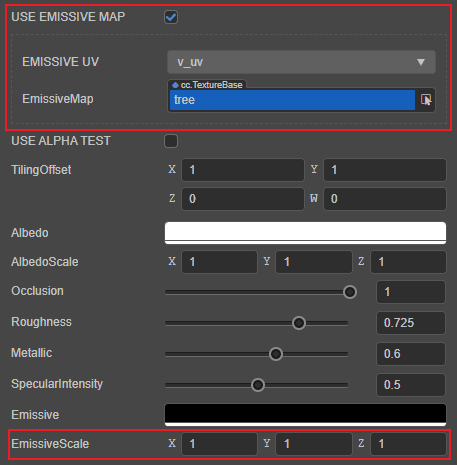

### 模板遮罩（Stencil）

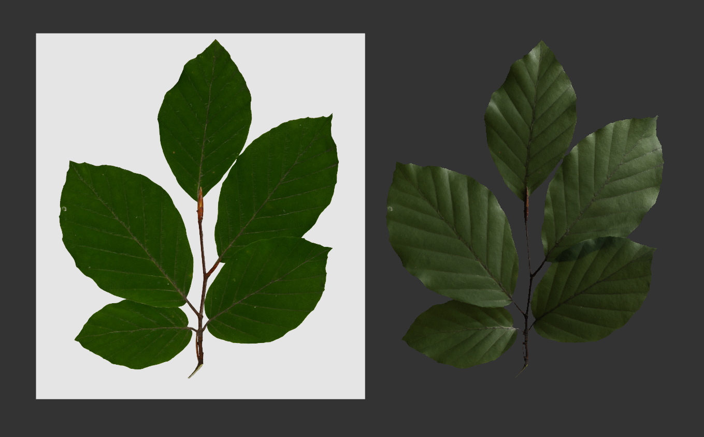

当渲染使用了模板遮罩（Stencil）的材质时，可开启 PBR 材质的 Alpha Test 功能，将遮罩之外的片元去除。步骤如下：

- 将模板遮罩（Stencil）作为 **Alpha 通道** 或 **红通道**，存储在固有色贴图中；
- 在 **资源管理器** 中创建一个新的材质，参考上文 **固有色** 部分的内容，将固有色贴图挂载到新的材质上；
- 勾选 **USE ALPHA TEST**，在下方显示的 **ALPHA TEST CHANNEL** 属性中选择模板遮罩（Stencil）所在的 Alpha 通道（对应属性中的 **a** 项）或者红通道（对应属性中的 **r** 项）；
- 在 `ALPHA TEST CHANNEL` 参数中选择模板遮罩（Stencil）所在的通道（Alpha 通道或红通道）；
- 通过 **AlphaThreshold** 属性调节抛弃片元明度的阈值；
- 如果有需要，可参考上文实现法线、环境光遮蔽等效果。

### 透明材质

材质属性面板中的 **Technique** 属性用于渲染透明或半透明材质，当设置为 **1-transparent** 时，将开启 Alpha Blending 功能，切换为渲染透明材质模式。

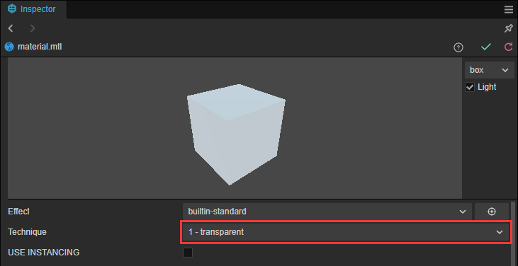

当切换到透明材质模式时，材质所有的功能与不透明模式没有差别。用户可以依照上述的工作流程进行材质制作。

由于当 Alpha Blending 开启时，引擎的渲染管线对深度的控制发生了改变，因此在切换到透明材质模式时，**需要勾选材质属性面板 PipelineStates -> DepthStencilState 下的 `DepthWrite` 参数。**

### PBR主要参数组装流程

## PBR 参数

在外部代码编辑器中打开 **资源管理器** 面板中 `internal -> effects` 目录下的 `builtin-standard.effect`，可以看到参数如下：

| 参数 | 说明 |
| :------- | :--- |
| tilingOffset | 模型 UV 的缩放和偏移量，xy 对应缩放，zw 对应偏移 |
| mainColor | 用于指定模型的固有色或固有色贴图，在 **属性检查器** 中的名称显示为 **albedo** |
| albedoMap/mainTexture | 固有色贴图，如果有指定，这项会和固有色颜色相乘 |
| albedoScale | 模型的固有色强度，用于控制固有色颜色对于最终颜色的影响权重 |
| alphaThreshold | 半透明测试阈值，alpha 值低于此值的像素会被 discard 掉 |
| normalMap | 法线贴图，用于增加表面细节 |
| normalStrenth | 法线贴图强度，控制凹凸质感的强弱 |
| pbrMap **R**（AO） **G**（Roughness） **B**（Metallic） | PBR 材质参数贴图，采样结果会和常数项相乘 R 通道：环境光遮蔽 G 通道：粗糙度 B 通道：金属度 |
| metallicRoughnessMap **G**（Roughness） **B**（Metallic） | 独立的粗糙度和金属度贴图，采样结果会和常数项相乘 G 通道：粗糙度 B 通道：金属度 |
| occlusionMap | 独立的环境光遮蔽贴图 采样结果会和常数项相乘 |
| occlusion | 环境光遮蔽系数 |
| roughness | 粗糙度系数 |
| metallic | 金属度系数 |
| emissive | 自发光颜色，独立于光照计算，由模型本身直接发散出的颜色 |
| emissiveMap | 自发光贴图 如果有指定，这项会和自发光颜色相乘，因此需要把自发光颜色（默认是黑色）调高才会有效果 |
| emissiveScale | 自发光强度 用于控制自发光颜色对于最终颜色的影响权重 |

## PBR 宏定义

| 宏定义 | 说明 |
| :---- | :--- |
| USE_BATCHING | 是否启用动态 Mesh 合批 |
| USE_INSTANCING | 是否启用几何体实例化 |
| HAS_SECOND_UV | 是否存在第二套 UV |
| ALBEDO_UV | 指定采样固有色贴图使用的 UV，默认使用第一套 |
| EMISSIVE_UV | 指定采样自发光贴图使用的 UV，默认使用第一套 |
| ALPHA_TEST_CHANNEL | 指定透明测试的测试通道，默认为 A 通道 |
| USE_VERTEX_COLOR | 是否启用顶点颜色。如果启用，顶点色会与固有色颜色相乘 |
| USE_ALPHA_TEST | 是否开启透明测试（镂空效果） |
| USE_ALBEDO_MAP | 是否使用固有色射贴图 |
| USE_NORMAL_MAP | 是否使用法线贴图 |
| USE_PBR_MAP | 是否使用 PBR 参数三合一贴图（**按 glTF 标准，RGB 通道必须分别对应环境光遮蔽、粗糙度和金属度**） |
| USE_METALLIC_ROUGHNESS_MAP | 是否使用金属粗糙二合一贴图（**按 glTF 标准，GB 通道必须分别对应粗糙和金属度**） |
| USE_OCCLUSION_MAP | 是否使用环境光遮蔽贴图（**按 glTF 标准，只会使用 R 通道**） |
| USE_EMISSIVE_MAP | 是否使用自发光贴图 |

更多 PBR 原理相关的内容，请参考 [PBR 理论](https://learnopengl-cn.github.io/07%20PBR/01%20Theory/#pbr)。
