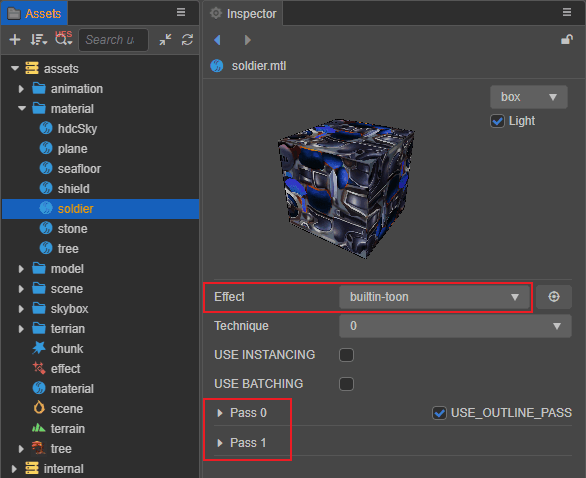
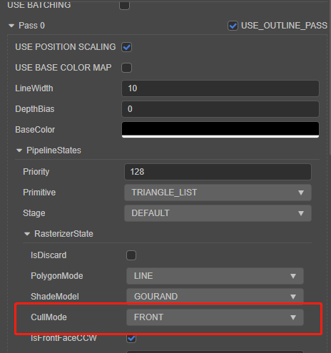
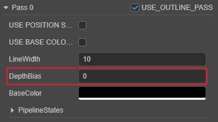
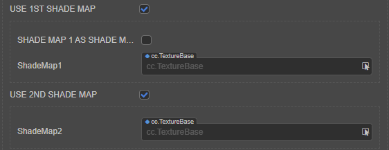
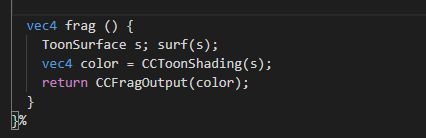

# 卡通渲染

相对于 [真实渲染](effect-builtin-pbr.md)（Physical Based Rendering - PBR），非真实渲染（Non-Photorealistic Rendering - NPR）通过特性化渲染，实现与真实世界完全不同的美术表现。

卡通渲染（Toon Shading）是非真实渲染的常见效果之一。

通常卡通渲染的内容包含以下几个基础部分：

- 对物体进行描边
- 降低色阶的数量并模拟色阶不连续现象
- 明暗色调分离
- 阴影形状干扰等

## 渲染过程

Cocos Creator 提供了内置卡通渲染着色器 `builtin-toon.effect`，以此为例，我们在材质资源中将 **Effect** 属性切换为 `builtin-toon.effect`，可以看到卡通渲染由两个渲染过程（Pass）组成：

- 渲染过程 0（Pass 0）：用于描边，默认不启用，可勾选右侧的 **USE_OUTLINE_PASS** 开启。
- 渲染过程 1（Pass 1）：正常渲染模型

### 渲染过程 0

渲染过程 0 会将光栅化状态中的剔除模式选择为正面剔除（`CullMode = FRONT`）并将模型的顶点沿法线进行扩张，由此得到一个比原模型较大的单色模型，之后 **渲染过程 1** 会正常渲染一次模型并遮盖住 **渲染过程 0** 的渲染结果，由于 **渲染过程 1** 的模型尺寸小于 **渲染过程 0** 的尺寸，因此会留下一个纯色的边缘形成描边。

 **渲染过程 0** 可通过勾选 **USE_OUTLINE_PASS** 开启或关闭。

当勾选 **USE_OUTLINE_PASS** 开启 **渲染过程 0** 的描边功能后，效果图如下：

若需要调整描边的深度效果，可通过 **DepthBias** 属性进行调整：

当不勾选 **USE_OUTLINE_PASS** 关闭 **渲染过程 0** 的描边功能后，效果图如下：

### 渲染过程 1

卡通渲染的核心思路是通过降低色阶的数量，模拟器卡通中的赛璐璐（Celluloid）画风。

在着色器中将色阶降低为三个色阶，并通过三个颜色组成：

- **baseColor**：基础颜色
- **shadeColor1**：一阶着色的颜色
- **shadeColor2**：二阶着色的颜色

其颜色与编辑器材质属性的对应关系如下图：

勾选 **USE_1ST_SHADE_MAP** 和 **USE_2ND_SHADE_MAP** 的情况下，使用外部进行纹理模拟色阶不连续现象。

通过着色器的 `surf` 方法计算表面着色器（`ToonSurface`）的参数，并由 `CCToonShading` 方法计算最终的着色。

## 参数和预编译宏定义

### 渲染过程 0

| 属性         | 说明                                                              |
| :------------- | :---------------------------------------------------------------- |
| lineWidth | 描边的宽度
| depthBias | 描边的深度位移调整因子
| baseColor | 描边的颜色

### 渲染过程 1

| 属性         | 说明                                                              |
| :------------- | :---------------------------------------------------------------- |
| tilingOffset   | 模型 UV 的缩放和偏移量，xy 对应缩放，zw 对应偏移|
| mainColor      | 主颜色，该颜色会作为最初的色阶|
| colorScale     | 颜色缩放，对主颜色，一阶和二阶颜色的 RGB 通道相乘 |
| alphaThreshold | 设置 Alpha 测试阀值，Alpha 值低于设定值的像素将被抛弃。该项仅在勾选 **USE_ALPHA_TEST** 后显示 |
| shadeColor1    | 一阶色阶的颜色，该颜色会作为卡通着色的中间色阶 |
| shadeColor2    | 二阶色阶的颜色，该颜色会作为卡通着色的最后一个色阶 |
| specular       | 高光颜色 |
| baseStep       | 一阶着色的步长 |
| baseFeather    | 一阶着色和主颜色混合因子，和 **BaseStep** 属性配合调整一阶色阶所占比例以及混合的形式 |
| shadeStep      | 二阶着色的步长 |
| shadeFeather   | 二阶着色和一阶着色的混合因子，和 **ShadeStep** 属性配合调整二阶色阶所占比例以及混合的形式 |
| shadowCover    | 阴影遮蔽因子 |
| emissive       | 自发光颜色，独立于光照计算，由模型本身直接发散出的颜色  |
| emissiveScale  | 自发光强度，用于控制自发光颜色对最终颜色的影响权重 |
| normalStrenth  | 法线伸缩量 只有在启用 USE_NORMAL_MAP 后才可以调整并对法线的 xy 轴进行缩放|
| normalMap      | 法线贴图  只有在启用 USE_NORMAL_MAP 后才可以调整 |
| mainTexture    | 主纹理，定义物体的基础纹理   编辑器内显示为 **baseColorMap**，需启用 USE_BASE_COLOR_MAP 宏才可以调整 |
| shadeMap1      | 一阶色阶纹理，若指定则会和设定的 ShadeColor1 相乘。该项仅在勾选 **USE 1ST SHADER MAP** 后显示 |
| shadeMap2      | 二阶色阶纹理，若指定则会和设定的 ShadeColor2 相乘。该项仅在勾选 **USE 2ND SHADER MAP** 后显示 |
| specularMap    | 高光贴图，若指定了贴图，则会和高光颜色相乘。该项仅在勾选 **USE SPECULAR MAP** 后显示 |
| emissiveMap    | 自发光贴图，若指定则会和自发光颜色相乘，因此需要将自发光颜色（默认是黑色）中的 RGBA 调高才会有效果。该项仅在勾选 **USE EMISSIVE MAP** 后显示 |

## 宏定义

| 宏名                          | 说明                      |
| :---------------------------- | :------------------------ |
| USE_INSTANCING | 是否启用动态 instancing |
| USE_OUTLINE_PASS              | 是否启用描边 Pass         |
| USE_NORMAL_MAP                | 是否使用法线贴图          |
| USE_BASE_COLOR_MAP            | 是否使用基础贴图          |
| USE_1ST_SHADE_MAP             | 是否使用贴图作为一阶色阶 |
| USE_2ND_SHADE_MAP             | 是否使用贴图作为二阶色阶图 |
| USE_EMISSIVE_MAP              | 是否使用自发光贴图        |
| USE_ALPHA_TEST                | 是否进行半透明测试        |
| USE_SPECULAR_MAP              | 是否使用高光贴图        |
| BASE_COLOR_MAP_AS_SHADE_MAP_1 | 使用 baseColorMap 作为一阶着色 |
| BASE_COLOR_MAP_AS_SHADE_MAP_2 | 使用 baseColorMap 作为二阶着色 |
| SHADE_MAP_1_AS_SHADE_MAP_2    | 二阶着色是否和一阶着色叠加|
