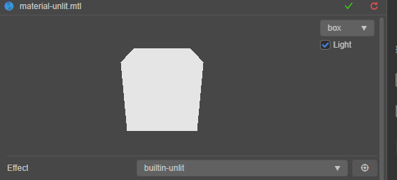

# 无光照

无光照是最基础的着色模型，这种模型下，引擎的任何光源都无法影响其最终效果，适用于：

- 不受光源影响的物体
- 画面要求不高或性能要求高的场景

在材质的 **Effect** 属性中将着色器切换为 Cocos Creator 内置的无光照着色器（builtin-unlit.effect）时，如下图：

## 制作标准

技术选型时，若要在使用 **unlit** 材质的模型下使用光照，可将光照信息绘制在纹理贴图上，然后将纹理贴图拖拽到材质的 **MainTexture** 属性框中。

若要使用真实光照，可参考：[真实物理渲染](effect-builtin-pbr.md)

## 参数

| 参数 | 说明 |
| :--- | :--- |
| mainTexture    | 主纹理|
| tilingOffset   | 模型 UV 的缩放和偏移量，xy 对应缩放，zw 对应偏移|
| mainColor      | 主颜色，该颜色会在片元着色器内被处理 |
| colorScale     | 和主颜色相乘 |
| alphaThreshold | 用于半透明测试，在启用 USE_ALPHA_TEST 的情况下，小于该值的像素会被抛弃（discard）|

## 宏

| 定义| 说明 |
| :--- | :---- |
| USE_INSTANCING | 是否启用几何体实例化 |
| USE_VERTEX_COLOR | 是否叠加顶点颜色和 Alpha 值 |
| USE_TEXTURE      | 是否使用主纹理（mainTexture） |
| USE_ALPHA_TEST   | 是否进行半透明测试（AlphaTest）|
| SAMPLE_FROM_RT   | 是否是从 RenderTexture 中采样，勾选后会对 UV 的 Y 值进行翻转 |
