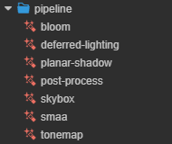
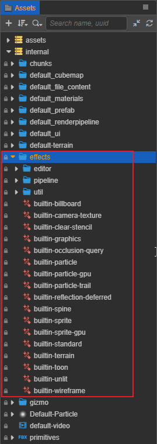

# 内置着色器（Builtin Effect）

引擎提供了一系列通用的内置着色器，位于编辑器 **资源管理器** 面板的 `internal -> effects` 目录下。双击着色器文件即可在外部 IDE 打开进行查看和编辑（前提是需要在 **偏好设置 -> 外部程序** 中配置 **默认脚本编辑器**）。

Creator 将内置着色器大致归类为以下几种：

- `editor`：编辑器内用的工具着色器，例如 gizmo。用户一般不需要关注这些。
- `pipeline`：管线特效着色器，包括延迟光照、后效和抗锯齿等。
- `util`：存放一些零散的内置着色器，例如序列帧动画。
- `dcc`：存放DCC材质导入相关的内置着色器。
- `surfaces`：存放新的[Surface Shader](surface-shader.md)着色器。
- 其他的为内置着色器，详情请参考下文说明。

## 内置管线特效着色器

| 着色器名称               | 说明                         |
| :----------------------- | :--------------------------- |
| bloom.effect             | 全屏泛光特效 |
| deferred-lighting.effect | 用于延迟管线中的光照处理阶段 |
| planar-shadow.effect     | 平面阴影 |
| post-process.effect      | 后处理 |
| skybox.effect            | 天空盒 |
| smaa.effect              | SMAA 抗锯齿 |
| tonemap.effect           | 引擎预留 |

## 内置着色器

| 着色器名称                         | 说明                                                                                 |
| :--- | :--- |
| builtin-billboard.effect | 公告板 公告板是一种使物体始终朝向摄像机的渲染方案，适用于树木，血条等渲染 |
| builtin-camera-texture.effect      | 相机纹理 |
| builtin-clear-stencil.effect       | 清理模板缓存 |
| builtin-graphics.effect            | [Graphics 组件](../ui-system/components/editor/graphics.md) 的着色器 |
| builtin-occlusion-query.effect     | 遮挡查询 |
| builtin-particle-trail.effect      | 粒子拖尾 |
| builtin-particle.effect            | 基于 CPU 渲染的粒子着色器  |
| builtin-particle-gpu.effect        | 基于 GPU 渲染粒子着色器    请参考 [粒子渲染器](../particle-system/renderer.md) 了解两个着色器的用法 |
| builtin-reflection-deferred.effect | 用于延迟着色中的反射处理 |
| builtin-spine.effect               | Spine 骨骼动画的着色器 |
| builtin-sprite.effect              | 精灵着色器 |
| builtin-sprite-gpu.effect          | 引擎预留 |
| builtin-standard.effect            | [基于物理的光照模型 PBR](effect-builtin-pbr.md) |
| builtin-terrain.effect             | 地形系统默认着色器 |
| builtin-toon.effect                | [卡通渲染](effect-builtin-toon.md) |
| builtin-unlit.effect               | [无光照](effect-builtin-unlit.md) |
| builtin-wireframe.effect           | 以线框模式进行绘制 |
