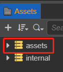

# 着色器片段

着色器片段（Chunk）是一种跨文件代码引用机制，使 Cocos Effect 代码片段可以在不同的文件之间进行复用。

着色器片段的语法基于 `GLSL 300 ES`，在资源加载时会进行预编译，生成目标 Shader 代码。

在标准 GLSL 语法基础上，Cocos Effect 引入了以下几种非常自然的 C 风格语法扩展。

## Include 机制

通过 include 机制，可以在任意 Shader 代码（ CCProgram 块或独立的头文件）中引入其他代码片段，如下所示：

```c
//引入引擎内置着色器片段
#include <cc-global>

//引入自定义着色器片段
#include "../headers/my-shading-algorithm.chunk"
```

### 相关规则和注意事项

<!-- - 着色器片段默认扩展名为 `.chunk`，include 时可省略。尖括号和双引号无区别； -->
- 着色器的默认扩展名为 `.chunk`，以下几种方法都可以正确地引入其他代码片段：

  ```glsl
    #include <filename.chunk> // 尖括号和双引号无区别
    #include "filename.chunk"
    #include "filename"    // 可忽略扩展名 ‘.chunk’
    #include <filename>
  ```

- 着色器片段在编译期会被展开，展开时每个着色器片段保证只会被展开一次，所以书写时不必担心，每个模块都可以包含自己依赖的头文件，即使这中间有重复；
- 所有不参与运行时实际计算流程的函数声明会在编译期被剔除，可以放心包含各类工具函数，不用担心生成的目标代码会有冗余；
- 着色器片段引用可以指定基于当前文件目录的相对路径（以下统称"相对路径"），也可以指定基于 Cocos Creator 编辑器 internal DB 路径下的 `assets/chunks` 目录的相对路径（以下统称"项目绝对路径"），两个位置如果有同名文件，则后者（项目绝对路径）优先；
- 引用了编辑器其他 DB（Database）的头文件（Internal 或各类插件 DB 等）只能指定项目绝对路径。当多个 DB 在此路径下有相同文件时，优先级为：用户项目 DB > 插件 DB > Internal DB；
- 编辑器内置头文件资源就在 internal DB 的 `assets/chunks` 目录下，所以可以不加目录直接引用，主要包括一些常用的工具函数和标准光照模型等。
- 所有在同一个 Cocos Effect 文件中声明的 CCProgram 代码块都可以相互引用。

### DB

DB（Database）是编辑器的概念，指的是编辑器内置数据 DB（internal），项目数据目录 DB（assets）。

资源管理器（Assets）窗口中的 assets 即为 DB assets，它位于项目目录下。资源管理器窗口中的 internal 即为 DB internal，它位于 Cocos Creator 安装目录下。

在Assets窗口中，选中 assets 或者  internal 点击鼠标右键，选择 **在文件夹中显示** ，即可打开对应目录。如下图所示：


## 创建着色器片段

在 **资源管理器** 点击右键，选择 **创建 -> 着色器片段（Chunk）**


创建成功后，会生成一个默认的片段示例，内容如下：

```glsl
// you can write GLSL code directly in here

#include <cc-global>

#define iResolution cc_screenSize
#define iTime cc_time.x
#define iTimeDelta cc_time.y
#define iFrame cc_time.z

// shadertoy template
void mainImage (out vec4 fragColor, in vec2 fragCoord) {
  // Normalized pixel coordinates (from 0 to 1)
  vec2 uv = fragCoord / iResolution.xy;
  // Time varying pixel color
  vec3 col = 0.5 + 0.5 * cos(iTime + uv.xyx + vec3(0, 2, 4));
  // Output to screen
  fragColor = vec4(col, 1.0);
}
```
