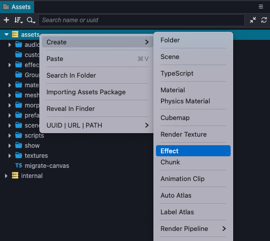
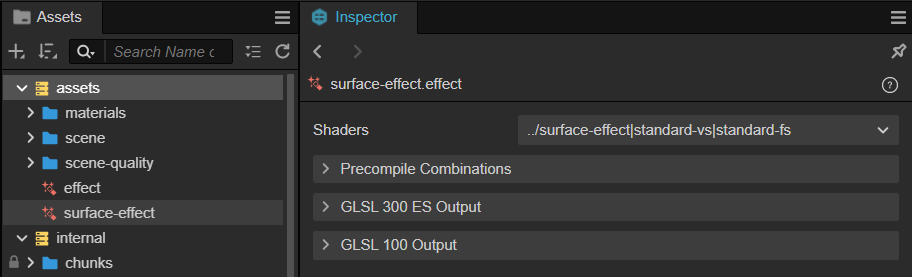
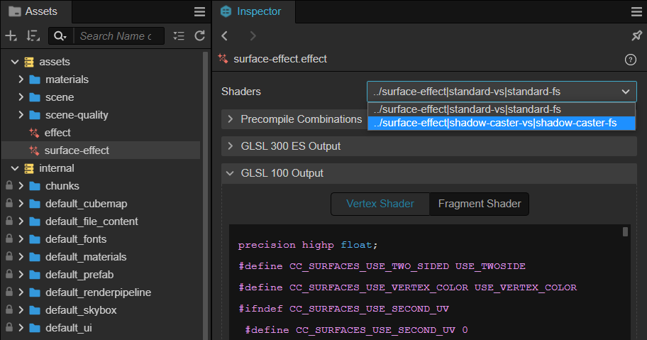
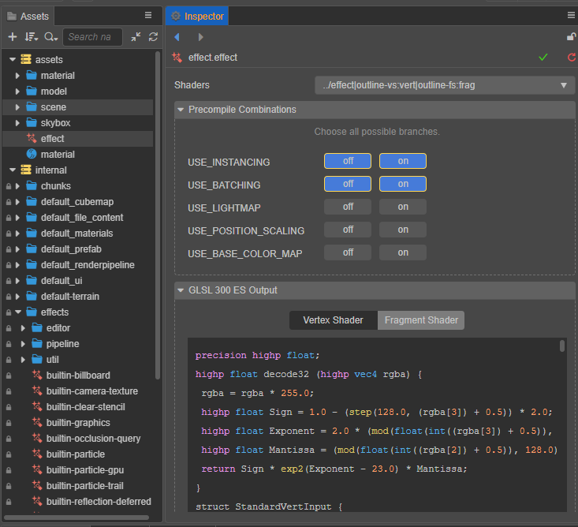
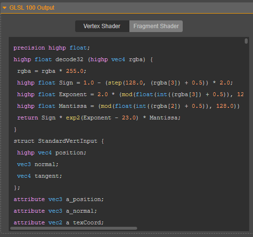
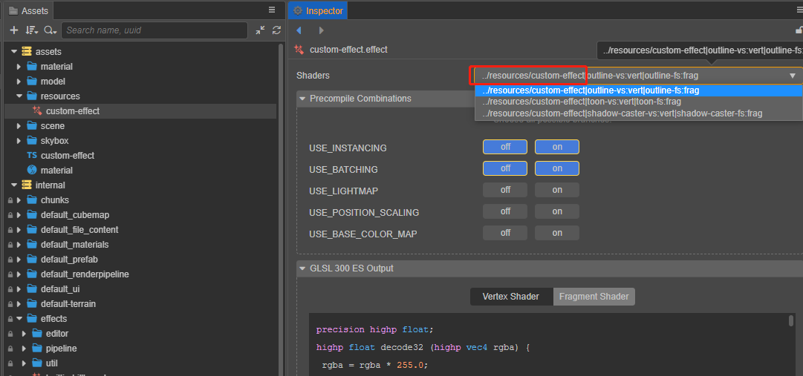

# 着色器资源

## 创建着色器

在 **资源管理器** 面板中点击左上角的 **+** 号按钮并选择 **着色器（Effect）** 便可创建新的着色器资源。或者直接在面板中点击右键并选择 **创建 -> 着色器（Effect）** 即可。



引擎会在 **资源管理器** 中创建一个默认名为 **effect** 的着色器资源：



在 **属性检查器** 中可以看到着色器主要由以下几部分组成：

|属性|说明|
| :-- | :-- |
|Shaders | 当前着色器以及其渲染过程的名称
| Precompile Combinations | 是否开启预处理宏定义组合，详情请参考下文说明
| GLSL 300 ES/100 Output | 着色器输出，详情请参考下文说明

## Shaders

如果当前的着色器有多个渲染过程，则可以通过 Shaders 右边的下拉框来选择不同的渲染过程。选择渲染过程后，可以通过 GLSL Output 窗口查看当前编译后的着色器代码。



## Precompile Combinations

一般情况下材质会在使用到相应宏定义的时候进行编译，当使用到较多宏定义时可能会出现卡顿的情况。因此便可以在该项配置预编译宏定义组合，用于提前编译所需的宏定义组合。例如下图中的配置：



表示会在初始化时预编译 4 个组合的着色器：

USE_INSTANCING = 0, USE_BATCHING = 0

USE_INSTANCING = 0, USE_BATCHING = 0

USE_INSTANCING = 1, USE_BATCHING = 0

USE_INSTANCING = 1, USE_BATCHING = 1

## GLSL Output

目前引擎提供 GLSL 300 ES 和 GLSL 100 的输出。

通过选择不同的标签页可切换显示编译后的顶点着色器和片元着色器：



## 程序化使用着色器

使用引擎内置着色器时，不需要着色器的路径和扩展名便可直接访问，代码示例如下：

```ts
// 获取内置无光照着色器 ‘builtin-unlit.effect’
const effect = EffectAsset.get('unlit');

const mat = new Material();

// 使用内置基于物理的光照着色器（PBR）‘builtin-standard.effect’ 初始化材质
mat.initialize({ effectName: "standard" });
```

如果是开发者自定义的着色器，需要在 **属性检查器** 面板中着色器的 **Shaders** 属性里找到相应着色器，然后通过其唯一字符串名称来加载使用。



以上图中的自定义着色器为例，代码示例如下：

```ts
resources.load("custom-effect", EffectAsset, ()=>{
    const effectAsset = EffectAsset.get("../resources/custom-effect");
    const material = new Material();
    material.initialize({ effectName: "../resources/custom-effect" });
})        
```
