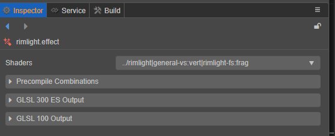

# 着色器资源

在 **资源查看器内** 单选着色器资源可以打开着色器的 **属性查看器**：

着色器的 **属性查看器** 主要由三部分组成:

|名称|说明|
|:--|:--|
|Shaders | 当前着色器
|Precompile Combinations| 选择是否开启预处理宏定义组合
|GLSL Output | 着色器输出

## Precompile Combinations

预处理宏定义组合可配置默认情况下的预处理宏定义是否开启，如在材质内有变换，则宏的值会重新编译。

## GLSL Output

目前引擎提供 GLSL 300 ES 和 GLSL 100 的输出。

通过选择不同的标签页可切换显示当前编译后的顶点着色器和片元着色器：

