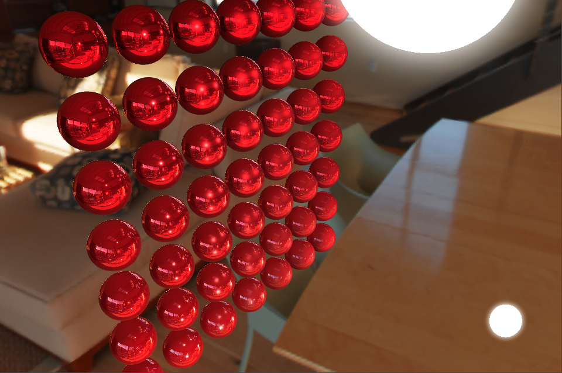

# 着色器简介

着色器 Cocos Effect 是一种基于 YAML 和 GLSL 的单源码嵌入式领域特定语言（single-source embedded domain-specific language），YAML 部分声明流程控制清单，GLSL 部分声明实际的 shader 片段，这两部分内容上相互补充，共同构成了一个完整的渲染流程描述。

>注意：如果希望在引擎中实现自定义的着色效果，需要书写自定义 Cocos Effect。我们推荐使用 VSCode，搜索安装 Cocos Effect 插件，以便编辑任何 effect 文件。

`GLSL` 是基于 C 语言风格的着色语言（OpenGL Shading Language），对于不熟悉 GLSL 语法的开发者，我们也准备一些常用的语法参考。

本节主要包含以下内容：

- [着色器语法](effect-framework.md)
    - [Pass 参数](pass-parameter-list.md)
    - [YAML 101 语法](yaml-101.md)
    - [GLSL 简介](glsl.md)
    - [预处理宏定义](macros.md)
- [着色器片段（Chunk）](effect-chunk-index.md)
    - [内置着色器片段（Buildin Chunk）](effect-buildin-chunk.md)
    - [全局 Uniform](uniform.md)

着色器的书写是基于图形学的了解，更多有关渲染的基础知识可以参考：

- [OpenGL](https://learnopengl-cn.github.io/)
