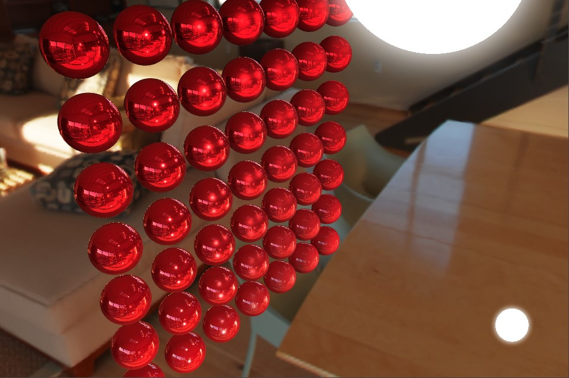

# 着色器（Cocos Shader）

在现代显卡中，若要正确地绘制物体，需要书写基于顶点（Vertex）和片元（Fragment）的代码片段，这些代码片段称为 Shader。在基于 OpenGL 系列驱动的硬件设备上，Shader 支持一种名为 GLSL（OpenGL Shading Language）的着色器语言。

为了适配工业化制作流，提升着色器片段的易用性，Cocos Creator 基于 GLSL 封装了一套着色器 — [Cocos Shader](./effect-syntax.md)。

本章主要介绍 Cocos Shader 的工作方式和使用方式。

## 内容

本章节主要包含以下内容：

- [创建与使用](effect-inspector.md)
- [内置着色器](effect-builtin.md)
    - [基于物理的光照模型 PBR](effect-builtin-pbr.md)
    - [卡通渲染](effect-builtin-toon.md)
    - [无光照](effect-builtin-unlit.md)
- [着色器语法](effect-syntax.md)
    - [Pass 可选配置参数](pass-parameter-list.md)
    - [YAML 101 语法简介](yaml-101.md)
    - [GLSL 语法简介](glsl.md)
    - [预处理宏定义](macros.md)
    - [着色器片段（Chunk）](effect-chunk-index.md)
- [内置全局 Uniform](uniform.md)
- [公共函数库](./common-functions.md)
- [前向渲染与延迟渲染 Shader 执行流程](./forward-and-deferred.md)
- [表面着色器 - Surface Shader](surface-shader.md)
    - [内置 Surface Shader 导读](./surface-shader/builtin-surface-shader.md)
    - [Surface Shader 基本结构](./surface-shader/surface-shader-structure.md)
    - [Surface Shader 执行流程](./surface-shader/shader-code-flow.md)
    - [include 机制](./surface-shader/includes.md)
    - [宏定义与重映射](./surface-shader/macro-remapping.md)
    - [使用宏定义实现函数替换](./surface-shader/function-replace.md)
    - [可替换的内置函数](./surface-shader/surface-function.md)
    - [渲染用途](./surface-shader/render-usage.md)
    - [光照模型](./surface-shader/lighting-mode.md)
    - [表面材质数据结构](./surface-shader/surface-data-struct.md)
    - [着色器类别](./surface-shader/shader-stage.md)
    - [组装器](./surface-shader/shader-assembly.md)
    - [VS 输入](./surface-shader/vs-input.md)
    - [FS 输入](./surface-shader/fs-input.md)
    - [自定义 Surface Shader](./surface-shader/customize-surface-shader.md)
    - [渲染调试功能](./surface-shader/rendering-debug-view.md)
- [传统着色器 - Legacy Shader](./legacy-shader/legacy-shader.md)
    - [内置 Legacy Shader 导读](./legacy-shader/legacy-shader-builtins.md)
    - [Legacy Shader 主要函数与结构体](./legacy-shader/legacy-shader-func-struct.md)
- [VSCode 着色器插件](./vscode-plugin.md)
- [自定义着色器](./write-effect-overview.md)
    - [2D 精灵着色器：Gradient](./write-effect-2d-sprite-gradient.md)
    - [3D 着色器：RimLight](./write-effect-3d-rim-light.md)
