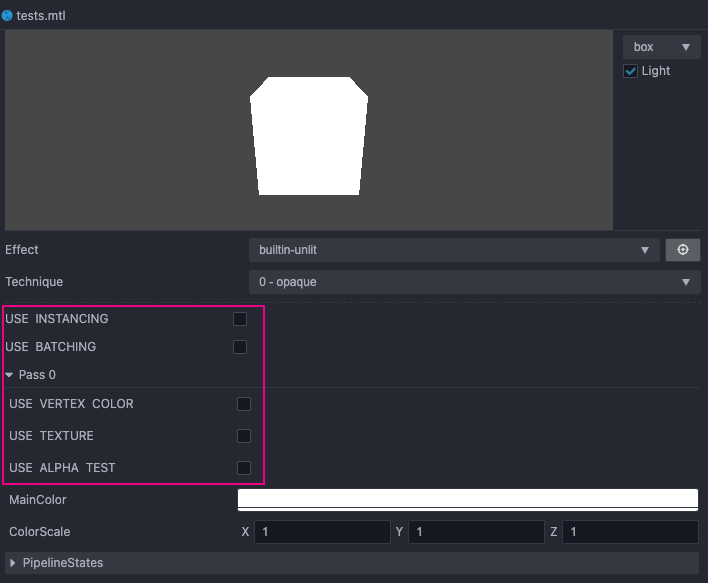
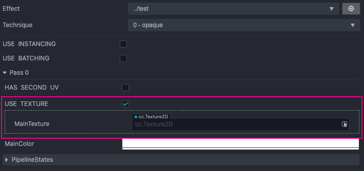
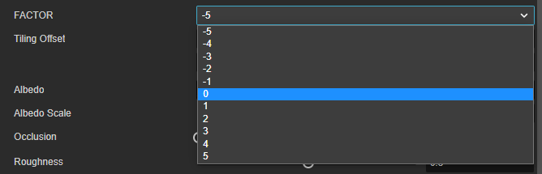
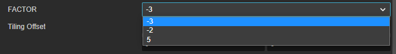

# 预处理宏定义

为了更好地管理代码内容，Cocos Effect 提供了预处理宏机制，它有几个特性：
1. 不同组合的宏会生成不同的代码
2. 生成的代码无冗余、执行高效
3. 使用过的宏定义会显示在材质面板上，方便调试
4. 以 `CC_` 开头的宏不会显示在材质面板上

以默认的 Surface Shader 为例，当它被材质使用时，你在材质的 **属性检查器** 中，可以看到如下图所示的宏开关：



## 宏定义注意事项

宏定义有一些默认的规则。

### 默认值

所有的宏定义默认值都是 false，因此当定义一个简单宏定义（例如用于布尔开关的宏）时，无法指定其默认值，但可通过 **属性检查器** 或代码修改。

如果设计上某些宏之间存在互斥关系（不能同时为 true），可以通过使用 tag 声明的宏来处理，详情请参考下文 [**Macro Tags**](#macro-tags) 部分的内容。

### 宏都会被定义

Cocos Effect 在运行时会用默认值 0 来定义所有 Shader 中出现的自定义宏

```ts
#define USE_INSTANCING 0
#define USE_TWOSIDE 0
#define USE_ALBEDO_MAP 0
```

> 仅限用户自定义宏，`GL_` 等开头的系统宏不在此列

所以，不能使用 `#ifdef` 或 `#if defined` 这样的形式来判断自定义宏是否生效，执行结果会始终为 true；

### 宏的使用范围

宏定义不仅可以应用在 `CCProgram` 里，控制宏定义内的代码逻辑，还可以应用在 `CCEffect` 中，将可编辑属性的显示状态与宏定义关联。

如下所示，仅当 `USE_USE_` 预处理宏开启时，`mainTexture` 才会显示在 **属性检查器** 面板上：

```glsl
CCEffect %{
    # ...
    properties:
        mainTexture:  { value: grey, target: albedoMap, editor: { parent: USE_ALBEDO_MAP, displayName: AlbedoMap } }
    # ...
}%

CCProgram unlit-fs %{
    // ...
    vec4 frag () {
        #if USE_ALBEDO_MAP
          //...
        #endif
    }
}%
```



## Macro Tags

当多个宏会互斥，或者一个宏有多种判定值时，我们可以将它们合成一组。

像下面这个例子中， FACTOR 的值会有许多种：

```glsl
#if FACTOR == -3
  // ...
#elif FACTOR == -2
  // ...
#elif FACTOR == 5
  // ...
#endif
```

针对这类有固定取值范围或固定选项的宏定义，需要选择一个合适的 tag 显式声明：

| Tag     | 说明 | 默认值 | 备注 |
| :-- | :-- | :-- | :-- |
| range   | 一个长度为 2 的数组。首元素为最小值，末元素为最大值 | [0, 3] | 针对连续数字类型的宏定义，显式指定它的取值范围。<br>范围应当控制到最小，有利于运行时的 shader 管理 |
| options | 一个任意长度的数组，每个元素都是一个可能的取值 | 如未显式声明则不会定义任何宏 | 针对有清晰选项的宏定义，显式指定它的可用选项 |

### range 的用法

```glsl
#pragma define-meta FACTOR range([-5, 5])
```

我们可以使用 `range` 来描述 `FACTOR` 宏的值，使它能够在界面上显示出 [-5, 5] 区间的所有值作为选项。 如下所示：



### options 的用法

当 FACTOR 只有 -3,-2,5 这三个值的情况下，我们就可以用 `options` 来处理。

```glsl
#pragma define-meta FACTOR range([-3, -2, 5])
```

材质面板上可以产生如下所示的选项效果：



## 函数宏

函数调用总是有一些额外开销的，我们可以利用函数式宏定义来实现 inline 函数，从而提升代码效率。

有不少工具函数都是函数式宏定义，比如：

```glsl
#pragma define CCDecode(position) \
  position = vec4(a_position, 1.0)
#pragma define CCVertInput(position) \
  CCDecode(position);         \
  #if CC_USE_SKINNING         \
    CCSkin(position);         \
  #endif                      \
  #pragma // empty pragma trick to get rid of trailing semicolons at effect compile time
```

WebGL 1.0 不支持函数式宏定义 (Function-like Macros)，但是 Cocos Creator 在 Cocos Effect 编译时支持了函数式宏定义，在输出的 Shader 中就已经将此类宏定义展开，可以放心使用。

更多关于宏定义的内容，请前往 [宏定义与重映射](./surface-shader/macro-remapping.md)。
