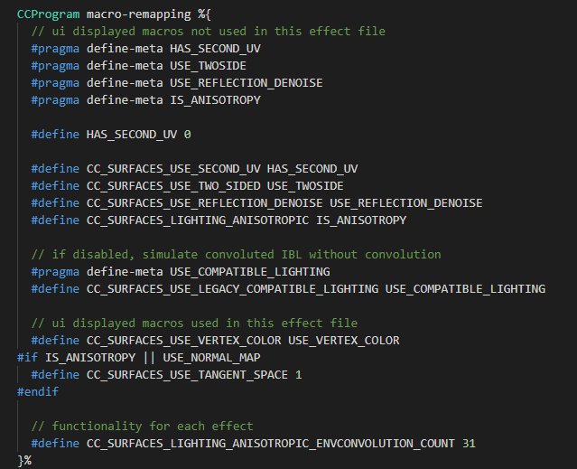
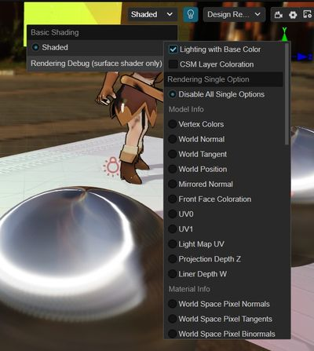

# 表面着色器（Surface Shader）

随着渲染对画面要求越来越高，着色器的实现也更加复杂，为了提供高效、统一的着色器流程，在 v3.5.1 中，我们新增了 Surface Shader 框架。开发者可以在 **资源管理器 -> internal -> effect -> surfaces** 以及 **资源管理器 -> internal -> chunk -> surfaces** 中找到对应的着色器以及着色器片段。

Surface Shader 使用统一渲染流程和结构，可以让用户以简洁的代码创建表面材质信息，指定用于组合的光照和着色模型。相比旧版（Legacy Shader）的优点是更易书写和维护，有更好的版本兼容性，也更不容易产生渲染错误。并且可以从统一流程中获取很多公共特性，如统一的全场景光照和 Debug View 调试功能等。

Creator 也更易扩展出多种常见的复杂材质提供给用户，未来还会支持 Shader Graph 自动生成 Effect 代码，可以极大提高 Shader 开发者的效率。但代价是无法定制光照和着色运算的具体内容，一旦指定了光照和着色模式，流程将按照既定路径来进行，不支持临时屏蔽或更改一些内部计算。如有这样的需求，请使用 Legacy Shader。

Surface Shader 仍然是基于 [Cocos Effect 的语法](effect-syntax.md)，以前的材质参数、technique、pass 及渲染状态等的定义完全可以复用。

## 相关概念

在了解 Surface Shader 之前，有几个概念需要说明一下：

### 1、渲染用途

说明了物体需要被渲染到哪里。

我们有很多渲染 Pass 用于渲染同一个物体到不同的纹理数据上，这些数据分别有内置的用途。比如说最常用的 **渲染到场景** 可以直接用于屏幕显示，或者把阴影投射物 **渲染到阴影贴图**，或者 **渲染到动态环境反射** 来生成反射贴图等。

这部分内容可以在 **资源管理器 -> internal -> chunk -> shading-entries -> main-functions** 内找到。


| 常用的渲染用途       | 文件位置             | 备注|
| -------------------- | -------------------- | --- |
| 渲染到场景（默认）   | render-to-scene      ||
| 渲染到阴影贴图       | render-to-shadowmap  ||
| 渲染到环境贴图       | render-to-reflectmap | 可选 |
| 渲染卡通描边         | misc/silhouette-edge ||
| 渲染天空             | misc/sky             ||
| 后期处理或通用计算 Pass | misc/quad            | 引擎预留 |

### 2、光照模型

说明物体表面的微观结构与固有光学属性是如何对光线产生影响和作用的。

比如说塑料会产生各向同性的圆形高光，头发会产生各向异性的条纹状高光，光线在皮肤上会发生散射，而在镜子这种更接近理想光学表面的物体上，绝大多数光线只会沿着反射角发生反射等。

| 光照模型名称 | 说明                                                         |
| ------------ | ------------------------------------------------------------ |
| standard     | PBR 光照，支持 GGX BRDF 分布的各向同性与各向异性光照，支持卷积环境光照 |
| toon         | 简单的卡通光照，阶梯状的光照效果                             |

### 3、表面材质模型

说明物体表面的一些物理参数（反照率、粗糙度等）是如何影响光照结果的。

通常材质与光照模型必须关联使用，我们会逐渐扩展常用的材质与光照模型。

| 材质模型名称 | 说明                                                         |
| ------------ | ------------------------------------------------------------ |
| standard     | 粗糙度和金属性描述的标准 PBR 材质，和 SP、Blender、Maya 等软件中的材质节点类似 |
| toon         | 简单的卡通材质，有多种 shade 颜色处理 |                          |

### 4、Shader Stage

渲染是由不同的着色器来完成的，有处理顶点、像素或通用计算的不同阶段，如下表所示：

| 着色器阶段      | 对应的 Surface Shader 代码标识 |
| --------------- | ---------------------------- |
| Vertex Shader   | vs                           |
| Fragment Shader | fs                           |
| Computer Shader | cs                           |

## 代码框架

除了和 Cocos Effect 相同的 CCEffect 参数、technique 和 UBO 内存布局等定义之外，再也无需考虑各种内部宏定义的处理、着色器输入输出变量、Instancing[^1]、繁琐的顶点变换、全局像素效果和每种渲染用途的细节计算等。

典型的 Surface Shader 代码通常由三个部分组成：

- `Macro Remapping`：将用户在 Effect 中声明或使用的宏名（部分）映射为 Surface 内部宏名。
- `Surface Functions`：用于声明表面材质信息相关的 Surface 函数。
- `Shader Assembly`：用于组装每个顶点着色器（Vertex Shader）和片元着色器（Fragment Shader）的代码模块。

此处以内置着色器 `surfaces/standard.effect` 为例，说明 Surface Shader 的代码框架。


### Macro Remapping

Surface Shader 内部计算时会用到一些宏开关，需要根据 Effect 中对应含义的宏名来指定。考虑到 Effect 中的宏名会直接显示在材质面板上，这样做的好处是 Effect 中的名称可以自由开放给用户而不影响 Surface 内部计算。

这些宏以 `CC_SURFACES_` 开头，以下是完整的宏列表：

| 宏名                                                  | 类型 | 含义                                                         |
| :---------------------------------------------------- | ---- | ------------------------------------------------------------ |
| CC_SURFACES_USE_VERTEX_COLOR                          | BOOL | 是否使用顶点色                                               |
| CC_SURFACES_USE_SECOND_UV                             | BOOL | 是否使用2uv                                                  |
| CC_SURFACES_USE_TWO_SIDED                             | BOOL | 是否使用双面法线，用于双面光照                               |
| CC_SURFACES_USE_TANGENT_SPACE                         | BOOL | 是否使用切空间（使用法线图或各向异性时必须开启）             |
| CC_SURFACES_TRANSFER_LOCAL_POS                        | BOOL | 是否在 FS 中访问模型空间坐标                                 |
| CC_SURFACES_LIGHTING_ANISOTROPIC                      | BOOL | 是否开启各向异性材质                                         |
| CC_SURFACES_LIGHTING_ANISOTROPIC_ENVCONVOLUTION_COUNT | UINT | 各向异性环境光卷积采样数，为 0 表示关闭卷积计算，仅当各向异性开启时有效 |
| CC_SURFACES_LIGHTING_USE_FRESNEL                      | BOOL | 是否通过相对折射率 ior 计算菲涅耳系数                        |
| CC_SURFACES_LIGHTING_TRANSMIT_DIFFUSE                 | BOOL | 是否开启背面穿透漫射光（如头发、叶片、耳朵等）               |
| CC_SURFACES_LIGHTING_TRANSMIT_SPECULAR                | BOOL | 是否开启背面穿透高光（如水面、玻璃折射等）                   |
| CC_SURFACES_LIGHTING_TRT                              | BOOL | 是否开启透射后内部镜面反射出的光线（如头发材质等）           |
| CC_SURFACES_LIGHTING_TT                               | BOOL | 是否开启透射后内部漫反射出的光线（用于头发材质）             |
| CC_SURFACES_USE_REFLECTION_DENOISE                    | BOOL | 是否开启环境反射除噪，仅 legacy 兼容模式下生效               |
| CC_SURFACES_USE_LEGACY_COMPATIBLE_LIGHTING            | BOOL | 是否开启 legacy 兼容光照模式，可使渲染效果和 legacy/standard.effect 完全一致，便于升级 |

> **注意**： 这些宏可以不定义，系统内部会自动定义为默认值 0；也可以直接定义为 0 或其他值，表示在此 Effect 中强制关闭或打开，禁止用户调节。

搜索 `CCProgram macro-remapping` 一段，可以看到内容有如下三部分组成：



#### 1、在 Surface 函数中未使用过的宏

```glsl
// ui displayed macros not used in this effect file
#pragma define-meta HAS_SECOND_UV
#pragma define-meta USE_TWOSIDE
#pragma define-meta USE_REFLECTION_DENOISE
#pragma define-meta IS_ANISOTROPY
#pragma define-meta USE_COMPATIBLE_LIGHTING
    
#define CC_SURFACES_USE_SECOND_UV HAS_SECOND_UV
#define CC_SURFACES_USE_TWO_SIDED USE_TWOSIDE
#define CC_SURFACES_USE_REFLECTION_DENOISE USE_REFLECTION_DENOISE
#define CC_SURFACES_LIGHTING_ANISOTROPIC IS_ANISOTROPY
#define CC_SURFACES_USE_LEGACY_COMPATIBLE_LIGHTING USE_COMPATIBLE_LIGHTING   
```

由于 Surface Shader 精简了很多不必要的公共流程代码，如 VS FS 传参的定义等等，之前存在于旧流程中的 ~~`#if HAS_SECOND_UV`~~ 这样的代码也就不存在了。对于此类宏，必须要在此处预先定义 **`#pragma define-meta MACRONAME`**，这样才可以显示在材质面板上。
定义好之后，下一行就可以使用标准 GLSL 预定义 **`#define CC_SURFACES_MACRONAME MACRONAME`**。

#### 2、在 Surface 函数中使用过的宏

```glsl
// ui displayed macros used in this effect file
#define CC_SURFACES_USE_VERTEX_COLOR USE_VERTEX_COLOR
#if IS_ANISOTROPY || USE_NORMAL_MAP
  #define CC_SURFACES_USE_TANGENT_SPACE 1
#endif
```

这部分简单多了，直接按照 **#define CC_SURFACES_MACRONAME MACRONAME** 定义即可。
不过 CC_SURFACES_USE_TANGENT_SPACE 宏要特别注意，通常开了法线贴图或各向异性，都要开启该宏，否则可能会出现编译错误。

#### 3、内部功能性的宏

```glsl
// functionality for each effect
#define CC_SURFACES_LIGHTING_ANISOTROPIC_ENVCONVOLUTION_COUNT 31
```

直接定义想要的值即可。

### Surface Function

**每个材质函数的功能类似于 DCC（Digital Content Creation） 软件的材质编辑器中输出一个材质参数到指定的材质节点**。类似于：


#### 1、定义

可以使用 `CCProgram` 或单独的 chunk 来定义 Surface 材质函数块。

> **注意**：VS 和 FS 使用的函数块必须分开。通常来讲所有的 VS 共享一个，所有的 FS 共享一个。在我们的例子中 `standard-vs` 和`shadow-caster-vs` 共用 `surface-vertex` 块，而 `standard-fs` 和 `shadow-caster-fs` 共用 `surface-fragment` 块。
>
> 用这种方式的好处是所有的用户自定义动画与材质的代码只需要写一份，却可以在各种渲染用途中保持统一。

Surface Shader 在内部提供了简单的默认函数，所以 **这些函数并不是必须定义的**，**如果你想重载某函数，需要预定义该函数对应的宏来完成**。这些函数命名以 `Surfaces + ShaderStage 名` 打头，后跟功能描述。可以在 [`editor/assets/chunks/surfaces/default-functions`](https://github.com/cocos/cocos-engine/tree/v3.7.0/editor/assets/chunks/surfaces/default-functions) 中查看不同材质模型中各 Surface 函数的具体定义与实现，如：

```glsl
#define CC_SURFACES_VERTEX_MODIFY_WORLD_POS
vec3 SurfacesVertexModifyWorldPos(in SurfacesStandardVertexIntermediate In)
{
  vec3 worldPos = In.worldPos;
  worldPos.x += sin(cc_time.x * worldPos.z);
  worldPos.y += cos(cc_time.x * worldPos.z);
  return worldPos;
}
```

预先定义 `CC_SURFACES_VERTEX_MODIFY_WORLD_POS` 宏，可以忽略掉内部默认函数，让 Surface Shader 使用你定义的函数来计算材质参数。

> **注意**：用这种方式的好处是方便扩展多种不同的材质模型和代码版本升级，新版增加的函数可以用新的名称和参数，仍然可以调用旧版定义的函数获取计算结果，无需写重复代码，也不用担心升级后编译报错。

#### 2、VS 对应的常用函数列表

VS 中的处理和材质模型关系相对比较小，所以这里都使用通用函数，函数参数均为 `SurfacesStandardVertexIntermediate` 结构体，存放的是 VS 输入输出的数据。用户无需再关心具体的顶点输入输出流程处理，只需要聚焦到某个数据是否需要及如何修改。

| 预先定义宏                                  | 对应的函数定义                           | 对应的材质模型 | 功能说明                                                     |
| ------------------------------------------- | ---------------------------------------- | -------------- | ------------------------------------------------------------ |
| CC_SURFACES_VERTEX_MODIFY_LOCAL_POS         | vec3 SurfacesVertexModifyLocalPos        | Common         | 返回修改后的模型空间坐标                                     |
| CC_SURFACES_VERTEX_MODIFY_LOCAL_NORMAL      | vec3 SurfacesVertexModifyLocalNormal     | Common         | 返回修改后的模型空间法线                                     |
| CC_SURFACES_VERTEX_MODIFY_LOCAL_TANGENT     | vec4 SurfacesVertexModifyLocalTangent    | Common         | 返回修改后的模型空间切线和镜像法线标记                       |
| CC_SURFACES_VERTEX_MODIFY_LOCAL_SHARED_DATA | void SurfacesVertexModifyLocalSharedData | Common         | 如果某些贴图和计算需要在多个材质节点中使用，可在此函数中进行，在世界变换前调用，直接修改 SurfaceStandardVertexIntermediate 结构体内的三个Local参数 |
| CC_SURFACES_VERTEX_MODIFY_WORLD_POS         | vec3 SurfacesVertexModifyWorldPos        | Common         | 返回修改后的世界空间坐标（世界空间动画）                     |
| CC_SURFACES_VERTEX_MODIFY_CLIP_POS          | vec4 SurfacesVertexModifyClipPos         | Common         | 返回修改后的剪裁（NDC）空间坐标（通常用于修改深度）          |
| CC_SURFACES_VERTEX_MODIFY_UV                | void SurfacesVertexModifyUV              | Common         | 修改结构体内的 UV0 和 UV1 （使用 tiling 等）                 |
| CC_SURFACES_VERTEX_MODIFY_WORLD_NORMAL      | vec3 SurfacesVertexModifyWorldNormal     | Common         | 返回修改后的世界空间法线（世界空间动画）                     |
| CC_SURFACES_VERTEX_MODIFY_ SHARED_DATA      | void SurfacesVertexModify SharedData     | Common         | 如果某些贴图和计算需要在多个材质节点中使用，可在此函数中进行，直接修改 SurfaceStandardVertexIntermediate 结构体内的参数，减少性能耗费 |

#### 3、FS 对应的常用函数列表

FS 中的函数大部分是只修改一项，在 Surface 函数中直接返回即可。有些函数可能会修改多项（如 UV 和切空间向量），此时会在参数列表中传入多个值用于修改。具体属于哪种情况请参考函数定义。

| 预先定义宏                                              | 对应的函数定义                                       | 对应的材质模型 | 功能说明                                                     |
| ------------------------------------------------------- | ---------------------------------------------------- | -------------- | ------------------------------------------------------------ |
| CC_SURFACES_FRAGMENT_MODIFY_ BASECOLOR_AND_TRANSPARENCY | vec4 SurfacesFragmentModify BaseColorAndTransparency | Common         | 返回修改后的基础色（rgb 通道）和透明值（a 通道）             |
| CC_SURFACES_FRAGMENT_ALPHA_CLIP_ONLY                    | vec4 SurfacesFragmentModify AlphaClipOnly            | Common         | 不需要获取颜色仅处理透贴的Pass中使用。如渲染到阴影图等，不重载此函数可能导致阴影没有透贴效果 |
| CC_SURFACES_FRAGMENT_MODIFY_ WORLD_NORMAL               | vec3 SurfacesFragmentModify WorldNormal              | Common         | 返回修改后的像素法线（通常是法线贴图）                       |
| CC_SURFACES_FRAGMENT_MODIFY_ SHARED_DATA                | void SurfacesFragmentModify SharedData               | Common         | 若某些贴图和计算需要在多个材质节点中使用，可在此函数中进行，直接修改 Surface 结构体内的参数，减少性能耗费，类似legacy shader中的surf()函数。**需要在定义函数前 include 必要的头文件** |
| CC_SURFACES_FRAGMENT_MODIFY_ WORLD_TANGENT_AND_BINORMAL | void SurfacesFragmentModify WorldTangentAndBinormal  | Standard PBR   | 修改 Surface 结构体内的世界切空间向量                        |
| CC_SURFACES_FRAGMENT_MODIFY_ EMISSIVE                   | vec3 SurfacesFragmentModify Emissive                 | Standard PBR   | 返回修改后的自发光颜色                                       |
| CC_SURFACES_FRAGMENT_MODIFY_ PBRPARAMS                  | vec4 SurfacesFragmentModify PBRParams                | Standard PBR   | 返回修改后的 PBR 参数（ao, roughness, metallic, specularIntensity） |
| CC_SURFACES_FRAGMENT_MODIFY_ ANISOTROPY_PARAMS          | vec4 SurfacesFragmentModify AnisotropyParams         | Standard PBR   | 返回修改后的各向异性参数（rotation, shape, unused, unused）  |
| CC_SURFACES_FRAGMENT_MODIFY_ BASECOLOR_AND_TOONSHADE    | void SurfacesFragmentModify BaseColorAndToonShade    | Toon           | 修改卡通渲染基础色                                           |
| CC_SURFACES_FRAGMENT_MODIFY_ TOON_STEP_AND_FEATHER      | vec4 SurfacesFragmentModify ToonStepAndFeather       | Toon           | 返回修改后的参数                                             |
| CC_SURFACES_FRAGMENT_MODIFY_ TOON_SHADOW_COVER          | vec4 SurfacesFragmentModify ToonShadowCover          | Toon           | 返回修改后的参数                                             |
| CC_SURFACES_FRAGMENT_MODIFY_ TOON_SPECULAR              | vec4 SurfacesFragmentModify ToonSpecular             | Toon           | 返回修改后的参数                                             |
| CC_SURFACES_LIGHTING_MODIFY_FINAL_RESULT                | void SurfacesLightingModifyFinalResult               | Common         | 自定义光照模型，可以在之前计算的光照结果上再次修改，比如添加轮廓光等。**需要在定义函数前 include 必要的头文件** |

#### 4、VS 输入值的获取

VS 输入值都在 `SurfacesStandardVertexIntermediate` 结构体中，作为 Surface 函数参数传入

| Vertex Shader 输入值 | 类型 | 使用时需要对应宏开启          | 含义                                 |
| ------------------- | ---- | ----------------------------- | ------------------------------------ |
| position            | vec4 | N/A                           | Local Position 局部坐标 |
| normal              | vec3 | N/A                           | Local Normal 局部法线 |
| tangent             | vec4 | CC_SURFACES_USE_TANGENT_SPACE | Local Tangent and Mirror Normal Sign 局部切线和镜像法线标记|
| color               | vec4 | CC_SURFACES_USE_VERTEX_COLOR  | Vertex Color 顶点色|
| texCoord            | vec2 | N/A                           | UV0 |
| texCoord1           | vec2 | CC_SURFACES_USE_SECOND_UV     | UV1 |
| clipPos             | vec4 | N/A                           | Clip(NDC) Position 归一化设备坐标 |
| worldPos            | vec3 | N/A                           | World Position 世界坐标 |
| worldNormal         | vec4 | N/A                           | World Normal and Two Side Sign 世界法线和双面材质标记|
| worldTangent        | vec3 | CC_SURFACES_USE_TANGENT_SPACE | World Tangent 世界切线|
| worldBinormal       | vec3 | CC_SURFACES_USE_TANGENT_SPACE | World Binormal 世界副法线|

#### 5、FS 输入值的获取

FS 的输入值目前作为宏来使用，大部分输入值在内部做了容错处理，可以无视对应宏条件随意访问。

| Fragment Shader 输入值 | 类型  | 使用时需要对应宏开启           | 含义               |
| --------------------- | ----- | ------------------------------ | ------------------        |
| FSInput_worldPos      | vec3  | N/A                            | World Position 世界坐标 |
| FSInput_worldNormal   | vec3  | N/A                            | World Normal 世界法线 |
| FSInput_faceSideSign  | float | N/A                            | Two Side Sign 物理正反面标记，可用于双面材质 |
| FSInput_texcoord      | vec2  | N/A                            | UV0                       |
| FSInput_texcoord1     | vec2  | N/A                            | UV1                       |
| FSInput_vertexColor   | vec4  | N/A                            | Vertex Color 顶点颜色 |
| FSInput_worldTangent  | vec3  | N/A                            | World Tangent 世界切线 |
| FSInput_mirrorNormal  | float | N/A                            | Mirror Normal Sign 镜像法线标记 |
| FSInput_localPos      | vec4  | CC_SURFACES_TRANSFER_LOCAL_POS | Local Position 局部坐标 |
| FSInput_clipPos       | vec4  | CC_SURFACES_TRANSFER_CLIP_POS  | Clip Position 投影/裁切空间坐标 |

### Shader Assembly

我们使用 include 不同模块头文件的形式，按顺序组装每个 Pass 的 Shader。

搜索 `standard-fs` 一段，可以看到整个 Fragment Shader 的组装过程分为 6 个部分

#### 1、宏

首先需要包含必要的内部宏映射和通用宏定义。

宏映射使用在 Macro Remapping 一段中描述的自定义 CCProgram 代码块或 chunk 文件。

接下来需要包含通用宏定义文件 `common-macros`，如下所示：

```glsl
Pass standard-fs:
#include <macro-remapping>
#include <surfaces/effect-macros/common-macros>
```

对于特殊渲染用途的 Pass 而言，很多 Shader 功能是关掉的，因此无需包含 `common-macros`，直接包含对应渲染用途的宏定义文件即可：

```glsl
Pass shadow-caster-fs:
#include <surfaces/effect-macros/render-to-shadowmap>
```

#### 2、Shader 通用头文件

根据 **当前的 Shader Stage 名称** 来选择对应的通用头文件，如下所示：

```glsl
Vertex Shader：
#include <surfaces/includes/common-vs>
Fragement Shader：
#include <surfaces/includes/common-fs>
```

#### 3、用户 Surface 功能函数

使用在 Surface Function 一段中描述的自定义 CCProgram 代码块或 chunk 文件。

由于 Surface 功能函数可能还会用到 Effect 参数相关的 UBO 内存布局，因此它也要提前被 Include，否则会编译出错。

如下所示：

```glsl
#include <shared-ubos>
#include <surface-fragment>
```

#### 4、光照模型

此部分为**可选项，只限渲染到场景的默认用途及 Fragment Shader 使用**。

使用 **光照模型名称** 来选择对应的头文件，如下所示：

```glsl
Standard PBR Lighting：
#include <lighting-models/includes/standard>
Toon Lighting：
#include <lighting-models/includes/toon>
```

#### 5、表面材质和着色模型

此部分为 **可选项，只限渲染到场景的默认用途使用**。

**材质模型名称 + Shader Stage 名称** 来选择对应的头文件，如下所示：

```glsl
Vertex Shader：
#include <surfaces/includes/standard-vs>
Fragement Shader：
#include <surfaces/includes/standard-fs>
```

#### 6、Shader 主函数

使用当前 Pass 的**渲染用途名称 + Shader Stage 名称** 来选择对应的主函数头文件。

```glsl
Pass standard-fs:
#include <shading-entries/main-functions/render-to-scene/fs>
Pass shadow-caster-fs:
#include <shading-entries/main-functions/render-to-shadowmap/fs>
```

## 渲染调试功能

> **注意**：只有使用 Surface Shader 框架的材质，内置的渲染调试功能才可以生效。

通过在编辑器的场景预览窗口右上角按钮选择对应的调试模式即可同屏查看模型、材质、光照及其他计算数据，在渲染效果异常的时候可以快速定位问题。



为了方便逐像素对比，我们使用全屏调试而非画中画的显示方式，可以快速在同一幅画面中切换不同数据来定位渲染错误所在，也可使用取色器来探知像素的具体数值。

另外 Surface Shader 还内置了 **无理数可视化** 的功能，一旦有一些像素出现异常的<font color=#ff0033> 红色(255, 0, 51) </font>和<font color=#00ff33> 绿色(0, 255, 51) </font>交替闪烁，则说明这些像素的渲染计算出现了无理数，请使用单项调试模式来检查模型切线或其他相关数据。

渲染调试功能细分为如下三种：<br>

### 1、公共选项

无论单项还是组合模式中都生效的调试选项，包括：

| 名称             | 功能                                                         | 调试技巧                                                     |
| ---------------- | ------------------------------------------------------------ | ------------------------------------------------------------ |
| 光照信息带固有色 | 勾选则显示正常材质光照，勾掉则显示白模纯光照的效果。         | 可更明显的查看AO、GI等间接光相关的影响。                     |
| 级联阴影染色     | 级联阴影从近到远逐层染色，分布为偏红、绿、蓝、黄，超出阴影范围的区域无染色。 | 可查看并确认场景阴影的精细度。<br />如果三四层占比太少说明阴影过于精细，应当增大阴影可视距离。<br />如果一二层占比太少说明阴影过于粗糙，应当减小阴影可视距离。 |

### 2、单项模式

调试重点<font color=#ff8000>聚焦在某个需要测试的数据上</font>，整个场景都将此数据可视化输出。

可调试的数据包括四大类：

#### I、原始模型数据

| 名称             | 功能                      | 说明及调试技巧                                               | 依赖项                                                       |
| ---------------- | ------------------------- | ------------------------------------------------------------ | ------------------------------------------------------------ |
| 顶点色           | 同名称                    |                                                              | 必须在材质中勾选**使用顶点色**                               |
| 世界空间顶点法线 | 同名称                    |                                                              |                                                              |
| 世界空间顶点切线 | 同名称                    | 如果计算中出现了无理数或异常光照效果可以重点检查此处，如果是黑色则说明未开启模型切线但开启了法线贴图或各向异性。 | 不能在模型的切线设置中选择排除<br />必须在材质中勾选**使用法线贴图**或**是各向异性** |
| 世界空间顶点坐标 | 可视化顶点坐标（无缩放）  | rgb显示xyz轴坐标数据。<br />可通过色彩来判断世界空间轴的不同，通过明暗来判断模型大小。 |                                                              |
| 法线图镜像       | 显示法线图翻转复用标记    | 为了提高法线图利用率，有些对称的模型（如面部）只会烘焙一半的法线，另一半使用镜像标记复用法线图中的数据。<br />如果该标记的值在模型上没有任何变化，可能导致模型另一半的法线呈现凹凸翻转等异常效果。 | 必须在材质中勾选**使用法线贴图**                             |
| 正反面标记       | 显示正面或反面            | 默认的单面模型，法线不会自动区分，在模型的正面和反面看到的明暗是相同的。<br />当单面模型使用双面材质时，会自动区分正反面法线，在模型的正面和反面看到的明暗是不同的。<br />该标记为白色表示模型正面，黑色表示反面。可通过它来查验单面模型的光照明暗问题。 |                                                              |
| UV0              | 显示第一套UV              |                                                              |                                                              |
| UV1              | 显示第二套UV              |                                                              | 必须在材质中勾选**使用第二套UV**                             |
| 光照贴图UV       | 显示光照贴图UV            | 如果光照贴图效果不正确，可开启此选项，对比光照贴图的大致区域来查错。 | 必须烘焙场景                                                 |
| 投影深度Z        | 显示（0-1非线性变化）深度 | 远裁面过大会导致近景深度值也会偏高                           |                                                              |
| 线性深度W        | 显示（0-1线性变化）深度   | 远裁面过大会导致近景深度值也会偏高                           |                                                              |

#### II、原始材质数据

| 名称                    | 功能                                                   | 说明及调试技巧                                         | 依赖项                                                       |
| ----------------------- | ------------------------------------------------------ | ------------------------------------------------------ | ------------------------------------------------------------ |
| 世界空间像素法线        | 同名称                                                 | 可以和对应的顶点数据做对比以查看法线贴图的影响是否正确 |                                                              |
| 世界空间像素切线/副法线 | 同名称                                                 | 可以和对应的顶点数据做对比以查看法线贴图的影响是否正确 | 不能在模型的切线设置中选择排除<br />必须在材质中勾选**使用法线贴图**或**是各向异性** |
| 固有色                  | 同名称                                                 |                                                        |                                                              |
| 漫反射颜色              | 从固有色和其他材质数据计算出的影响漫反射光照的基础色   |                                                        |                                                              |
| 镜面反射颜色            | 从固有色和其他材质数据计算出的影响镜面反射光照的基础色 |                                                        |                                                              |
| 不透明度                | 越小表示越透明                                         |                                                        | 必须在材质中开启**Alpha Blend**                              |
| 金属度                  | 同名称                                                 |                                                        |                                                              |
| 粗糙度                  | 同名称                                                 |                                                        |                                                              |
| 镜面反射强度            | 显示非金属基准镜面反射率F0的倍增                       | 如果镜面反射都为黑色，请检查此项数据是否设置为0        |                                                              |

#### III、光照结果数据

| 名称           | 功能                                | 说明及调试技巧 | 依赖项                                           |
| -------------- | ----------------------------------- | -------------- | ------------------------------------------------ |
| 直接光漫反射   | 同名称                              |                |                                                  |
| 直接光镜面反射 | 同名称                              |                |                                                  |
| 直接光照       | 相当于直接光漫反射 + 直接光镜面反射 |                |                                                  |
| 环境光漫反射   | 同名称                              |                |                                                  |
| 环境光镜面反射 | 同名称                              |                |                                                  |
| 环境光照       | 相当于环境光漫反射 + 环境光镜面反射 |                |                                                  |
| 自发光         | 显示材质中设置的自发光颜色          |                |                                                  |
| 光照贴图       | 显示烘焙的光照贴图RGB颜色           |                | 必须烘焙场景                                     |
| 阴影           | 显示平行光、聚光灯、点光的阴影      |                | 必须在场景面板和光源中开启阴影，物体开启接收阴影 |
| 环境光遮蔽     | 显示材质中设置的AO贴图及实时AO的值  |                |                                                  |

#### IV、其他数据

| 名称   | 功能                         | 说明及调试技巧 | 依赖项                   |
| ------ | ---------------------------- | -------------- | ------------------------ |
| 雾因子 | 显示雾效因子，越大说明雾越浓 |                | 必须在场景面板中开启雾效 |

### 3、组合模式

调试重点<font color=#ff8000>聚焦在总体的渲染表现上</font>，可以屏蔽或打开每个模块，模块之间互不关联，可查看不同模块之间对渲染效果的影响。

单项模式优先级高于组合模式，<font color=#ff0000>如果想使用组合模式的话，必须选中无单项模式。</font>

包括：

| 名称           | 功能                    | 说明及调试技巧                                               | 类别     |
| -------------- | ----------------------- | ------------------------------------------------------------ | -------- |
| 直接光漫反射   | 开启/禁用直接光漫反射   | 影响平行光、聚光灯和点光                                     | 光照     |
| 直接光镜面反射 | 开启/禁用直接光镜面反射 | 影响平行光、聚光灯和点光                                     | 光照     |
| 环境光漫反射   | 开启/禁用环境光漫反射   | 影响天光                                                     | 光照     |
| 环境光镜面反射 | 开启/禁用环境光镜面反射 | 影响天光                                                     | 光照     |
| 自发光         | 开启/禁用自发光         | 如果有些物体过亮或者曝掉，可尝试关闭此选项是不是材质中设置了不必要的自发光 | 光照     |
| 光照贴图       | 开启/禁用烘焙光照       | 影响烘焙                                                     | 光照     |
| 阴影           | 开启/禁用直接光阴影     | 影响实时平行光/聚光灯/点光阴影和烘焙的平行光阴影             | 光照     |
| 环境光遮蔽     | 开启/禁用环境光遮蔽     | 影响天光                                                     | 光照     |
| 法线贴图       | 开启/禁用法线图         | 如果光照异常散乱，可尝试关闭此选项以查看是否是法线图扰动强度不当所致<br />如果光照效果错误或出现无理数，可尝试关闭此选项以查看是否是模型未开启切线所致 | 材质     |
| 雾             | 开启/禁用雾效           | 如果场景颜色异常变灰，可尝试关闭此选项以查看是否是雾参数设置不当所致 | 环境     |
| 色调映射       | 开启/禁用色调映射       | 如果场景色彩与原材质差异过大，可尝试关闭此选项查看是否正常，说明场景面板中不该勾选UseHDR | 色彩空间 |
| 伽马矫正       | 开启/禁用伽马矫正       | 如果场景色彩异常浓艳与偏暗，可尝试关闭此选项查看是否正常，说明贴图资源可能被多次伽马矫正了 | 色彩空间 |

### 4、运行时使用渲染调试

使用引擎内置资源中的预设体  `tools/debug-view-runtime-control`，将它拖到场景 Canvas 节点下即可在运行时使用 UI 来进行渲染调试。

## 定制化表面着色器

虽然 Surface Shader 提供了大多数场景材质都能适配的光照模型，但其功能还是较为固定的。对于某些特殊的、风格化的材质，**用户需要使用完全定制化的光照甚至是色彩计算**，比如说需要轮廓光、额外的补光、非真实的环境照明等等。我们也为此种需求提供了如下解决方案：

#### 1、自行添加 vs 输出与 fs 输入：

VS 阶段新定义 varying 变量之后在某个 Surface 函数中计算并输出该值
FS 阶段新定义 varying 变量之后在某个 Surface 函数中获取并使用该值

甚至可以在不同阶段的 Shader 主函数中混用 Surface Shader 和 Legacy Shader（不推荐，使用时要保证 varying 顶点数据在两个阶段一致）。

#### 2、使用 Surface 函数自定义材质信息和光照结果：

在 Surface 函数中添加如下代码，其中 XXXXX 是当前的**材质模型名称**

首先将自定义数据写入材质信息 surfaceData 中

然后使用 surfaceData 和 lightingData 在内部计算好的光照结果基础上进行修改或直接重新计算（光照信息如法线、光方向、视线方向等都在 lightingData 中），结果写入 result 的各项成员即可。对于局部光源（点光、聚光灯等）而言，此函数会逐光源执行。

```glsl
#include <surfaces/data-structures/XXXXX>
#define CC_SURFACES_FRAGMENT_MODIFY_SHARED_DATA
void SurfacesFragmentModifySharedData(inout SurfacesMaterialData surfaceData)
{
    // set user-defined data to surfaceData
}

#include <lighting-models/includes/common>
#define CC_SURFACES_LIGHTING_MODIFY_FINAL_RESULT
void SurfacesLightingModifyFinalResult(inout LightingResult result, in LightingIntermediateData lightingData, in SurfacesMaterialData surfaceData, in LightingMiscData miscData)
{
    // use surfaceData and lightingData for customizing lighting result
}
```

如果希望<font color=#ff0000>在重载函数内可以直接调用现成的内置光照模块函数</font>，可以将 lighting-models/includes/common 改为对应光照模型使用的头文件，如 lighting-models/includes/standard

#### 3、使用自定义的 Surface 基础函数：

有时候需要制作一些公用的 Surface 函数供不同的 Effect 使用以降低代码量和维护成本。在系统内部是以函数名称作为功能匹配的，所以：

最简单的方法是生成一个着色器片段 .chunk 文件，定义一些名称不同但功能、参数和返回值都相同的函数，然后在 Effect 文件中先 include 此片段，然后在 Surface 函数中调用它，如：

```glsl
// user-defined-common-surface.chunk:
void FragmentModifySharedData(inout SurfacesMaterialData surfaceData)
{
    // set user-defined data to surfaceData
}

// effect
#include <user-defined-common-surface.chunk>
#define CC_SURFACES_FRAGMENT_MODIFY_SHARED_DATA
void SurfacesFragmentModifySharedData(inout SurfacesMaterialData surfaceData)
{
    FragmentModifySharedData(surfaceData);
    // user-defined code
    surfaceData.XXX = XXX;
}
```
第二种方法是使用宏将同名的 Surface 函数包裹起来，写法类似 default-function 文件夹中定义的默认函数，这样可以起到重载的功效，即**需要定义的函数就重载，不需要改变的函数就不写**，Effect 会变得很简洁。

但需要注意，**重载函数定义要放在前面**，即在 Effect 文件中先定义需要重载的 Surface 函数，再在后面 include 基函数的定义 chunk，如：

```glsl
// user-defined-common-surface.chunk:
// base surface function
#ifndef CC_SURFACES_FRAGMENT_MODIFY_SHARED_DATA
#define CC_SURFACES_FRAGMENT_MODIFY_SHARED_DATA
void SurfacesFragmentModifySharedData(inout SurfacesMaterialData surfaceData)
{
    .................
}
#endif

// effect
// this function needs overriding
#define CC_SURFACES_FRAGMENT_MODIFY_SHARED_DATA
void SurfacesFragmentModifySharedData(inout SurfacesMaterialData surfaceData)
{
    .............
}
// base functions should place after override functions
#include <user-defined-common-surface.chunk>

```

## 公共函数库

可以在 **资源管理器 -> internal -> chunks -> common** 文件夹下找到不同分类的函数库头文件。

库中的函数不依赖任何内部数据（引擎相关 uniform 和贴图等），可以当作工具函数直接使用。

Surface 内部已经自动包含了常用的公共函数头文件，根据类型可分为：

| 文件夹名 | 函数用途                                 |
| -------- | ---------------------------------------- |
| color    | 色彩相关功能（颜色空间、tone-mapping 等） |
| data     | 数据相关功能（压缩解压缩等）             |
| debug    | Debug View 相关功能                       |
| effect   | 场景特效相关功能（水、雾等）             |
| lighting | 光照相关功能（bxdf、反射、衰减、烘焙等） |
| math     | 数学库（坐标变换、数值判定和运算等）     |
| mesh     | 模型相关功能（材质转换、模型动画等）     |
| shadow   | 阴影相关功能（pcf、pcss 等）        |
| texture  | 贴图相关功能（采样、mip 计算等）          |

[^1]: 不支持自定义几何体实例化属性。
