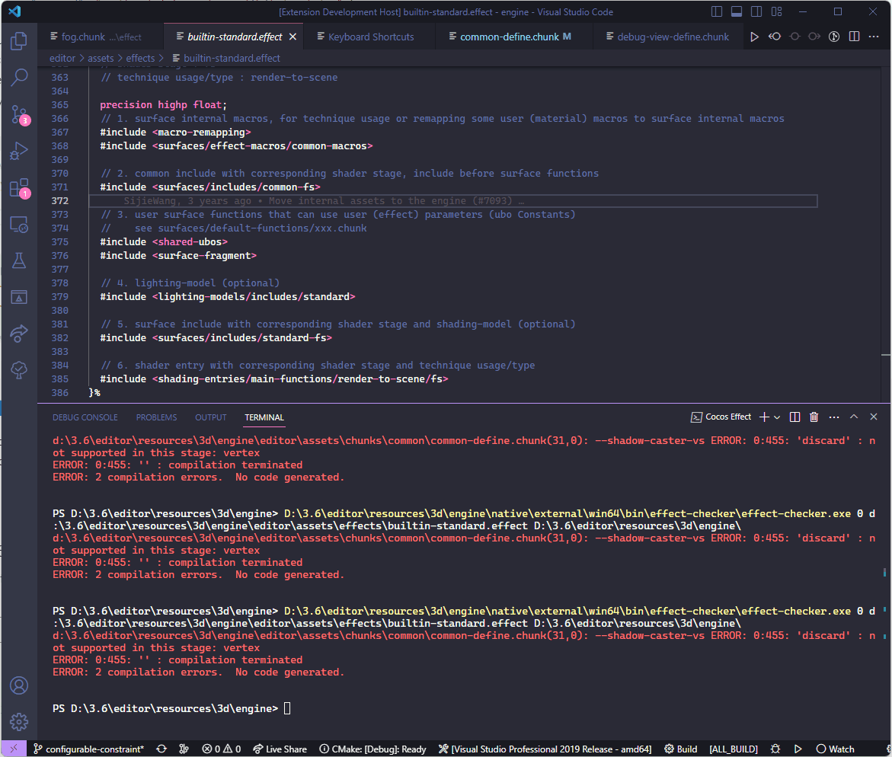

## VSCode 着色器插件（实验性）

在 VSCode 应用商店中搜索扩展 Cocos Effect 并安装，即可启用 .effect 文件的简易语法着色。

如果打开的 .effect 是 3.7.3 及之后版本引擎中的内置文件，或使用此版本编辑器打开过的工程中的文件，会自动新增如下功能：

### 1、自动补全和语法着色

引擎内置函数、宏和全局变量的自动补全、语法着色等功能。

输入关键字会有列表提示，按上下键选择，同时会显示提示信息，按回车可以自动补全

鼠标移动到补全后的关键字上会有悬停提示信息，包括注释和所在文件位置等

> **注意**：由于是实验性功能，此功能目前仅支持部分引擎内置常用代码的感应，不支持用户代码自动感应。

### 2、语法检查及错误跳转

当前窗口打开一个 .effect 文件，然后在查看菜单--命令面板（Ctrl+Shift+P）....选择**Cocos Effect: compile effect**即可调用工具自动编译当前文件，并给出对应的错误提示，**在提示窗口红色错误的文件路径上按住 Ctrl 点击鼠标左键即可跳转到对应代码行**。

在此项右侧有一个小的齿轮图标，点击还可以添加快捷键绑定，此后只要在 .effect 文件中按快捷键即可调用语法检查器，完整操作流程见下图。

> **注意**：由于是实验性功能，此功能目前只支持 Windows 系统。

### 3、其他设置

插件会自动根据打开的 .effect / .chunk 文件所在位置来查找引擎对应的位置和相应的补全提示信息，但只限引擎内置文件或被新版编辑器打开过的工程中的文件。

如果打开的文件是在外部文件夹或老版引擎及工程中，上述新增功能就会失效，此时可以下载一个新版本引擎，然后在插件设置中指定新版编辑器或引擎的文件夹，这样就能够支持所有的 .effect 了。

操作步骤：

1. 文件菜单--首选项--设置
2. 输入 cocos
3. Cocos-effect: Engine Path中填入新版引擎或编辑器所在的文件夹即可（会自动识别）
