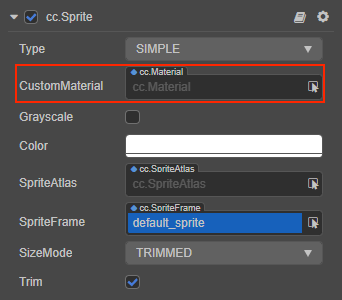
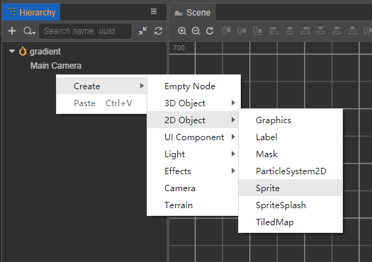
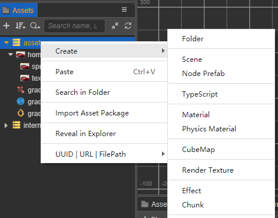
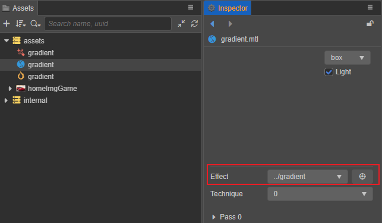
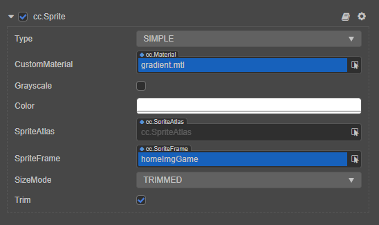
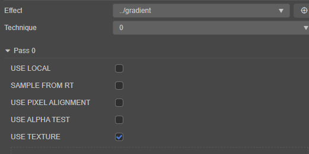
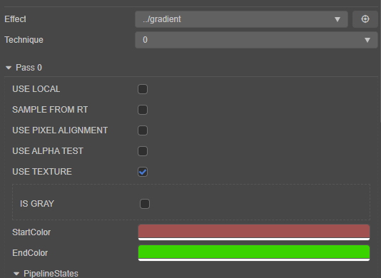
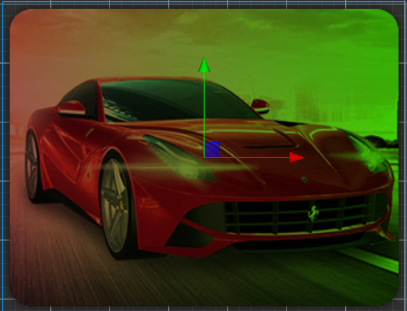
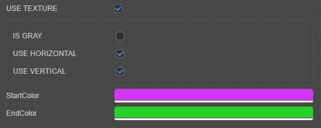
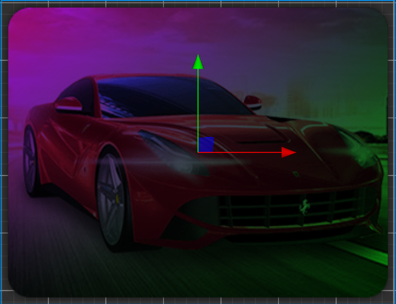

# 2D 精灵着色器：Gradient

默认的情况下，UI 和 2D 组件会使用引擎内置的着色器，这些着色器放在 **资源管理器** 面板的 **internal -> effects** 目录下，可查看 [内置着色器](effect-builtin.md) 来了解其作用。

对于任何持有 CustomMaterial 属性的 UI 和 2D 组件，都可在 **属性检查器** 内通过该属性的下拉框选择或者从 **资源管理器** 内拖拽实现自定义材质。

引擎规定 UI 组件的自定义材质只能有一个。



> **注意**：
> 在使用自定义材质后，可能会打断合批。
> 关于 UI 和 2D 组件合批的使用，可以参考：[2D 渲染组件合批规则说明](../ui-system/components/engine/ui-batch.md)

本文将通过实现一个精灵的渐变着色器来演示如何为 UI 和 2D 组件使用自定义着色器。

## 搭建工程

通过 CocosDashBoard 创建一个新的 2D 项目。

创建一个新的场景并在场景内添加一个 Sprite 组件：



在 **资源管理器** 内创建下列资源：
- gradient.effect 的着色器文件
- 拷贝 **资源管理器 -> intenal -> effects** 内的 `builtin-sprite` 着色器的内容到 gradient.effect 内
- 一个名为 gradient.mtl 的材质并在 **属性查看器** 内的 Effect 栏选择 gradient.effect
- 导入任意的纹理

材质和着色器的创建可通过在 **资源管理器** 内任意空白处点击鼠标右键，或单击 **资源管理** 上的 `+` 按钮



创建好的工程如图示：



选中创建好的精灵，将 gradient.mtl 材质和导入的纹理分别赋予给精灵的对应属性：



## CCEffect

通过观察可得知，渐变可以理解为在某个轴上，随着坐标变化，颜色发生变化的现象。因此在 CCEffect 段内给着色器的 properties 增加两个颜色属性分别代表渐变的起始颜色和结束颜色。

```yaml
startColor: { value: [1.0, 1.0, 1.0, 1.0], # gradientA 的 RGBA 通道的默认值
              editor: {type: color} } # 在属性查看器内展示的样式，此处展示为颜色
endColor: { value: [1.0, 1.0, 1.0, 1.0], 
              editor: {type: color} }}
```

此时的 CCEffect:

```yaml
CCEffect %{
  techniques:
  - passes:
    - vert: sprite-vs:vert
      frag: sprite-fs:frag
      depthStencilState:
        depthTest: false
        depthWrite: false
      blendState:
        targets:
        - blend: true
          blendSrc: src_alpha
          blendDst: one_minus_src_alpha
          blendDstAlpha: one_minus_src_alpha
      rasterizerState:
        cullMode: none
      properties:
        alphaThreshold: { value: 0.5 }
        startColor: { value: [1.0, 1.0, 1.0, 1.0], editor: {type: color} }
        endColor: { value: [1.0, 1.0, 1.0, 1.0], editor: {type: color} }
}%
```

注意这里定义了两个颜色值 `startColor` 和 `endColor`，如果要将这两个颜色正确的传入给着色器片段，则需要增加对应的 Uniform。

>在引擎中离散的 Uniform 声明已不是一个选择，因此需要使用 UBO 来声明。 若要了解更多 UBO 的内容可参考：[着色器语法](effect-syntax.md)。

在 `CCProgram sprite-fs` 段内添加下列的代码：

```glsl
   uniform Constant{
    vec4 startColor;
    vec4 endColor;
  }; 
```

此时引擎会自动将 properties 内定义的属性和 `Constant` 内的 Uniform 进行关联。

## 顶点着色器

通常不用对顶点着色器做额外的处理，因此保留系统内置的 `sprite-vs`。

## 片元着色器

在默认的精灵着色器内，精灵顶点的 XY 轴和纹理坐标的 UV 是对应的，因此可考虑使用纹理坐标的变化来达成渐变，在 USE_TEXTURE 宏定义的范围内增加下列代码：

```glsl
#if USE_TEXTURE            
    o *= CCSampleWithAlphaSeparated(cc_spriteTexture, uv0); 
    #if IS_GRAY
    float gray  = 0.2126 * o.r + 0.7152 * o.g + 0.0722 * o.b;
    o.r = o.g = o.b = gray;
    #endif

    o.rgb *= mix(startColor, endColor, vec4(uv0.x)).rgb;
#endif
```

勾选原有材质上的 `USE_TEXTURE` 选项：



此时通过调整材质上的 `startColor` 和 `endColor` 则可以观察到不同的渐变：




## 使用预处理宏定义

在上述的片元着色器内，只考虑了纹理坐标轴 U 的渐变，为了灵活性和支持更多的功能，通过预处理宏定义来实现不同轴的渐变，因此删掉下列代码：

```glsl
o.rgb *= mix(startColor, endColor, vec4(uv0.x)).rgb;
```

添加下列代码：

```glsl
#if USE_HORIZONTAL
    o.rgb *= mix(startColor, endColor, vec4(uv0.x)).rgb;
#endif

#if USE_VERTICAL 
    o.rgb *= mix(startColor, endColor, vec4(uv0.y)).rgb;
#endif        
```

这里声明了两个预处理宏定义 `USE_HORIZONTAL` 和 `USE_VERTICAL` 分别代表了水平方向和垂直方向的渐变，可以方便的按需使用：




完整的着色器代码：

```glsl
// Copyright (c) 2017-2020 Xiamen Yaji Software Co., Ltd.
CCEffect %{
  techniques:
  - passes:
    - vert: sprite-vs:vert
      frag: sprite-fs:frag
      depthStencilState:
        depthTest: false
        depthWrite: false
      blendState:
        targets:
        - blend: true
          blendSrc: src_alpha
          blendDst: one_minus_src_alpha
          blendDstAlpha: one_minus_src_alpha
      rasterizerState:
        cullMode: none
      properties:
        alphaThreshold: { value: 0.5 }
        startColor: { value: [1.0, 1.0, 1.0, 1.0], editor: {type: color} }
        endColor: { value: [1.0, 1.0, 1.0, 1.0], editor: {type: color} }
}%

CCProgram sprite-vs %{
  precision highp float;
  #include <cc-global>
  #if USE_LOCAL
    #include <cc-local>
  #endif
  #if SAMPLE_FROM_RT
    #include <common>
  #endif
  in vec3 a_position;
  in vec2 a_texCoord;
  in vec4 a_color;

  out vec4 color;
  out vec2 uv0;

  vec4 vert () {
    vec4 pos = vec4(a_position, 1);

    #if USE_LOCAL
      pos = cc_matWorld * pos;
    #endif

    #if USE_PIXEL_ALIGNMENT
      pos = cc_matView * pos;
      pos.xyz = floor(pos.xyz);
      pos = cc_matProj * pos;
    #else
      pos = cc_matViewProj * pos;
    #endif

    uv0 = a_texCoord;
    #if SAMPLE_FROM_RT
      CC_HANDLE_RT_SAMPLE_FLIP(uv0);
    #endif
    color = a_color;

    return pos;
  }
}%

CCProgram sprite-fs %{
  precision highp float;
  #include <embedded-alpha>
  #include <alpha-test>

  in vec4 color;

  uniform Constant{
    vec4 startColor;
    vec4 endColor;
  };   

  #if USE_TEXTURE
    in vec2 uv0;
    #pragma builtin(local)
    layout(set = 2, binding = 11) uniform sampler2D cc_spriteTexture;
  #endif

  vec4 frag () {
    vec4 o = vec4(1, 1, 1, 1);

    #if USE_TEXTURE            
      o *= CCSampleWithAlphaSeparated(cc_spriteTexture, uv0); 
      #if IS_GRAY
        float gray  = 0.2126 * o.r + 0.7152 * o.g + 0.0722 * o.b;
        o.r = o.g = o.b = gray;
      #endif

      #if USE_HORIZONTAL
         o.rgb *= mix(startColor, endColor, vec4(uv0.x)).rgb;
      #endif
      
      #if USE_VERTICAL 
         o.rgb *= mix(startColor, endColor, vec4(uv0.y)).rgb;
      #endif      

    #endif

    o *= color;

    ALPHA_TEST(o);
    return o;
  }
}%

```
