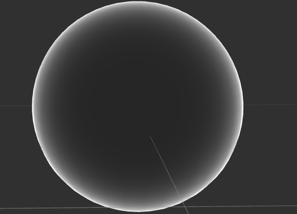
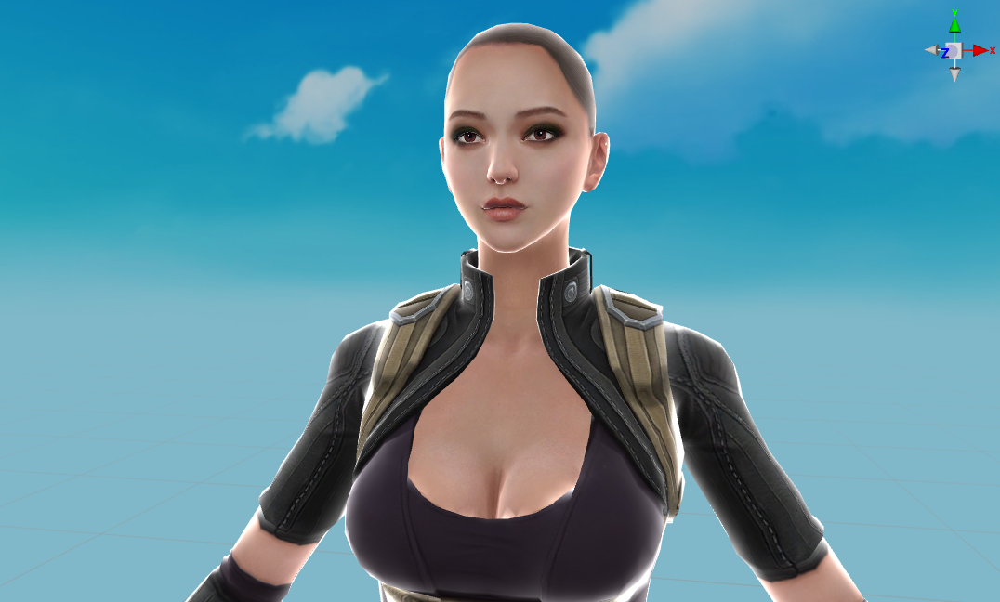
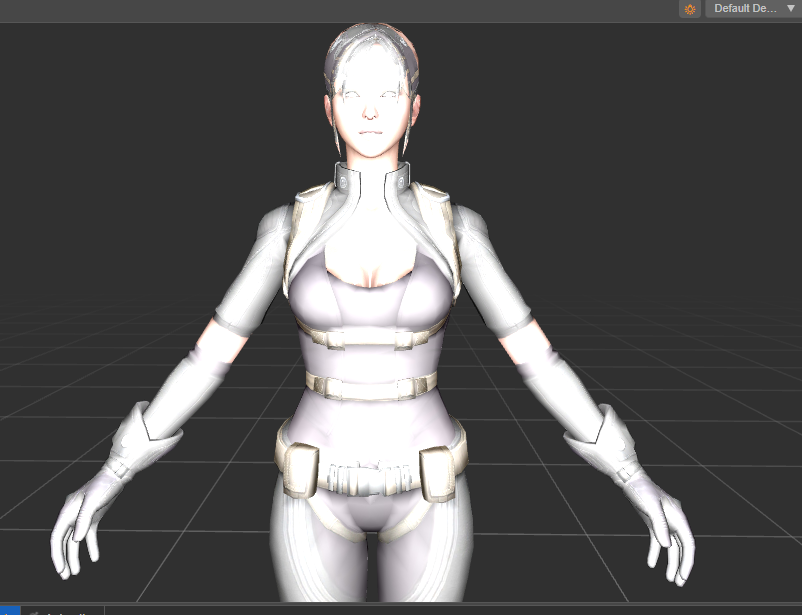
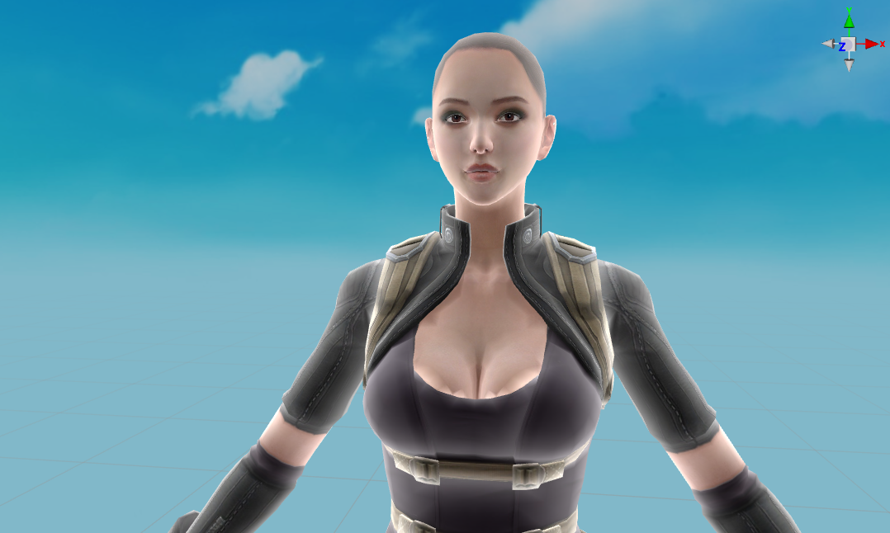
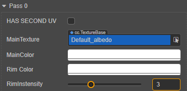
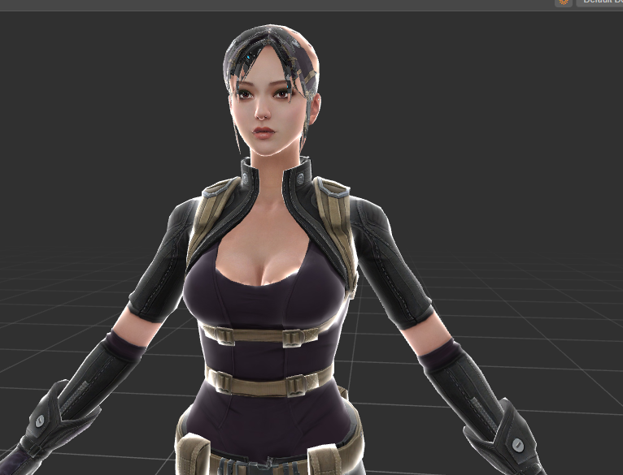
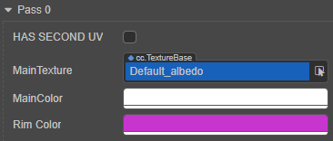
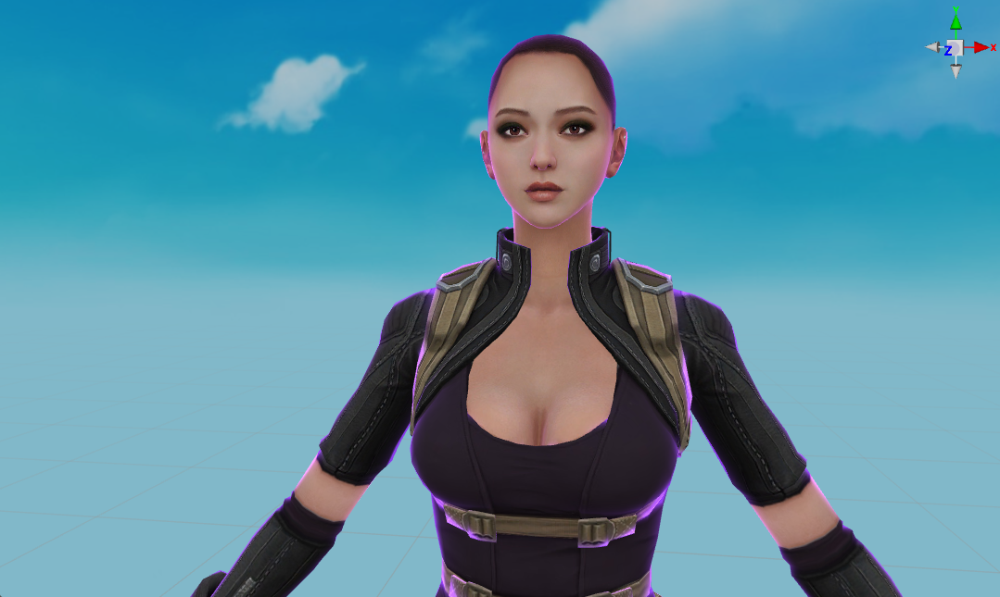

# 编写着色器

本文将基于 RimLight 编写一个基础的 `GLSL` 着色器。

菲涅尔现象（Fresnel Effect）：

菲涅尔现象指的是不同材质上，光照强度随着视角的变化而变化的现象。

<!-- 没有找到版权图片 -->
 <!-- 没有找到版权图片 -->

RimLight:

也称为“内发光”、“轮廓光”或者“边缘光”，是一种通过使物体的边缘发出高亮，让物体更加生动的技术。

RimLight 是菲涅尔现象的一种应用，通过计算物体法线和视角方向的夹角的大小，调整发光的位置和颜色，是一种简单，高效的提升渲染效果的着色器。

 

<!-- 
RimLight 实现简单，效率高，效果也不错。 
-->

本文将以 RimLight 为例，实现 Cocos Creator 的着色器。

首先参考[新建着色器](write-effect-overview.md)新建一个名为 `rimlight.effect` 的着色器。

## CCEffect 

由于不考虑半透明的渲染，因此可删掉半透明的渲染技术部分,并将 `frag` 修改为： `rimlight-fs:frag`

```yaml
# 删除如下的部分
- name: transparent
    passes:
    - vert: general-vs:vert # builtin header
      frag: rimlight-fs:frag
      blendState:
        targets:
        - blend: true
          blendSrc: src_alpha
          blendDst: one_minus_src_alpha
          blendSrcAlpha: src_alpha
          blendDstAlpha: one_minus_src_alpha
      properties: *props 
```

为了方便调整 RimLight 的颜色，增加一个用于调整 RimLight 颜色的属性，由于不考虑半透明，只使用该颜色的 RGB 通道：
```yaml
rimLightColor:  { value: [1.0, 1.0, 1.0],   # RGB 的默认值
                  target: rimColor.rgb,     # 绑定到 Uniform rimColor 的 RGB 通道上
                  editor: {                 # 在 material 的属性查看器内的样式定义
                    displayName: Rim Color, # 显示 Rim Color 作为显示名称
                    type: color } }         # 该字段的类型为颜色值
```

此时的 CCEffect 代码：

```yaml
CCEffect %{
  techniques:
  - name: opaque
    passes:
    - vert: general-vs:vert # builtin header
      frag: rimlight-fs:frag
      properties: &props
        mainTexture:    { value: white } 
        mainColor:      { value: [1, 1, 1, 1], editor: { type: color } }    
        # Rim Light 的颜色，只依赖 rgb 三个通道的分量
        rimLightColor:  { value: [1.0, 1.0, 1.0], target: rimColor.rgb, editor: { displayName: Rim Color, type: color } }
}%
```

注意需要在片元着色器的 `uniform Constant` 内增加对应的 `rimColor` 字段：

```glsl
uniform Constant {        
  vec4 mainColor;    
  vec4 rimColor;  
}; 
```

## 顶点着色器

顶点着色器直接沿用引擎内置的通用顶点着色器：

```yaml
 - vert: general-vs:vert # builtin header
```
## 片元着色器

将片元着色器 `CCProgram unlit-fs` 修改为： `CCProgram rimlight-fs` 。

要计算视点的方向，需要获取当前相机的位置，之后用相机的位置减去当前的坐标， 包含 `cc-global` 这个着色器片段，

为片元着色器增加下面的代码：
```glsl
#include <cc-global>  // 包含 Cocos Creator 内置全局变量  
```

着色器代码：

```glsl
CCProgram rimlight-fs %{
  precision highp float;  
  #include <cc-global>  // 包含 Cocos Creator 内置全局变量  
  #include <output>
  #include <cc-fog-fs>

  ...

}
```

视点方向的计算是通过当前相机的位置向量减去片元着色器内由顶点着色器传入的位置信息 `v_position`：

```glsl
vec3 viewDirection = cc_cameraPos.xyz - v_position; //计算视点的方向
```

我们不关心视角向量的长度，因此得到 viewDirection 后，通过 normalize 方法进行归一化处理：

```glsl
vec3 normalizedViewDirection = normalize(viewDirection);  //对视点方向进行归一化
```

注意 cc_cameraPos 的 xyz 分量表示了相机的位置， w 分量不会用到。

此时的片元着色器代码：

```glsl
  vec4 frag(){ 
    vec3 viewDirection = cc_cameraPos.xyz - v_position; //计算视点的方向
    vec3 normalizedViewDirection = normalize(viewDirection);  //对视点方向进行归一化
    vec4 col = mainColor * texture(mainTexture, v_uv); //计算最终的颜色
    CC_APPLY_FOG(col, v_position);
    return CCFragOutput(col);  
  }
```
接下来需要计算法线和视角的夹角，由于使用的是内置标准顶点着色器 `general-vs:vert` ，法线已由顶点着色器传入到片元着色器，若要在片元着色器里面使用，只需在代码如增加：

```glsl
in vec3 v_normal;
```

此时的片元着色器： 

```glsl
CCProgram rimlight-fs %{
  precision highp float;
  #include <cc-global>
  #include <output>
  #include <cc-fog-fs>

  in vec2 v_uv;
  in vec3 v_normal;
  in vec3 v_position;

  ....
}
```

法线由于管线的插值，不再处于归一化状态， 因此需要对法线进行归一化处理，使用 `normalize` 函数进行归一化：

```glsl
vec3 normal = normalize(v_normal);  //重新归一化法线。
```

此时的 `frag` 函数：

```glsl
vec4 frag(){ 
    vec3 normal = normalize(v_normal);  //重新归一化法线。
    vec3 viewDirection = cc_cameraPos.xyz - v_position; //计算视点的方向
    vec3 normalizedViewDirection = normalize(viewDirection);  //对视点方向进行归一化
    vec4 col = mainColor * texture(mainTexture, v_uv); //计算最终的颜色
    CC_APPLY_FOG(col, v_position);
    return CCFragOutput(col);  
}
```

这时可计算法线和视角的夹角，在线性代数里面，点积表示为：
```math
a·b = |a||b|cos(θ)
```
可得出：
```math
cos(θ) = a·b /(|a|*|b|)
```
由于法线和视角方向都已经归一化，因此他们的模长为 1，点积的结果则表示为法线和视角的 cos 值。

```glsl
dot(normal, normalizedViewDirection)
```

注意点积的计算可能会出现小于 0 的情况，而颜色是正值，通过 `max` 函数将其约束在 [0, 1] 这个范围内：

```glsl
max(dot(normal, normalizedViewDirection), 0.0)
```

此时可根据点积的结果来调整 RimLight 的颜色：

```glsl
float rimPower = max(dot(normal, normalizedViewDirection), 0.0);//计算 RimLight 的亮度
vec4 col = mainColor * texture(mainTexture, v_uv); //计算最终的颜色
col.rgb += rimPower * rimColor.rgb; //增加边缘光
```
着色器代码如下：

```glsl
vec4 frag(){ 
    vec3 normal = normalize(v_normal);//重新归一化法线。
    vec3 viewDirection = cc_cameraPos.xyz - v_position; //计算视点的方向
    vec3 normalizedViewDirection = normalize(viewDirection);  //对视点方向进行归一化
    float rimPower = max(dot(normal, normalizedViewDirection), 0.0); //计算 RimLight 的亮度
    vec4 col = mainColor * texture(mainTexture, v_uv); //计算最终的颜色
    col.rgb += rimPower * rimColor.rgb; //增加边缘光
    CC_APPLY_FOG(col, v_position);
    return CCFragOutput(col);  
}
```

可观察到物体中心比边缘更亮，这是因为边缘顶点的法线和视角的夹角更大，得到的余弦值更小。

>此步骤若无法观察到效果，可调整 `MainColor` 使其不为白色。因为默认的 `MainColor` 颜色是白色遮盖了边缘光的颜色。



要调整这个结果，只需用 1 减去点积的结果即可，删除下面的代码：

~~float rimPower = max(dot(normal, normalizedViewDirection), 0.0);~~

并改为：

```glsl
float rimPower = 1.0 - max(dot(normal, normalizedViewDirection), 0.0);
```

片元着色器代码：

```glsl
vec4 frag(){ 
    vec3 normal = normalize(v_normal);  //重新归一化法线。
    vec3 viewDirection = cc_cameraPos.xyz - v_position; //计算视点的方向
    vec3 normalizedViewDirection = normalize(viewDirection);  //对视点方向进行归一化
    float rimPower = 1.0 - max(dot(normal, normalizedViewDirection), 0.0);
    vec4 col = mainColor * texture(mainTexture, v_uv); //计算最终的颜色
    col.rgb += rimPower * rimColor.rgb; //增加边缘光
    CC_APPLY_FOG(col, v_position);
    return CCFragOutput(col);  
  }
```



虽然已经出现的边缘光，但是如果希望通过参数去调整则不是很方便，可在着色器的 CCEffect 段内增加一个可调整的参数 rimIntensity。由于之前 rimColor 的 alpha 分量没有被使用到，因此借用该分量进行绑定可节约额外的 Uniform 字段：

增加如下代码：
```yaml
rimInstensity:  { value: 1.0,         # 默认值为 1 
                  target: rimColor.a, # 绑定到 rimColor 的 alpha 通道
                  editor: {           # 属性查看器的样式
                    slide: true,      # 使用滑动条来作为显示样式
                    range: [0, 10],   # 滑动条的值范围
                    step: 0.1}        # 每次点击调整按钮时，数值的变化值
```

CCEffect 代码：

```yaml
CCEffect %{
  techniques:
  - name: opaque
    passes:
    - vert: general-vs:vert # builtin header
      frag: rimlight-fs:frag
      properties: &props
        mainTexture:    { value: white } 
        mainColor:      { value: [1, 1, 1, 1], editor: { type: color } }    
        # Rim Light 的颜色，只依赖 rgb 三个通道的分量
        rimLightColor:  { value: [1.0, 1.0, 1.0], target: rimColor.rgb, editor: { displayName: Rim Color, type: color } }
        # rimLightColor 的 alpha 通道没有被用到，复用该通道用来描述 rimLightColor 的强度。
        rimInstensity:  { value: 1.0, target: rimColor.a, editor: {slide: true, range: [0, 10], step: 0.1}}   
}%               
```

通过 pow 函数，可调整边缘光，使其范围不是线性变化：

~~col.rgb += rimPower * rimColor.rgb;~~

```glsl
float rimInstensity = rimColor.a; // alpha 通道为亮度的指数
col.rgb += pow(rimPower, rimInstensity) * rimColor.rgb;  // 使用 pow 函数对点积进行指数级修改
```

>pow 是 GLSL 的内置函数，其形式为：pow(x, p)，代表以 x 为底数，p 为指数的指数函数。

最终片元着色器代码：

```glsl
  vec4 frag(){ 
    vec3 normal = normalize(v_normal);  //重新归一化法线。
    vec3 viewDirection = cc_cameraPos.xyz - v_position; //计算视点的方向
    vec3 normalizedViewDirection = normalize(viewDirection);  //对视点方向进行归一化
    float rimPower = 1.0 - max(dot(normal, normalizedViewDirection), 0.0);//计算 RimLight 的亮度
    vec4 col = mainColor * texture(mainTexture, v_uv); //计算最终的颜色
    float rimInstensity = rimColor.a;  // alpha 通道为亮度的指数
    col.rgb += pow(rimPower, rimInstensity) * rimColor.rgb; //增加边缘光
    CC_APPLY_FOG(col, v_position); 
    return CCFragOutput(col);  
  }
```

之后将材质属性查看器面板的 rimIntensity 的值修改为 3：



此时可观察到边缘光照更自然： 



通过 Rim Color 和 rimIntensity 可调整边缘光的颜色和范围：





最终的着色器代码： 

```glsl
CCEffect %{
  techniques:
  - name: opaque
    passes:
    - vert: general-vs:vert # builtin header
      frag: rimlight-fs:frag
      properties: &props
        mainTexture:    { value: white } 
        mainColor:      { value: [1, 1, 1, 1], editor: { type: color } }    
        # Rim Light 的颜色，只依赖 rgb 三个通道的分量
        rimLightColor:  { value: [1.0, 1.0, 1.0], target: rimColor.rgb, editor: { displayName: Rim Color, type: color } }
        # rimLightColor 的 alpha 通道没有被用到，复用该通道用来描述 rimLightColor 的强度。
        rimInstensity:  { value: 1.0, target: rimColor.a, editor: {slide: true, range: [0, 10], step: 0.1}}   
}%

CCProgram rimlight-fs %{
  precision highp float;
  #include <cc-global>
  #include <output>
  #include <cc-fog-fs>

  in vec2 v_uv;
  in vec3 v_normal;
  in vec3 v_position;

  uniform sampler2D mainTexture;

  uniform Constant {
    vec4 mainColor;
    vec4 rimColor;  
  }; 
  vec4 frag(){     
    vec3 normal = normalize(v_normal);  //重新归一化法线。
    vec3 viewDirection = cc_cameraPos.xyz - v_position; //计算视点的方向
    vec3 normalizedViewDirection = normalize(viewDirection);  //对视点方向进行归一化
    float rimPower = 1.0 - max(dot(normal, normalizedViewDirection), 0.0);//计算 RimLight 的亮度
    vec4 col = mainColor * texture(mainTexture, v_uv); //计算最终的颜色
    float rimInstensity = rimColor.a;  // alpha 通道为亮度的指数
    col.rgb += pow(rimPower, rimInstensity) * rimColor.rgb; //增加边缘光
    CC_APPLY_FOG(col, v_position); 
    return CCFragOutput(col);  
  }
}%
```

 