# 如何向 Cocos 提交代码

> 文：薰依

和 Cocos2d-x 一样，Cocos Creator 也是一个开源引擎，连同范例、文档都是开源的。 
在你开发游戏的过程中，当发现了引擎、文档或者范例不够完善的地方，如果仅仅是向官方团队提出建议，官方团队可能会因为人力资源的紧张而无法及时跟进。在此我们欢迎所有用户主动向我们提交 PR，帮助 Cocos 越做越好。引擎有 Bug？提 PR！范例难看？提 PR！API 注释不清晰？提 PR！文档有错别字？提 PR！想要把你的宝贵修改贡献给游戏社区？提 PR！以下几个是目前官方比较常用的开源仓库，这些仓库都可以提交 PR。

JavaScript 引擎：[GitHub](https://github.com/cocos/cocos-engine) | [Gitee](https://gitee.com/mirrors_cocos-creator/engine) 
Cocos2d-x 引擎：[GitHub](https://github.com/cocos/engine-native) | [Gitee](https://gitee.com/mirrors_cocos-creator/engine-native) 
jsb-adapter：[GitHub](https://github.com/cocos-creator-packages/jsb-adapter) | [Gitee](https://gitee.com/mirrors_cocos-creator/jsb-adapter) 
Mini-game-adapters：[GitHub](https://github.com/cocos-creator-packages/adapters/) | [Gitee](https://gitee.com/mirrors_cocos-creator/adapters)

下面让我们来看一下，如何从零开始在 GitHub 上向 Cocos 提交代码。

## 注册一个 GitHub 账号

打开 [GitHub 网站](https://github.com/) 注册账号。若之前已经有注册过，那直接登录就可以了。

## 环境配置

### 安装 Git

首先先确认电脑是否已经安装 Git，命令行输入 `git`，安装过则会输出以下内容：

未安装过则 [下载 Git](https://git-scm.com/download/) 并安装。安装过程中的所有选项保留默认就可以了，一直点 next，直到安装完成。

### 安装 Git 客户端 —— Sourcetree

Sourcetree 是比较常用的 Git 客户端工具。如果不使用 Sourcetree 的话，Git 操作全部要通过命令行操作完成，比较麻烦。下面以 Windows 版本为例进行演示。

1、下载 [Sourcetree](https://www.sourcetreeapp.com/) 并解压缩，进行安装。

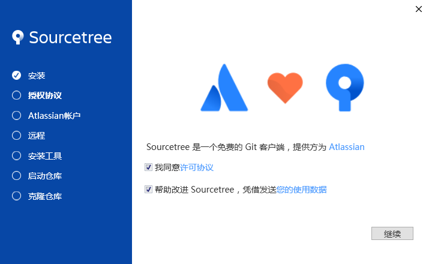

2、登录 Atlassian 帐号。Atlassian 支持使用 Google 帐号登录，所以如果你有 Google 帐号或者之前注册过 Atlassian 帐号，则单击 **使用已有账号** 登录就可以了。否则单击 **转到我的 Atlassian** 进行注册（需要使用 VPN 注册）。

3、配置账号，这一步可以点击 **跳过初始设置** 跳过设置，后面再进行账号配置。

4、加载 SSH 密钥。单击 **否**。

5、提示框提示：“Sourcetree：未找到 Mercurial”。Mercurial 也是一种版本控制软件，Sourcetree 同时支持 Git 和 Mercurial。选择 **我不想使用 Mercurial**。

安装完成后界面如下图所示：

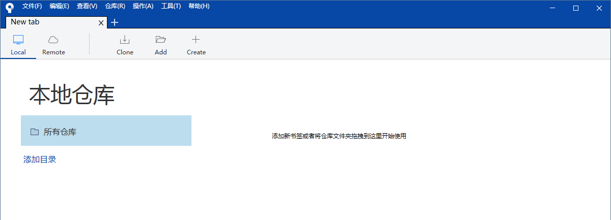

### Sourcetree 配置 GitHub 账号

1、打开 Sourcetree，点击菜单栏的 **工具 -> 选项**，在 **一般** 中进行配置，如下图所示：

配置完成后点击 **确定**。

2、点击 **工具 -> 选项**，在 **验证** 中配置托管账户。点击 **刷新 OAuth 令牌**（默认已登录 GitHub 账号），等待显示 **认证成功** 后点击 **确定**。如下图所示：

## Fork 项目

以手册文档的代码仓库 **creator-docs**（[GitHub](https://github.com/cocos/cocos-docs) | [Gitee](https://gitee.com/mirrors_cocos-creator/creator-docs)）为例。进入手册文档仓库页面，点击右上角的 Fork 按钮，如下图所示：

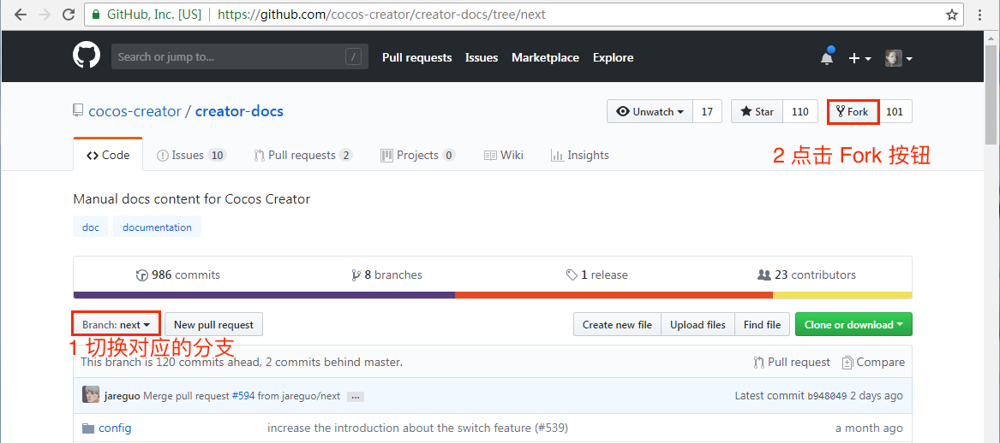

Fork 完成后，会自动跳转到你的 GitHub 仓库页面，可以看到已经生成了 creator-docs 项目副本，如下图所示：

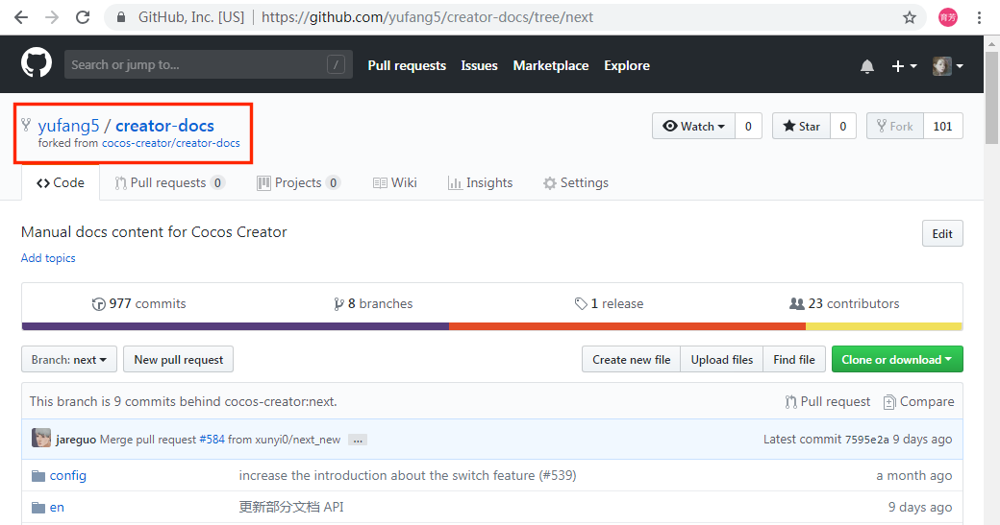

## 将远程仓库克隆到本地仓库

1、首先需要到你的远程仓库复制 **远程仓库项目地址**，如下图所示：

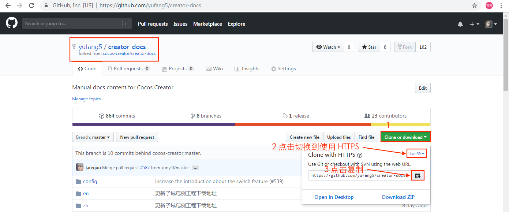

2、切换到 Sourcetree 后点击上方的 **Clone** 按钮，跳转到 Clone 页面，粘贴刚才复制的 **远程仓库项目地址**，然后填入相关配置。如果想让本地的文件夹名称和项目名称一样，那么在本地存储路径后添加 `/creator-docs`。配置完成后点击 **克隆**。

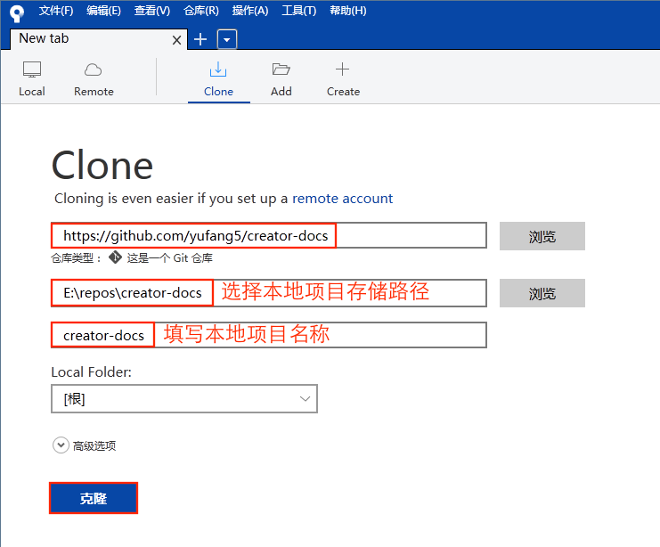

克隆完成后就会在本地自动创建 creator-docs 文件夹并且在 Sourcetree 上自动打开项目。

## 上传本地修改到远程仓库

1、检出需要的分支。在左侧的 **远程** 目录下有一个 **origin** 仓库，这是你自己的远程仓库。例如要修改的分支是 next 分支，则点击 **origin** 后双击 **next** 分支，会弹出 **检出新分支** 窗口，然后点击 **确定**。如下图所示：

可以看到在左侧 **分支** 栏目下已经生成了本地的 next 分支。

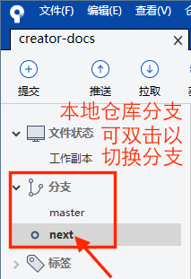

**注意**：根据不同的版本，还需要切换不同的分支，例如：

- **vX.Y** 分支：对应 X.Y 版本所用分支
- **next** 分支：用于 2.0 分支
- **master/develop** 分支：当前最新版本所用分支

2、打开本地 creator-doc 项目进行修改，修改完成后查看仓库详情，如下图所示：

3、提交暂存区文件到本地仓库。将你要上传的修改文件提交到本地暂存区，然后在下方备注提交内容注释。完成之后点击 **提交**，将暂存区文件提交到本地仓库。步骤如下图所示：

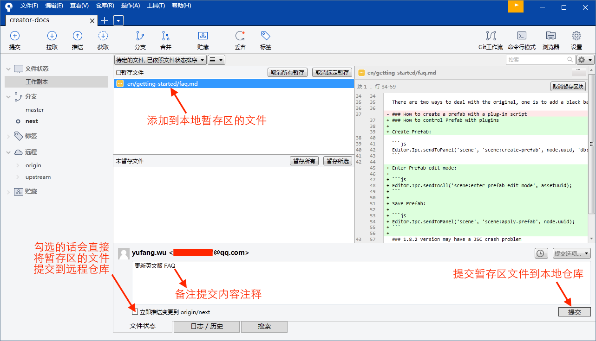

4、点击 **推送**，将本地仓库的修改推送到自己的远程仓库 origin。

5、完成之后，到 GitHub 自己的 creator-docs 远程仓库查看（可以从 **右上方的头像 -> Your profile -> Repositories -> creator-docs** 进入你的远程仓库），可以看到已经有本次的提交信息了。然后点击 **New pull request**。

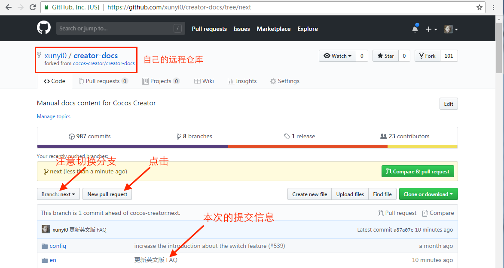

6、点击 **New pull request** 后会跳转到官方仓库的 **Open a pull request**。标题会自动填入刚才提交的信息，也可自行修改。下方的填写信息区域需要对提交内容进行适当的补充。特别是针对引擎本身的修改，请将问题描述、改动内容、涉及版本、相关平台等信息补充完整。如果有相关 Issue，或者论坛地址也可以贴上来。最下方的是本次提交的 PR 的改动详情。填写完成后点击 **Create pull request**。

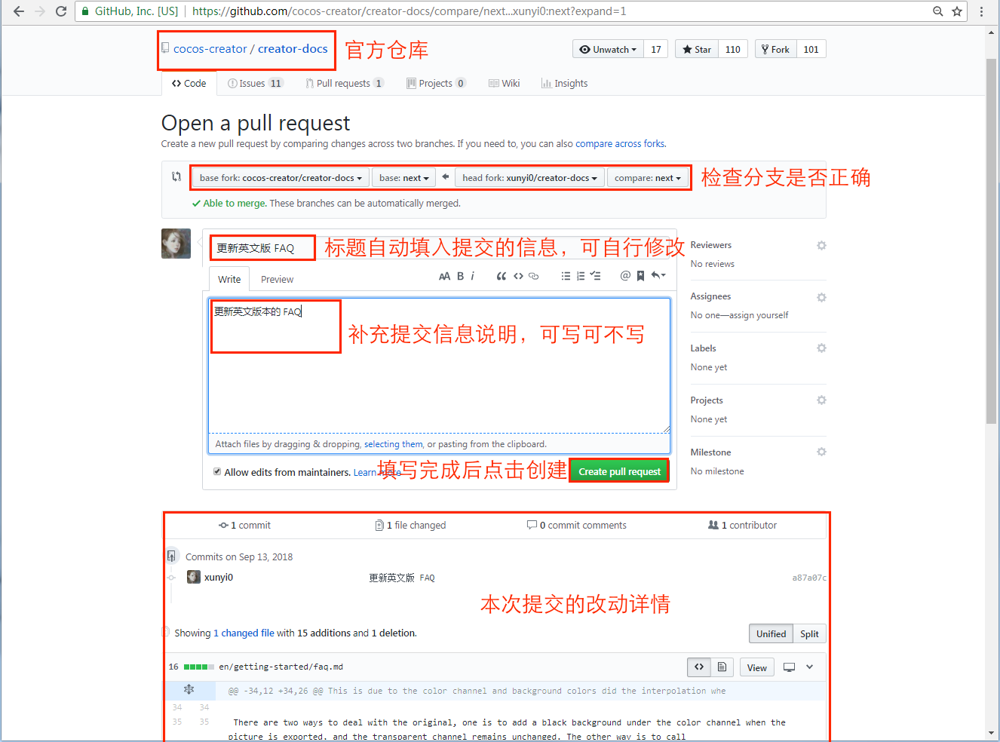

7、创建完成后在官方仓库 creator-docs 的 pull requests 页面中可以看到创建了一个新的 PR。官方人员会收到提醒并将 PR 指派给相关人员进行 review 和合并。

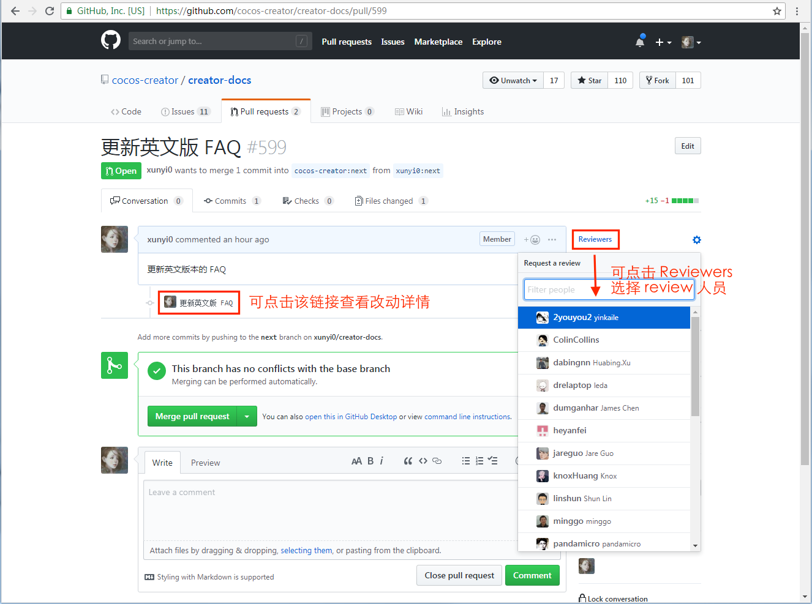

到此 PR 创建完成，若官方审核通过，就会把这个 PR 的修改合并到官方仓库中了。若官方觉得有需要，也会在该 PR 上展开进一步讨论。请留意 GitHub 相关消息或关注 PR 所在页面，以免错过讨论。如果你需要修改 PR 提交的内容，请重复 **上传本地修改到远程仓库** 中的 2、3、4 步骤。

在官方仓库中也可以看到提交的修改：

## 添加官方仓库

如果距离上次克隆仓库已经挺长时间，那么请在提交 PR 前先从官方仓库获取最新的修改以防和其他人的修改发生冲突。

1、添加官方仓库。点击 Sourcetree 右上方的 **设置 -> 远程仓库 -> 添加**，如下图所示：

2、复制官方仓库 **creator-docs**（[GitHub](https://github.com/cocos/cocos-docs) | [Gitee](https://gitee.com/mirrors_cocos-creator/creator-docs)）的 HTTPS 地址，跟上个步骤复制你的仓库项目的 HTTPS 地址操作步骤一致，然后填入。完成后点击 **确定**。如下图所示：

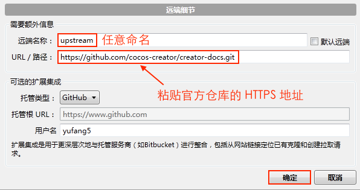

3、在 Sourcetree 的 creator-docs 本地仓库的左侧，可以看到有 origin 和 upstream 两个远程仓库，分别是自己的远程仓库和官方仓库。右键点击 **远程 -> upstream（官方仓库）** 选择 **从 upstream（官方仓库）获取**，如下图所示：

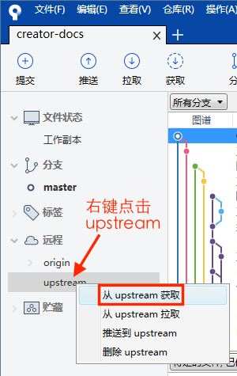

获取完成后可以看到 **远程 -> upstream** 下已经有了官方仓库的各个分支

4、从官方仓库拉取最新更新。切换到要拉取的分支，然后点击左上方的 **拉取**，在弹出来的对话框中选择远程对应的分支，然后点击 **确定**。如下图所示：

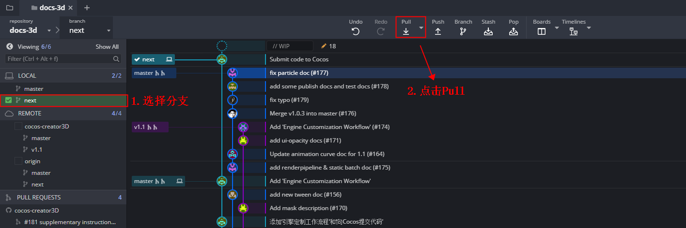

**注意**：在更新官方版本前，如果你完全不熟悉 Git 的操作，建议先确保没有在本地的 Git 仓库中进行任何文件的改动。如果有的话，建议先手动还原，然后等更新完毕后再手动把改动添加回来。

## 如何反馈文档有关的问题

针对文档本身的问题，建议通过 GitHub issue 进行反馈，下面我们简单演示一下。在提交问题之前请先确认：

- 文档版本和 Creator 版本是否一致
- 操作步骤是否正确
- 是否是文档本身的问题，例如代码错误或者根据文档步骤执行出现异常等。

若以上问题都是确定的，那么，有以下两种提交方式：

1、可在 creator 官方文档的右下方点击 **提交反馈** 进入提交 issue 界面。

填写完成后点击 **Submit new issue** 提交 issue，就完成了。

2、或者也可以进入官方仓库 **creator-docs**（[GitHub](https://github.com/cocos/cocos-docs) | [Gitee](https://gitee.com/mirrors_cocos-creator/creator-docs)），选择 **Issue -> New issue** 进入提交 issue 界面，填写内容并提交。

本次提交 pr 和提交 issue 的教程到这里就结束了，若有不理解或者有误的地方请根据上述步骤向我们反馈。 
有些人可能会问，为什么要这么麻烦的提交问题。其实，正确的提交问题可以节省很多的沟通成本，而且有些问题可能在初步排查的时候就可以解决了，或者会发现只是由于自己粗心大意导致的。而官方节省下来的人力就可以更好的去服务于 Creator，让 Creator 能更好地为游戏开发者服务。

<!--
### 生成 SSH 密钥

1、通过命令行命令创建 SSH key。运行命令 `ssh-keygen -t rsa -b 4096 -C "your_email@example.com"`，过程需要连按三次回车：

- 首先会提示 `Enter file in which to save the key (/c/Users/Administrator/.ssh/id_rsa):`，意思是让指定密钥保存的地址，一般默认就可以，直接回车。默认存放在 `/c/Users/Administrator/.ssh/id_rsa`。 
- 然后会提示 `Enter passphrase (empty for no passphrase)`，无需设置，回车即可。 
- 最后提示 `Enter same passphrase again`，无需设置，回车即可。会生成 `id_rsa` 和 `id_rsa.pub` 两个文件，分别是私钥和公钥。我们需要把公钥配置到自己的 GitHub 帐号上，这样才能与 GitHub 之间通过 ssh 建立连接。

**注意**：

（1）若运行创建 SSH key 命令时提示 `“ssh-key” 不是内部或外部命令，也不是可运行的程序或批处理文件`。则需要先找到 `Git/usr/bin` 目录下的 **ssh-keygen.exe** (如果找不到，可以在计算机全局搜索)，复制 **ssh-keygen.exe** 所在的路径。然后右键点击 **计算机 -> 高级系统设置 -> 环境变量 -> 系统变量**，找到 Path 变量进行编辑，在最后输入分号，粘贴复制的 **ssh-keygen.exe** 路径并保存。最后重新运行创建 SSH key 的命令即可。

（2）**.ssh** 文件夹是隐藏文件夹，需要 Windows 设置隐藏文件夹可见才能看见。

2、然后打开 `id_rsa.pub` 文件，复制里面的 key。

### GitHub 帐号配置 ssh 密钥

1、访问 [GitHub 网站](https://github.com/) 登录之前注册的 GitHub 账号。单击右上角头像，选择 **Setting**，进入帐号设置选择左侧 **SSH and GPG keys**。然后点击右上方的 **New SSH key**，添加刚刚复制的 SSH key。添加完成后点击 **Add SSH key**。

配置完成后如下图所示：

2、链接验证。输入 `ssh -T git@github.com` 命令行输出结果如下图，说明已经链接成功。

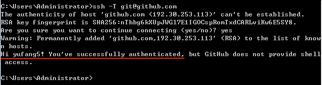

## Fork 项目

以手册文档的代码仓库 [creator-docs](https://github.com/cocos/cocos-docs) 为例。进入手册文档仓库页面，点击右上角的 Fork 按钮，如下图所示：

Fork 完成后，会自动跳转到你的 GitHub 仓库页面，可以看到已经生成了 creator-docs 项目，如下图所示：

## 通过 SSH 链接将远程仓库克隆到本地仓库。

1、首先在 GitHub 上复制你的仓库项目的 SSH 地址。如下图所示：

2、打开 Sourcetree 点击 **Remote** 选项卡，在远程仓库中会显示刚才从官方仓库 fork 下来的在你的 GitHub 账户上的项目 creator-docs。然后右键点击 Clone，或者点击上方 Remote 选项卡右边的 Clone 按钮。

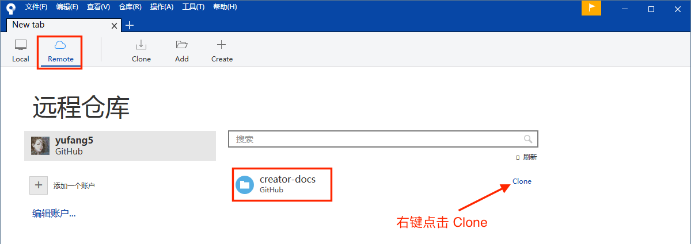

跳转到 Clone 页面后填入相关配置。如果想让本地的文件夹名称和项目名称一样，那么在本地存储路径后添加 `/creator-docs`。配置完成后点击 **克隆**，就会在本地自动创建 creator-docs 文件夹并且在 Sourcetree 自动打开项目。

克隆完成后在 Sourcetree 上打开如下：

## 上传本地修改到远程仓库

1、检出需要的分支。在左侧的 **远程** 目录下有一个 **origin** 仓库，这是你自己的远程仓库。例如要修改的分支是 next 分支，则点击 **origin** 后双击 **next**，会弹出 **检出新分支** 窗口，然后点击确定。如下图所示：

可以看到在左侧 **分支** 栏目下已经生成了本地的 next 分支。

2、打开本地 creator-doc 项目进行修改，修改完成后查看仓库详情，如下图所示：

3、提交暂存区文件到本地仓库。步骤如下图所示：

4、点击 **推送**，将本地仓库的修改推送到自己的远程仓库。

5、完成之后，到 GitHub 自己的 creator-docs 远程仓库查看（可以从 **右上方的头像 -> Your profile -> Repositories -> creator-docs** 进入你的远程仓库），可以看到已经有本次的提交信息了。然后点击 **New pull request**。

6、点击 **New pull request** 后会跳转到官方仓库的 **Open a pull request**。标题会自动填入刚才提交的信息，也可自行修改。下方的填写信息区域需要对提交内容进行适当的补充。特别是针对引擎本身的修改，请将问题描述、改动内容、涉及版本、相关平台等信息补充完整。如果有相关 Issue，或者论坛地址也可以贴上来。最下方的是本次提交的 PR 的改动详情。填写完成后点击 **Create pull request**。

7、创建完成后在官方仓库 creator-docs 的 pull requests 页面中可以看到创建了一个新的 PR。官方人员会收到提醒并将 PR 指派给相关人员进行 review 和合并。

到此 PR 创建完成，若官方合并了这个 PR 就会把你的修改合并到官方仓库中了。

在官方仓库中也可以看到提交的修改：

## 添加官方仓库

当你 fork 过仓库之后很久没有更新时，请先从官方仓库获取最新的修改以防与其他人出现文件修改冲突。

1、添加官方仓库。点击 Sourcetree 右上方的 **设置 -> 远程仓库 -> 添加**，如下图所示：

2、复制官方仓库 [creator docs](https://github.com/cocos/cocos-docs) 的 SSH 地址，跟上个步骤复制你的仓库项目的 SSH 地址操作步骤一致，然后填入。完成后点击 **确定**。如下图所示：

3、在 Sourcetree 的 creator-docs 本地仓库的左侧，可以看到有 origin 和 upstream 两个远程仓库，分别是自己的远程仓库和官方仓库。右键点击 **远程 -> upstream（官方仓库）** 选择 **从 upstream（官方仓库）获取**，如下图所示：

获取完成后可以看到 **远程 -> upstream** 下已经有了官方仓库的各个分支

4、从官方仓库拉取最新更新。选择要拉取的分支，然后点击左上方的 **拉取**，在弹出来的拉取框中选择远程分支 upstream，注意分支一致，然后点击 **确定**。如下图所示：

接下来我们再来看一下针对文档仓库应该如何正确的提交问题。
-->