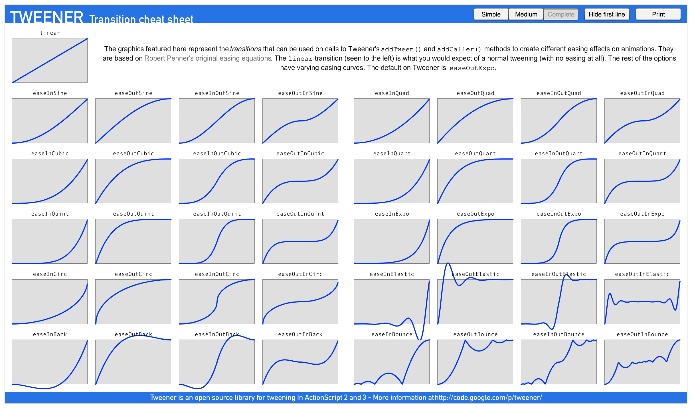

# 缓动相关接口介绍

## Tween 属性和接口说明

### 接口说明

| 接口               | 功能说明                                     |
| :---------------- | :------------------------------------------ |
| **tag**           | 为当前缓动添加一个数值类型（`number`）的标签 |
| **to**            | 添加一个对属性进行 **绝对值** 计算的间隔动作  |
| **by**            | 添加一个对属性进行 **相对值** 计算的间隔动作  |
| **set**           | 添加一个 **直接设置目标属性** 的瞬时动作      |
| **delay**         | 添加一个 **延迟时间** 的瞬时动作              |
| **call**          | 添加一个 **调用回调** 的瞬时动作              |
| **target**        | 添加一个 **直接设置缓动目标** 的瞬时动作      |
| **union**         | **将上下文的缓动动作打包成一个**            |
| **then**          | **插入一个 Tween 到缓动队列中**             |
| **repeat**        | **执行几次**（此前为重复几次，请及时适配）  |
| **repeatForever** | **一直重复执行**                            |
| **sequence**      | **添加一个顺序执行的缓动**                  |
| **parallel**      | **添加一个同时进行的缓动**                  |
| **start**         | **启动缓动**                                |
| **stop**          | **停止缓动**                                |
| **clone**         | **克隆缓动**                                |
| **show**          | **启用节点链上的渲染，缓动目标需要为 Node** |
| **hide**          | **禁用节点链上的渲染，缓动目标需要为 Node** |
| **removeSelf**    | **将节点移出场景树，缓动目标需要为 Node**   |

### 静态接口说明

这些方法为 `Tween` 的静态方法，调用方式示例： `Tween.stopAll`。

|接口 | 功能说明 |
|:-- |:---|
|**stopAll**| 停止所有缓动 <br> 该接口会移除底层所有已注册的缓动动画 <br> **注意**：该方法会影响所有对象
|**stopAllByTag**|停止所有指定标签的缓动  <br> 该接口将移除 通过 **tag** 方法指定的所有缓动 <br> 可通过传入第二个 **target:Node** 来指定是否仅移除指定对象上带有某个标签的缓动
|**stopAllByTarget** |停止所有指定对象的缓动

## 工具函数说明

|接口| 功能说明
|:-- |:--|
|**tween<T>**| 这是一个工具函数，帮助实例化 Tween 类 <br> **注意**：该方法并非 Tween 类的成员，开发者也可自行调用 new Tween< T >(target:T) 的方式实例化缓动。

### 简单示例

这里以一个的 to 缓动动画作为示例演示缓动的用法：

```ts
let tweenDuration : number = 1.0;                                   // 缓动的时长
tween(this.node.position).to( tweenDuration, new Vec3(0, 10, 0),    //这里以node的位置信息坐标缓动的目标 
    {                                                               //ITweenOption 的接口实现：
    onUpdate : (target:Vec3, ratio:number)=>{                       // onUpdate 接受当前缓动的进度
        this.node.position = target;                                // 将缓动系统计算出的结果赋予 node 的位置
    }
}).start();                                                         // 调用 start 方法，开启缓动
```

更多示例可查看 [缓动示例](tween-example.md)

## 一些限制

为了降低更新 `Node Transform` 信息的频率，`Node` 内部维护了一个 `dirty` 状态，只有在调用了可能会改变 `Node Transform` 信息的接口，才会将 `dirty` 置为需要更新的状态。

但目前的接口存在一定的限制，例如：通过 `this.node.position` 获取到的 `position` 是一个通用的 `Vec3`。

当执行 `this.node.position.x = 1` 这段代码的时候，只执行了 `position` 的 `getter`，并没有执行 `position` 的 `setter`。由于 `dirty` 并没有更新，便会导致渲染时使用的节点的 `Transform` 信息没有更新。

目前，我们也不支持这样的调用，而是鼓励使用 `setPosition` 或 `position` 的 `setter`，如下所示：

```typescript
let _pos = new Vec3(0, 1, 0);
this.node.position = _pos;      // 这里将通过 position 的 setter
this.node.setPosition(_pos);    // 这里将通过接口 setPosition
```

## ITweenOption 接口说明

ITweenOption 为缓动提供可选属性，该类无法直接实例化，主要用于 `to` 和 `by` 这两个接口内，为这两个接口提供不同的缓动函数和接收缓动的回调。

通过 `easing` 接口可以调整缓动函数，目前引擎内支持的缓动函数可参考 [内置缓动函数](tween-interface.md/内置缓动函数)。

修改缓动函数示例：

```ts
let tweenDuration: number = 1.0;         // 缓动的时长
tween(this.node)
.to(tweenDuration, { position: new Vec3(0, 10, 0) }, {  //这里以node的位置信息坐标缓动的目标 
    easing: "backIn",       //缓动函数，可以使用已有的，也可以传入自定义的函数。      
}).start(); // 调用 start 方法，开启缓动
```

完整示例可查看 [ITweenOption 完整示例](tween-example.md)

### 内置缓动函数

`ITweenOption.easing` 的可选项如下：

```ts
export type TweenEasing =
'linear'    | 'smooth'     | 'fade'         | 'constant'     |
'quadIn'    | 'quadOut'    | 'quadInOut'    | 'quadOutIn'    |
'cubicIn'   | 'cubicOut'   | 'cubicInOut'   | 'cubicOutIn'   |
'quartIn'   | 'quartOut'   | 'quartInOut'   | 'quartOutIn'   | 
'quintIn'   | 'quintOut'   | 'quintInOut'   | 'quintOutIn'   |
'sineIn'    | 'sineOut'    | 'sineInOut'    | 'sineOutIn'    |
'expoIn'    | 'expoOut'    | 'expoInOut'    | 'expoOutIn'    |
'circIn'    | 'circOut'    | 'circInOut'    | 'circOutIn'    |
'elasticIn' | 'elasticOut' | 'elasticInOut' | 'elasticOutIn' |
'backIn'    | 'backOut'    | 'backInOut'    | 'backOutIn'    |
'bounceIn'  | 'bounceOut'  | 'bounceInOut'  | 'bounceOutIn';
```

其效果图为：


图片源自 [http://hosted.zeh.com.br/tweener/docs/en-us/](http://hosted.zeh.com.br/tweener/docs/en-us/)
