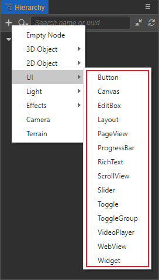
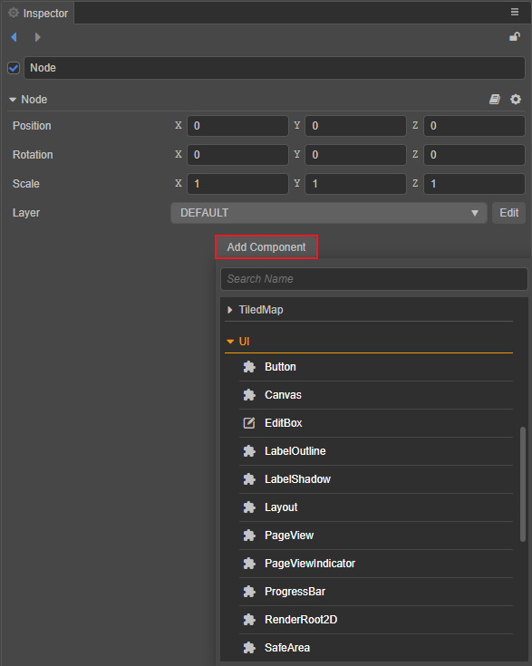

# UI 组件

一些常用的 UI 控件可通过添加节点的方式来创建。在 **层级管理器** 中点击左上角的 **+** 创建节点按钮，然后选择 **UI** 来创建所需的 UI 节点，相应的 UI 组件便会自动挂载到节点上：

其它的 UI 组件，可以手动在 **层级管理器** 中选中节点，然后在 **属性检查器** 中点击 **添加组件 -> UI** 的方式来添加：

各组件的具体说明，请参考相应的组件说明文档。
