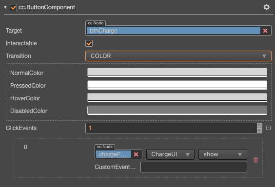
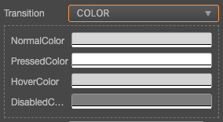

# Button（按钮）组件参考

Button 组件可以响应用户的点击操作，当用户点击 Button 时，Button 自身会有状态变化。另外，Button 还可以让用户在完成点击操作后响应一个自定义的行为。




点击 **属性检查器** 下面的 **添加组件** 按钮，然后从 **添加 UI 组件** 中选择 **Button**，即可添加 Button 组件到节点上。

按钮的脚本接口请参考 [Button API](https://docs.cocos.com/creator/3.4/api/zh/#/docs/3.4/zh/ui/Class/Button)。

## Button 属性

| 属性                 | 功能说明             |
| :-------------       | :----------        |
| Target               | Node 类型，当 Button 发生 Transition 的时候，会相应地修改 Target 节点的 SpriteFrame，颜色或者 Scale。                      |
| Interactable         | 布尔类型，设为 false 时，则 Button 组件进入禁用状态。                                                                    |
| Transition           | 枚举类型，包括 NONE、COLOR、SPRITE 和 SCALE。每种类型对应不同的 Transition 设置。详情见下方的 **Button Transition** 部分。    |
| Click Event          | 列表类型，默认为空，用户添加的每一个事件由节点引用，组件名称和一个响应函数组成。详情见下方的 **Button 点击事件** 部分。                 |

### Button Transition

Button 的 Transition 用来指定当用户点击 Button 时的状态表现。目前主要有 NONE、COLOR、SPRITE 和 SCALE。


#### Color Transition



| 属性            | 功能说明                         |
| :------------- | :----------                     |
| Normal         | Button 在 Normal 状态下的颜色。    |
| Pressed        | Button 在 Pressed 状态下的颜色。   |
| Hover          | Button 在 Hover 状态下的颜色。     |
| Disabled       | Button 在 Disabled 状态下的颜色。  |
| Duration       | Button 状态切换需要的时间间隔。      |

#### Sprite Transition


| 属性            | 功能说明                                 |
| :------------- | :----------                             |
| Normal         | Button 在 Normal 状态下的 SpriteFrame。   |
| Pressed        | Button 在 Pressed 状态下的 SpriteFrame。  |
| Hover          | Button 在 Hover 状态下的 SpriteFrame。    |
| Disabled       | Button 在 Disabled 状态下的 SpriteFrame。 |

#### Scale Transition


| 属性            | 功能                                                                                       |
| :------------- | :----------                                                                                |
| Duration       | Button 状态切换需要的时间间隔。                                                                |
| ZoomScale      | 当用户点击按钮后，按钮会缩放到一个值，这个值等于 Button 原始 **scale * zoomScale**，zoomScale 可以为负数  |

### Button 点击事件

Button 目前只支持 Click 事件，即当用户点击并释放 Button 时才会触发相应的回调函数。

### 组件事件结构


| 属性             | 功能说明                                           |
| :-------------  | :----------                                       |
| Target          | 带有脚本组件的节点。                                  |
| Component       | 脚本组件名称。                                       |
| Handler         | 指定一个回调函数，当用户点击 Button 并释放时会触发此函数。 |
| CustomEventData | 用户指定任意的字符串作为事件回调的最后一个参数传入。       |

### 通过脚本代码添加回调

#### 方法一

这种方法添加的事件回调和使用编辑器添加的事件回调是一样的，都是通过代码添加。首先需要构造一个 `EventHandler` 对象，然后设置好对应的 `target`、`component`、`handler` 和 `customEventData` 参数。

```ts
import { _decorator, Component, Event, Node, Button, EventHandler } from 'cc';
const { ccclass, property } = _decorator;

@ccclass("example")
export class example extends Component {
    onLoad () {
        const clickEventHandler = new EventHandler();
        clickEventHandler.target = this.node; // 这个 node 节点是你的事件处理代码组件所属的节点
        clickEventHandler.component = 'example';// 这个是脚本类名
        clickEventHandler.handler = 'callback';
        clickEventHandler.customEventData = 'foobar';

        const button = this.node.getComponent(Button);
        button.clickEvents.push(clickEventHandler);
    }

    callback (event: Event, customEventData: string) {
        // 这里 event 是一个 Touch Event 对象，你可以通过 event.target 取到事件的发送节点
        const node = event.target as Node;
        const button = node.getComponent(Button);
        console.log(customEventData); // foobar
    }
}
```

#### 方法二

通过 `button.node.on('click', ...)` 的方式来添加，这是一种非常简便的方式，但是该方式有一定的局限性，在事件回调里面无法
获得当前点击按钮的屏幕坐标点。

```ts
// 假设我们在一个组件的 onLoad 方法里面添加事件处理回调，在 callback 函数中进行事件处理

import { _decorator, Component, Button } from 'cc';
const { ccclass, property } = _decorator;

@ccclass("example")
export class example extends Component {
    @property(Button)
    button: Button | null = null;
    onLoad () {
        this.button.node.on(Button.EventType.CLICK, this.callback, this);
    }

    callback (button: Button) {
        // 注意这种方式注册的事件，无法传递 customEventData
    }
}
```
