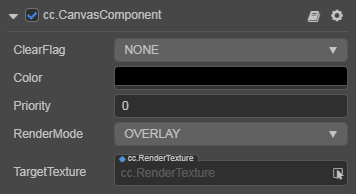

# Canvas（画布）组件参考

**Canvas（画布）** 组件所在的节点是 UI 的根节点。场景中 Canvas 节点可以有多个。**所有 UI 元素都必须作为 Canvas 的子节点才能被渲染**，当前处于哪一个 Canvas 节点下，就被哪个 Canvas 渲染。多个 Canvas 之间可以通过 `Priority` 属性排序.

除了它所在节点是 UI 根节点外，它自身还具有屏幕适配的功能，在游戏制作上面对多分辨率适配也起到关键作用，具体请参考[多分辨率适配方案](../engine/multi-resolution.md)。Canvas 的设计分辨率和适配方案统一通过 **项目设置** 配置。在 Canvas 内部会自带一个相机，默认照射 z 轴方向是从 -1000 - 998，所以**针对 UI 上元素的 z 轴设计必须限制在这个范围内才能正常显示（不取临界值）**。

在过去的设计里 Canvas 是最后渲染的，意味着它可以遮盖 3D 的所有内容渲染，但这远远不能满足项目开发需求（例如：一个 2D 地图配合 3D 角色的功能）。因此，我们加入了 RenderMode 属性，用户可以在原有基础上决定是否切换 UI 的相机的行为为 3D 相机和 UI 相机的排序渲染。当然，这个功能是要配合 ClearFlag 来调控。具体可以参考 [相机混合排序](../engine/priority.md#2.-相机混合排序)。

## Canvas 属性

| 属性           | 功能说明                                                 |
| :------------- | :----------                                            |
| RenderMode    | Canvas 渲染模式，**Intersperse** 下可以指定 Canvas 与场景中的相机的渲染顺序，**Overlay** 下 Canvas 会在所有场景相机渲染完成后渲染。注意：启用 **Intersperse** 模式，如果 3D 场景的相机内容显示上要在 Canvas 前面，相机的 ClearFlags 也要为 Dont_Clear。
| Priority       | 当 RenderMode 为 **Intersperse** 时，指定与其它相机的渲染顺序，当 RenderMode 为 **Overlay** 时，指定跟其余 Canvas 做排序使用。
| ClearFlag     | Canvas 清理屏幕缓冲区的标记。 Dont_Clear 不清理。 Depth_Only 清理深度缓冲。 Solid_Color 清理颜色深度缓冲。
| Color     | 清理颜色缓冲区后的颜色。
| TargetTexture | 目标渲染纹理

## 注意事项

如果遇到 UI 渲染出错，花屏，闪屏等现象，可以看此处的 [注意事项](../engine/priority.md#注意事项)。
